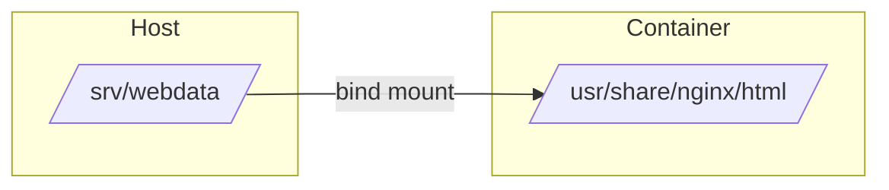

# How to Manage Container Storage Volumes with Podman on RHEL

Author: [nawazdhandala](https://www.github.com/nawazdhandala)

Tags: RHEL, Podman, Volumes, Storage, Linux

Description: Learn how to manage persistent data for Podman containers on RHEL using volumes, bind mounts, and tmpfs mounts, including SELinux considerations.

---

Containers are ephemeral by design. When you remove a container, its filesystem goes with it. If your application stores data - databases, logs, configuration - you need persistent storage. Podman offers three ways to handle this: named volumes, bind mounts, and tmpfs mounts.

Having dealt with data loss from forgetting to set up volumes on test environments more than once, I can tell you this is worth getting right from the start.

## Named Volumes

Named volumes are the preferred way to persist data. Podman manages the storage location and lifecycle:

# Create a named volume
```bash
podman volume create mydata
```

# List all volumes
```bash
podman volume ls
```

# Inspect a volume to see where it stores data
```bash
podman volume inspect mydata
```

For rootful containers, volumes are stored under `/var/lib/containers/storage/volumes/`. For rootless, they are under `~/.local/share/containers/storage/volumes/`.

## Using Named Volumes with Containers

# Run a MariaDB container with a named volume for data persistence
```bash
podman run -d --name mydb \
  -e MYSQL_ROOT_PASSWORD=secret \
  -v dbdata:/var/lib/mysql \
  docker.io/library/mariadb:latest
```

Now if you stop and remove the container, the data persists:

```bash
podman stop mydb
podman rm mydb

# Start a new container using the same volume
podman run -d --name mydb-new \
  -e MYSQL_ROOT_PASSWORD=secret \
  -v dbdata:/var/lib/mysql \
  docker.io/library/mariadb:latest
```

Your database data is still there.

## Bind Mounts

Bind mounts map a specific host directory into the container:

# Create a directory on the host
```bash
mkdir -p /srv/webdata
echo "<h1>Hello from RHEL</h1>" > /srv/webdata/index.html
```

# Mount the host directory into the container
```bash
podman run -d --name web \
  -v /srv/webdata:/usr/share/nginx/html:ro \
  -p 8080:80 \
  docker.io/library/nginx:latest
```

The `:ro` flag makes the mount read-only inside the container. Use `:rw` (the default) for read-write access.



## SELinux and Volume Mounts

On RHEL with SELinux enabled, you need to tell Podman how to label mounted directories:

# Use :Z for private unshared label (most common)
```bash
podman run -v /srv/data:/data:Z my-image
```

# Use :z for shared label (multiple containers access the same directory)
```bash
podman run -v /srv/shared:/data:z my-image
```

The difference matters:
- `:Z` relabels the directory so only this specific container can access it
- `:z` relabels the directory so multiple containers can share it

If you skip the label, SELinux will likely block access and you will see "Permission denied" errors inside the container.

# Check SELinux context on a directory
```bash
ls -laZ /srv/webdata/
```

## tmpfs Mounts

For temporary data that should not persist and should stay in memory:

# Mount a tmpfs volume (stored in RAM)
```bash
podman run -d --name tempapp \
  --tmpfs /tmp:size=100m \
  docker.io/library/nginx:latest
```

# Using the --mount flag for tmpfs
```bash
podman run -d --name tempapp \
  --mount type=tmpfs,destination=/tmp,tmpfs-size=104857600 \
  docker.io/library/nginx:latest
```

tmpfs mounts are useful for sensitive data that should not be written to disk, or for scratch space that benefits from RAM speed.

## Volume Drivers and Options

Podman supports volume options for specific use cases:

# Create a volume with specific options
```bash
podman volume create --opt device=tmpfs --opt type=tmpfs --opt o=size=100m tmpvol
```

# Create a volume backed by an NFS mount
```bash
podman volume create --opt type=nfs \
  --opt o=addr=192.168.1.10,rw \
  --opt device=:/exports/data \
  nfsdata
```

## Sharing Volumes Between Containers

Multiple containers can share the same volume:

# Create a shared volume
```bash
podman volume create shared-logs
```

# Writer container generates logs
```bash
podman run -d --name log-writer \
  -v shared-logs:/var/log/app \
  registry.access.redhat.com/ubi9/ubi-minimal \
  /bin/bash -c 'while true; do echo "$(date) - log entry" >> /var/log/app/app.log; sleep 5; done'
```

# Reader container can access the same logs
```bash
podman run --rm -v shared-logs:/logs:ro \
  registry.access.redhat.com/ubi9/ubi-minimal \
  tail -5 /logs/app.log
```

## Backing Up Volumes

Back up your volume data before major changes:

# Back up a volume to a tar archive
```bash
podman run --rm -v dbdata:/source:ro -v /backup:/backup \
  registry.access.redhat.com/ubi9/ubi-minimal \
  tar czf /backup/dbdata-backup.tar.gz -C /source .
```

# Restore a volume from a backup
```bash
podman volume create dbdata-restored

podman run --rm -v dbdata-restored:/target -v /backup:/backup:ro \
  registry.access.redhat.com/ubi9/ubi-minimal \
  tar xzf /backup/dbdata-backup.tar.gz -C /target
```

## Volume Permissions with Rootless Containers

Rootless containers run with user namespace mapping, which can cause permission issues:

# Check how your user maps inside the namespace
```bash
podman unshare id
```

# Fix ownership for a volume directory used by rootless containers
```bash
podman unshare chown -R 1000:1000 ~/.local/share/containers/storage/volumes/mydata/_data/
```

# Alternative: use --userns=keep-id to map your host UID into the container
```bash
podman run --userns=keep-id -v ~/mydata:/data my-image
```

With `--userns=keep-id`, your host user's UID is used inside the container, which avoids most permission headaches.

## Cleaning Up Volumes

# Remove a specific volume
```bash
podman volume rm mydata
```

# Remove all unused volumes (not attached to any container)
```bash
podman volume prune
```

# Remove a container and its anonymous volumes
```bash
podman rm -v mycontainer
```

## Listing Volume Usage

# See which containers use which volumes
```bash
podman ps -a --format '{{.Names}} {{.Mounts}}'
```

# Check disk usage for volumes
```bash
podman system df -v
```

## Summary

Persistent storage on Podman comes down to three choices: named volumes for application data, bind mounts when you need to control the exact host path, and tmpfs for temporary in-memory storage. On RHEL, always remember the SELinux labels (`:Z` or `:z`) on bind mounts, or you will spend hours debugging permission errors. For rootless containers, `--userns=keep-id` is your friend for avoiding UID mapping headaches.
