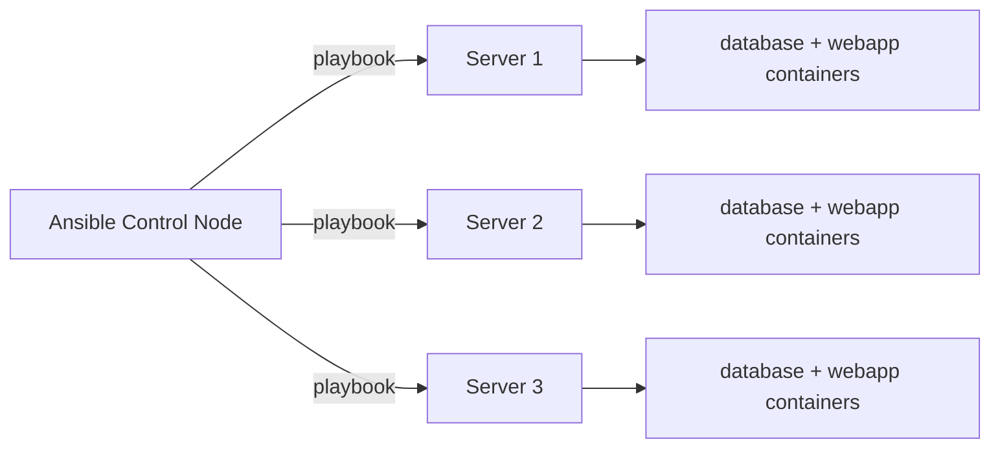

# How to Manage Containers Using the Podman RHEL System Role on RHEL

Author: [nawazdhandala](https://www.github.com/nawazdhandala)

Tags: RHEL, Podman, Ansible, System Roles, Linux

Description: Learn how to use the Podman RHEL System Role to automate container deployment and management across multiple RHEL servers using Ansible.

---

If you are managing containers across dozens or hundreds of RHEL servers, configuring each one manually is not realistic. The Podman RHEL System Role lets you define your container configuration in Ansible and push it to all your systems at once. It handles installing Podman, configuring registries, creating Quadlet service files, and managing container lifecycle.

## What are RHEL System Roles?

RHEL System Roles are a collection of Ansible roles maintained by Red Hat for automating common system administration tasks. The `podman` role handles container management.

## Installing the System Roles

# Install RHEL System Roles on your Ansible control node
```bash
sudo dnf install -y rhel-system-roles
```

# Verify the podman role is available
```bash
ls /usr/share/ansible/roles/rhel-system-roles.podman/
```

## Basic Playbook Structure

Here is a minimal playbook that ensures Podman is installed and runs a container:

```bash
cat > deploy-containers.yml << 'EOF'
---
- name: Deploy containers on RHEL servers
  hosts: webservers
  become: true
  vars:
    podman_create_host_directories: true
    podman_firewall:
      - port: 8080/tcp
        state: enabled
    podman_quadlet_specs:
      - name: web
        type: container
        Container:
          Image: docker.io/library/nginx:latest
          PublishPort: "8080:80"
        Service:
          Restart: always
        Install:
          WantedBy: default.target

  roles:
    - rhel-system-roles.podman
EOF
```

## Setting Up the Inventory

```bash
cat > inventory.ini << 'EOF'
[webservers]
server1.example.com
server2.example.com
server3.example.com

[webservers:vars]
ansible_user=admin
ansible_become=true
EOF
```

## Running the Playbook

# Deploy containers to all web servers
```bash
ansible-playbook -i inventory.ini deploy-containers.yml
```

## Deploying Multi-Container Applications

```bash
cat > deploy-app-stack.yml << 'EOF'
---
- name: Deploy application stack
  hosts: appservers
  become: true
  vars:
    podman_quadlet_specs:
      - name: app-net
        type: network
        Network:
          Subnet: "10.89.5.0/24"
          Gateway: "10.89.5.1"

      - name: db-data
        type: volume

      - name: database
        type: container
        Container:
          Image: docker.io/library/mariadb:latest
          Network: app-net.network
          Volume: "db-data.volume:/var/lib/mysql:Z"
          Environment:
            MYSQL_ROOT_PASSWORD: "{{ vault_db_root_password }}"
            MYSQL_DATABASE: myapp
        Service:
          Restart: always
        Install:
          WantedBy: default.target

      - name: webapp
        type: container
        Unit:
          Requires: database.service
          After: database.service
        Container:
          Image: registry.example.com/myapp:latest
          Network: app-net.network
          PublishPort: "8080:8000"
          Environment:
            DATABASE_HOST: database
            DATABASE_PORT: "3306"
        Service:
          Restart: always
        Install:
          WantedBy: default.target

    podman_firewall:
      - port: 8080/tcp
        state: enabled

  roles:
    - rhel-system-roles.podman
EOF
```



## Configuring Rootless Containers

Deploy containers as a regular user:

```bash
cat > deploy-rootless.yml << 'EOF'
---
- name: Deploy rootless containers
  hosts: webservers
  become: true
  become_user: appuser
  vars:
    podman_quadlet_specs:
      - name: web
        type: container
        Container:
          Image: docker.io/library/nginx:latest
          PublishPort: "8080:80"
        Service:
          Restart: always
        Install:
          WantedBy: default.target

  roles:
    - rhel-system-roles.podman
EOF
```

## Managing Registry Authentication

```bash
cat > configure-registries.yml << 'EOF'
---
- name: Configure container registries
  hosts: all
  become: true
  vars:
    podman_registry_logins:
      - registry: registry.redhat.io
        username: "{{ vault_rh_username }}"
        password: "{{ vault_rh_password }}"
      - registry: registry.example.com
        username: "{{ vault_private_username }}"
        password: "{{ vault_private_password }}"

  roles:
    - rhel-system-roles.podman
EOF
```

Store sensitive values in Ansible Vault:

```bash
ansible-vault create group_vars/all/vault.yml
```

## Using Kubernetes YAML with the System Role

Deploy using kube play:

```bash
cat > deploy-kube.yml << 'EOF'
---
- name: Deploy Kubernetes YAML
  hosts: appservers
  become: true
  vars:
    podman_quadlet_specs:
      - name: myapp
        type: kube
        Kube:
          Yaml: /etc/containers/myapp.yaml

  pre_tasks:
    - name: Copy Kubernetes YAML
      ansible.builtin.copy:
        src: files/myapp.yaml
        dest: /etc/containers/myapp.yaml
        mode: '0644'

  roles:
    - rhel-system-roles.podman
EOF
```

## Updating Container Images

Force an image update across all servers:

```bash
cat > update-images.yml << 'EOF'
---
- name: Update container images
  hosts: webservers
  become: true
  tasks:
    - name: Pull latest image
      containers.podman.podman_image:
        name: docker.io/library/nginx:latest
        force: true

    - name: Restart the web service
      ansible.builtin.systemd:
        name: web.service
        state: restarted
EOF
```

```bash
ansible-playbook -i inventory.ini update-images.yml
```

## Verifying Deployment

Add verification tasks to your playbooks:

```bash
cat > verify-deployment.yml << 'EOF'
---
- name: Verify container deployment
  hosts: webservers
  become: true
  tasks:
    - name: Check container is running
      ansible.builtin.command: podman ps --filter name=web --format "{{.Status}}"
      register: container_status
      changed_when: false

    - name: Display container status
      ansible.builtin.debug:
        var: container_status.stdout

    - name: Verify web server responds
      ansible.builtin.uri:
        url: http://localhost:8080
        return_content: false
      register: web_response

    - name: Display response status
      ansible.builtin.debug:
        msg: "Web server returned {{ web_response.status }}"
EOF
```

## Rolling Updates

Implement rolling updates across your fleet:

```bash
cat > rolling-update.yml << 'EOF'
---
- name: Rolling update of containers
  hosts: webservers
  serial: 1
  become: true
  tasks:
    - name: Pull new image
      containers.podman.podman_image:
        name: registry.example.com/myapp:latest
        force: true

    - name: Restart container service
      ansible.builtin.systemd:
        name: webapp.service
        state: restarted

    - name: Wait for service to be healthy
      ansible.builtin.uri:
        url: http://localhost:8080/health
      register: result
      until: result.status == 200
      retries: 30
      delay: 5
EOF
```

The `serial: 1` directive updates one server at a time, keeping the rest serving traffic.

## Summary

The Podman RHEL System Role makes it practical to manage containers at scale on RHEL. Write your container definitions as Ansible variables, run the playbook, and the role handles everything from package installation to Quadlet file creation to service management. For fleets of servers running the same container workloads, this is the way to go.
