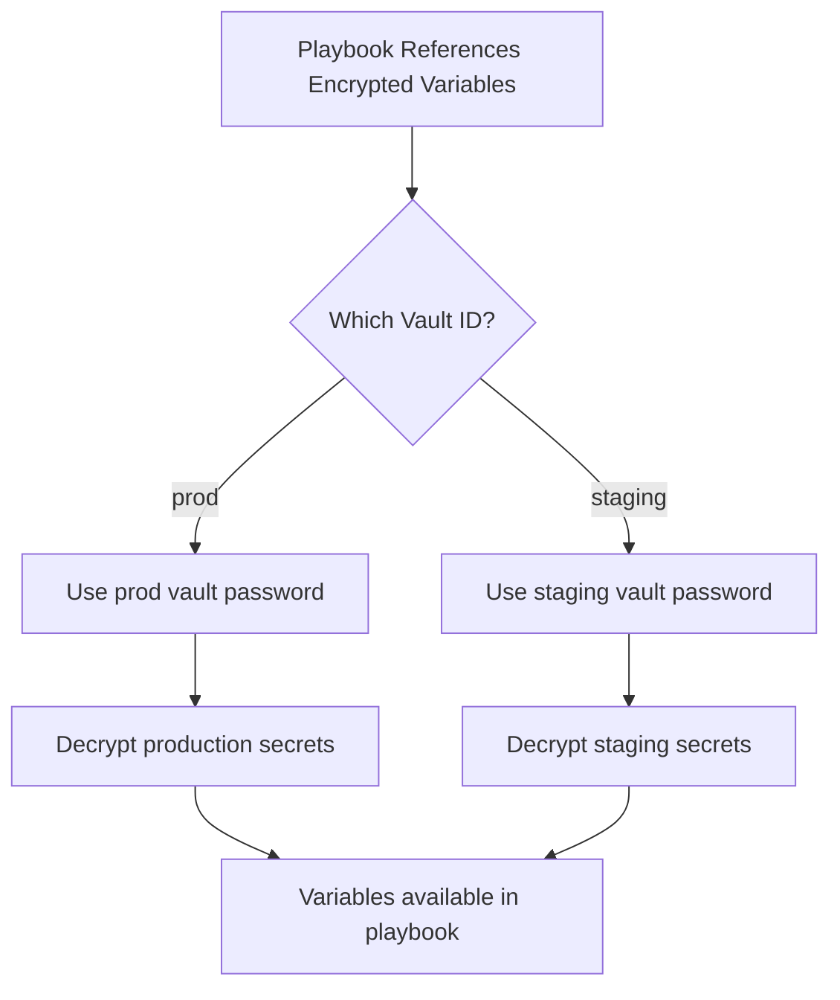

# How to Manage Sensitive Credentials with Ansible Vault on RHEL 9

Author: [nawazdhandala](https://www.github.com/nawazdhandala)

Tags: RHEL, Ansible Vault, Security, Credentials, Linux, Automation

Description: A practical guide to using Ansible Vault on RHEL 9 to encrypt, manage, and use sensitive credentials like passwords, API keys, and certificates in your Ansible playbooks.

---

## Why You Need Ansible Vault

If you are using Ansible to manage infrastructure, sooner or later your playbooks will need passwords, API keys, database credentials, or SSL certificates. Storing these in plain text inside your playbooks or variable files is a security risk, especially if your code lives in a Git repository.

Ansible Vault solves this by encrypting sensitive data with AES-256 encryption. You can encrypt entire files or individual variables, and Ansible decrypts them transparently at runtime when you provide the vault password.

## Creating an Encrypted File

The simplest way to start is by creating a new encrypted file.

```bash
# Create a new encrypted variables file
ansible-vault create secrets.yml
```

This opens your default editor (set by `$EDITOR`). Add your sensitive variables:

```yaml
---
db_password: "s3cureP@ssword!"
api_key: "ak_live_abc123def456"
smtp_password: "mailP@ss99"
```

When you save and close the editor, the file is encrypted. If you look at it directly, you will see something like:

```bash
# View the encrypted file contents
cat secrets.yml
```

```
$ANSIBLE_VAULT;1.1;AES256
61326438396534323432323637653731616233346230393433326536326438353363333339616562
...
```

The `$ANSIBLE_VAULT;1.1;AES256` header tells Ansible this is a vault-encrypted file.

## Viewing Encrypted Files

To read the contents of an encrypted file without editing it:

```bash
# View the decrypted contents
ansible-vault view secrets.yml
```

You will be prompted for the vault password.

## Editing Encrypted Files

To modify an encrypted file:

```bash
# Open the encrypted file for editing
ansible-vault edit secrets.yml
```

The file is decrypted, opened in your editor, and re-encrypted when you save. The original file is never stored on disk in plain text.

## Encrypting an Existing File

If you already have a plain text file with sensitive data:

```bash
# Encrypt an existing plain text file
ansible-vault encrypt vars/production-secrets.yml
```

This replaces the plain text content with the encrypted version in place.

## Decrypting a File

If you need to permanently remove encryption from a file:

```bash
# Decrypt a file back to plain text
ansible-vault decrypt secrets.yml
```

Be careful with this. If the file is in a Git repository, the plain text secrets will be in your commit history.

## Changing the Vault Password

To re-encrypt a file with a new password:

```bash
# Change the vault password on a file
ansible-vault rekey secrets.yml
```

You will be prompted for the old password and then the new password. This is useful for password rotation.

## Encrypting Individual Variables

Instead of encrypting entire files, you can encrypt just specific values. This is called inline encryption, and it lets you see variable names while keeping values secret.

```bash
# Encrypt a single string value
ansible-vault encrypt_string 's3cureP@ssword!' --name 'db_password'
```

Output:

```yaml
db_password: !vault |
          $ANSIBLE_VAULT;1.1;AES256
          62313365396662343061393464336163383764316462...
```

Copy this output into your variables file. The variable name is visible, but the value is encrypted.

You can mix encrypted and plain text variables in the same file:

```yaml
---
# vars/app-config.yml
app_name: mywebapp
app_port: 8080
db_host: db.example.com
db_name: production
db_password: !vault |
          $ANSIBLE_VAULT;1.1;AES256
          62313365396662343061393464336163383764316462...
api_key: !vault |
          $ANSIBLE_VAULT;1.1;AES256
          38653732326431303530623831333639633564373666...
```

## Using Vault in Playbooks

### Basic Usage

Reference encrypted variables the same way you reference any variable. Ansible handles decryption automatically.

```yaml
# deploy-app.yml - Deploy application with database credentials
---
- name: Deploy web application
  hosts: webservers
  become: true
  vars_files:
    - vars/app-config.yml
    - secrets.yml

  tasks:
    - name: Configure database connection
      template:
        src: templates/db-config.j2
        dest: /etc/myapp/database.conf
        owner: root
        group: myapp
        mode: '0640'

    - name: Set API key in environment file
      lineinfile:
        path: /etc/myapp/env
        regexp: '^API_KEY='
        line: "API_KEY={{ api_key }}"
        mode: '0640'
```

### Running the Playbook

When you run a playbook that uses vault-encrypted data, you need to provide the vault password.

```bash
# Prompt for the vault password interactively
ansible-playbook deploy-app.yml --ask-vault-pass

# Use a password file
ansible-playbook deploy-app.yml --vault-password-file ~/.vault_pass
```

## Using a Vault Password File

For automation and CI/CD pipelines, you do not want interactive password prompts. Store the vault password in a file.

```bash
# Create a vault password file
echo 'YourVaultP@ssword' > ~/.vault_pass

# Set strict permissions - only the owner can read it
chmod 600 ~/.vault_pass
```

Configure Ansible to use this file by default:

```ini
# Add to ansible.cfg
[defaults]
vault_password_file = ~/.vault_pass
```

With this configuration, you do not need to pass `--ask-vault-pass` or `--vault-password-file` every time.

Important: Never commit the vault password file to Git. Add it to `.gitignore`:

```bash
# Add vault password file to gitignore
echo '.vault_pass' >> .gitignore
echo '*.vault_pass' >> .gitignore
```

### Using a Script as a Password Source

For even more security, you can use a script that retrieves the password from an external source like a secrets manager.

```bash
# Create a script that fetches the vault password
cat > ~/get-vault-pass.sh << 'SCRIPT'
#!/bin/bash
# Retrieve vault password from a secure source
# This example reads from a file, but you could query
# a secrets manager API here
cat ~/.vault_pass
SCRIPT

chmod 700 ~/get-vault-pass.sh
```

Reference the script in your configuration:

```ini
# In ansible.cfg
[defaults]
vault_password_file = ~/get-vault-pass.sh
```

## Multiple Vault Passwords

In larger environments, you might want different passwords for different types of secrets (production vs. staging, application vs. infrastructure).

### Vault IDs

Ansible supports vault IDs to manage multiple passwords.

```bash
# Encrypt a file with a specific vault ID
ansible-vault create --vault-id prod@prompt secrets-prod.yml
ansible-vault create --vault-id staging@prompt secrets-staging.yml
```

Use password files with vault IDs:

```bash
# Encrypt with a vault ID and password file
ansible-vault create --vault-id prod@~/.vault_pass_prod secrets-prod.yml
ansible-vault create --vault-id staging@~/.vault_pass_staging secrets-staging.yml
```

When running playbooks that use multiple vault IDs:

```bash
# Provide multiple vault passwords
ansible-playbook deploy.yml \
    --vault-id prod@~/.vault_pass_prod \
    --vault-id staging@~/.vault_pass_staging
```



## Practical Example: Managing Database Credentials

Here is a complete example of managing database credentials across environments.

Create the encrypted secrets file:

```bash
# Create production secrets
ansible-vault create group_vars/dbservers/vault.yml
```

Add the credentials:

```yaml
---
vault_db_root_password: "pr0dR00tP@ss"
vault_db_app_password: "pr0dAppP@ss"
vault_db_repl_password: "pr0dReplP@ss"
```

Create a corresponding plain text variables file that references the vault variables:

```yaml
# group_vars/dbservers/vars.yml
---
db_root_password: "{{ vault_db_root_password }}"
db_app_password: "{{ vault_db_app_password }}"
db_repl_password: "{{ vault_db_repl_password }}"
db_port: 5432
db_data_directory: /var/lib/pgsql/data
```

The naming convention of prefixing vault variables with `vault_` makes it easy to see which values come from encrypted sources.

Use these in a playbook:

```yaml
# configure-database.yml
---
- name: Configure PostgreSQL
  hosts: dbservers
  become: true
  tasks:
    - name: Set PostgreSQL root password
      postgresql_user:
        name: postgres
        password: "{{ db_root_password }}"
      become_user: postgres

    - name: Create application database user
      postgresql_user:
        name: appuser
        password: "{{ db_app_password }}"
        role_attr_flags: LOGIN
      become_user: postgres
```

## Best Practices

### Organize Vault Files Consistently

Keep vault files in predictable locations:

```
ansible-project/
  group_vars/
    all/
      vars.yml          # Plain text variables
      vault.yml         # Encrypted variables
    webservers/
      vars.yml
      vault.yml
    dbservers/
      vars.yml
      vault.yml
  host_vars/
    special-server/
      vars.yml
      vault.yml
```

### Use a Naming Convention

Prefix all vault-stored variables with `vault_` so developers know the source:

```yaml
# In vault.yml (encrypted)
vault_api_key: "encrypted-value"

# In vars.yml (plain text)
api_key: "{{ vault_api_key }}"
```

### Never Commit Plain Text Secrets

Run a pre-commit check to ensure no unencrypted secrets get committed:

```bash
# Check if a file is encrypted before committing
head -1 group_vars/all/vault.yml | grep -q "^\$ANSIBLE_VAULT" || echo "WARNING: vault.yml is not encrypted!"
```

### Rotate Vault Passwords Regularly

```bash
# Rekey all vault files when rotating passwords
find . -name "vault.yml" -exec ansible-vault rekey {} \;
```

### Limit Access to Vault Password Files

```bash
# Verify vault password file permissions
ls -la ~/.vault_pass
# Should show: -rw------- (600)
```

## Summary

Ansible Vault is a straightforward way to keep credentials safe in your automation code. Use `ansible-vault create` for new encrypted files, `encrypt_string` for individual values, and vault password files for unattended automation. Organize your secrets with a clear naming convention, keep vault files in predictable locations alongside plain text variables, and never commit unencrypted credentials to version control. With vault IDs, you can manage separate passwords for different environments, which scales well as your infrastructure grows. The goal is simple: make it easy to do the right thing and hard to accidentally expose secrets.
