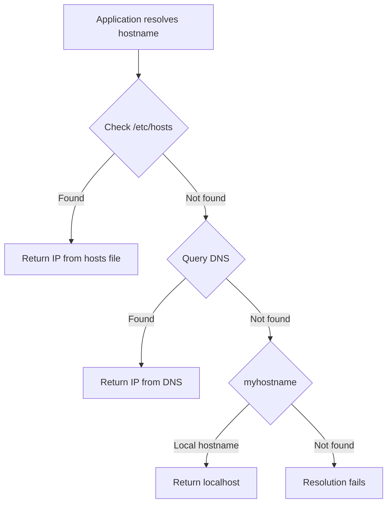

# How to Manage /etc/hosts and Hostname Resolution on RHEL

Author: [nawazdhandala](https://www.github.com/nawazdhandala)

Tags: RHEL, /etc/hosts, DNS, Hostname, Linux

Description: A practical guide to managing the /etc/hosts file and controlling hostname resolution order on RHEL, including best practices for production environments.

---

The `/etc/hosts` file is one of the oldest configuration files in Unix history, and it is still relevant on modern RHEL systems. While DNS handles the heavy lifting for name resolution, `/etc/hosts` provides fast, local overrides that work even when DNS is down. Knowing how to manage it properly, along with understanding how RHEL decides where to look for hostname resolution, is fundamental sysadmin knowledge.

## How Name Resolution Works on RHEL

When an application tries to resolve a hostname, the system follows a resolution order defined in `/etc/nsswitch.conf`. On RHEL, the default configuration looks at `/etc/hosts` first, then DNS:

```bash
# Check the current name resolution order
grep hosts /etc/nsswitch.conf
```

Typical output:

```
hosts:      files dns myhostname
```

This means:
1. **files** - Check `/etc/hosts` first
2. **dns** - Query DNS servers
3. **myhostname** - Fall back to systemd's local hostname resolution



## Understanding the /etc/hosts File

The format is simple: IP address followed by one or more hostnames.

```bash
# View the current hosts file
cat /etc/hosts
```

Default RHEL `/etc/hosts`:

```
127.0.0.1   localhost localhost.localdomain localhost4 localhost4.localdomain4
::1         localhost localhost.localdomain localhost6 localhost6.localdomain6
```

## Adding Entries to /etc/hosts

### Manual Editing

```bash
# Add a host entry
echo "10.0.1.50 db-primary.example.com db-primary" >> /etc/hosts

# Add multiple entries
cat >> /etc/hosts << 'EOF'
10.0.1.51 db-replica.example.com db-replica
10.0.1.60 app-server.example.com app-server
10.0.1.70 monitoring.example.com monitoring
EOF
```

Each line can have multiple hostnames. The first hostname is typically the FQDN, and additional entries are short aliases:

```
10.0.1.50   db-primary.example.com db-primary dbmaster
```

### Using sed for Targeted Edits

```bash
# Change the IP for an existing hostname
sed -i 's/10.0.1.50.*db-primary/10.0.1.55 db-primary.example.com db-primary/' /etc/hosts

# Remove a specific entry
sed -i '/db-replica/d' /etc/hosts
```

## Best Practices for /etc/hosts

### Always Include the System Hostname

Your server's own hostname should resolve to its actual IP, not just 127.0.0.1:

```bash
# Get the current hostname
hostnamectl hostname

# Add the hostname with its real IP
echo "10.0.1.50 server01.example.com server01" >> /etc/hosts
```

This is important for applications that need to resolve their own hostname to a real IP address. Java applications and some databases are particularly sensitive to this.

### Keep localhost Entries Intact

Never remove or modify the default localhost entries. Many services depend on `127.0.0.1 localhost` being resolvable:

```
# These lines should always be present
127.0.0.1   localhost localhost.localdomain localhost4 localhost4.localdomain4
::1         localhost localhost.localdomain localhost6 localhost6.localdomain6
```

### Use Comments for Documentation

```bash
# Database cluster
10.0.1.50   db-primary.example.com db-primary
10.0.1.51   db-replica-1.example.com db-replica-1
10.0.1.52   db-replica-2.example.com db-replica-2

# Application servers
10.0.1.60   app-01.example.com app-01
10.0.1.61   app-02.example.com app-02

# Monitoring
10.0.1.70   prometheus.example.com prometheus
10.0.1.71   grafana.example.com grafana
```

## When to Use /etc/hosts vs DNS

Use `/etc/hosts` when:

- You need resolution that works even when DNS is down
- You are overriding DNS for testing (pointing a domain to a different IP)
- You have a small, static set of hosts that rarely change
- You need resolution during early boot before the network is fully up
- You are working in an air-gapped environment without DNS

Use DNS when:

- You have more than a dozen hosts to manage
- Hostnames need to be resolvable from multiple machines
- You need dynamic updates (DHCP-to-DNS registration)
- You need features like SRV records, round-robin, or failover

## Managing /etc/hosts with Configuration Management

For environments with many servers, managing `/etc/hosts` manually on each machine is not scalable. Here are some approaches:

### Template-Based Approach

Create a standard hosts file and distribute it:

```bash
#!/bin/bash
# generate-hosts.sh - Generate a hosts file from a server inventory

cat > /etc/hosts << 'EOF'
# Managed by automation - do not edit manually
127.0.0.1   localhost localhost.localdomain
::1         localhost localhost.localdomain

# Infrastructure
10.0.1.1    gateway.example.com gateway
10.0.1.2    dns1.example.com dns1
10.0.1.3    dns2.example.com dns2

# Database servers
10.0.1.50   db-primary.example.com db-primary
10.0.1.51   db-replica.example.com db-replica

# Application servers
10.0.1.60   app-01.example.com app-01
10.0.1.61   app-02.example.com app-02
EOF

# Add this server's own entry
HOSTNAME=$(hostnamectl hostname)
MY_IP=$(nmcli -t -f IP4.ADDRESS device show ens192 | head -1 | cut -d: -f2 | cut -d/ -f1)
echo "$MY_IP   $HOSTNAME" >> /etc/hosts
```

## Modifying the Resolution Order

If you need to change the order of name resolution:

```bash
# Edit nsswitch.conf to change resolution order
vi /etc/nsswitch.conf
```

Some variations:

```
# Default: check hosts file first, then DNS
hosts:      files dns myhostname

# Check DNS first, then hosts file
hosts:      dns files myhostname

# Use only DNS (not recommended)
hosts:      dns myhostname

# Add mdns for multicast DNS (Avahi)
hosts:      files mdns4_minimal [NOTFOUND=return] dns myhostname
```

Changing this order takes effect immediately for new lookups - no service restart is needed.

## Testing Name Resolution

```bash
# getent uses nsswitch.conf order (tests the full resolution chain)
getent hosts db-primary.example.com

# dig queries DNS directly (bypasses /etc/hosts)
dig db-primary.example.com

# host queries DNS directly
host db-primary.example.com

# ping shows which IP it resolved to
ping -c 1 db-primary.example.com
```

The distinction between `getent` and `dig`/`host` is important. `getent` follows the nsswitch.conf resolution order and will find entries in `/etc/hosts`. `dig` and `host` only query DNS servers and will not see `/etc/hosts` entries.

## Overriding DNS for Testing

A common use case for `/etc/hosts` is temporarily pointing a domain to a different IP for testing:

```bash
# Redirect a production domain to a test server
echo "10.0.1.99 api.example.com" >> /etc/hosts

# Test the application against the test server
curl https://api.example.com/health

# Remove the override when done
sed -i '/10.0.1.99.*api.example.com/d' /etc/hosts
```

## IPv6 Entries

`/etc/hosts` supports IPv6 addresses:

```bash
# Add IPv6 host entries
echo "2001:db8::50 db-primary-v6.example.com db-primary-v6" >> /etc/hosts
```

## Troubleshooting Host Resolution

```bash
# Check if a hostname resolves and through which source
getent hosts db-primary.example.com

# If getent works but applications fail, check nsswitch.conf
grep hosts /etc/nsswitch.conf

# If resolution is slow, check DNS server availability
nmcli device show | grep DNS
dig @10.0.1.2 example.com

# Check for duplicate or conflicting entries
grep db-primary /etc/hosts
```

## Wrapping Up

The `/etc/hosts` file remains a valuable tool for local name resolution on RHEL. It provides fast, reliable, DNS-independent hostname lookups that work in any situation. The key is to use it for what it is good at - small, static mappings that need to work reliably - and use DNS for everything else. Keep the file clean, documented, and managed through automation when possible, and it will serve you well.
