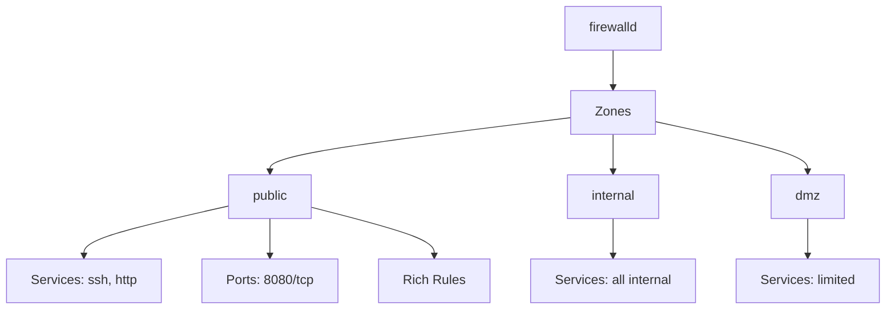

# How to Manage Firewalld Rules with Ansible on RHEL

Author: [nawazdhandala](https://www.github.com/nawazdhandala)

Tags: RHEL, Ansible, firewalld, Security, Automation, Linux

Description: Use Ansible to manage firewalld zones, services, ports, and rich rules across your RHEL servers for consistent network security.

---

Firewall configuration is one of the most common sources of inconsistency across a server fleet. One server has port 8080 open, another does not, and nobody remembers why. Ansible with the firewalld module gives you a single source of truth for every firewall rule on every server.

## Firewalld Concepts



## Basic Firewall Management

```yaml
# playbook-firewall.yml
# Configure firewalld on RHEL servers
---
- name: Configure firewall rules
  hosts: all
  become: true

  tasks:
    - name: Ensure firewalld is installed and running
      ansible.builtin.dnf:
        name: firewalld
        state: present

    - name: Start and enable firewalld
      ansible.builtin.systemd:
        name: firewalld
        enabled: true
        state: started

    - name: Allow SSH (should already be open, but be explicit)
      ansible.posix.firewalld:
        service: ssh
        permanent: true
        state: enabled
        immediate: true

    - name: Allow HTTP and HTTPS for web servers
      ansible.posix.firewalld:
        service: "{{ item }}"
        permanent: true
        state: enabled
        immediate: true
      loop:
        - http
        - https
      when: "'webservers' in group_names"
```

## Managing by Server Role

```yaml
# playbook-firewall-roles.yml
# Apply firewall rules based on server role
---
- name: Configure firewall by server role
  hosts: all
  become: true

  vars:
    # Base services allowed on all servers
    base_firewall_services:
      - ssh

    # Role-specific services
    webserver_services:
      - http
      - https

    dbserver_services: []

    dbserver_ports:
      - "5432/tcp"  # PostgreSQL

    appserver_ports:
      - "8080/tcp"
      - "8443/tcp"

  tasks:
    - name: Allow base services on all servers
      ansible.posix.firewalld:
        service: "{{ item }}"
        permanent: true
        state: enabled
        immediate: true
      loop: "{{ base_firewall_services }}"

    - name: Allow web server services
      ansible.posix.firewalld:
        service: "{{ item }}"
        permanent: true
        state: enabled
        immediate: true
      loop: "{{ webserver_services }}"
      when: "'webservers' in group_names"

    - name: Allow database server ports
      ansible.posix.firewalld:
        port: "{{ item }}"
        permanent: true
        state: enabled
        immediate: true
      loop: "{{ dbserver_ports }}"
      when: "'dbservers' in group_names"

    - name: Allow application server ports
      ansible.posix.firewalld:
        port: "{{ item }}"
        permanent: true
        state: enabled
        immediate: true
      loop: "{{ appserver_ports }}"
      when: "'appservers' in group_names"
```

## Managing Zones

```yaml
# playbook-firewall-zones.yml
# Configure firewalld zones
---
- name: Configure firewall zones
  hosts: all
  become: true

  tasks:
    - name: Create a custom zone for the internal network
      ansible.posix.firewalld:
        zone: internal-apps
        state: present
        permanent: true
      notify: Reload firewalld

    - name: Assign interface to internal zone
      ansible.posix.firewalld:
        zone: internal-apps
        interface: eth1
        permanent: true
        state: enabled
        immediate: true

    - name: Allow services in the internal zone
      ansible.posix.firewalld:
        zone: internal-apps
        service: "{{ item }}"
        permanent: true
        state: enabled
        immediate: true
      loop:
        - http
        - https
        - nfs
        - postgresql

    - name: Set the default zone
      ansible.builtin.command: firewall-cmd --set-default-zone=public
      changed_when: false

  handlers:
    - name: Reload firewalld
      ansible.builtin.systemd:
        name: firewalld
        state: reloaded
```

## Rich Rules

For more complex filtering:

```yaml
# playbook-firewall-rich.yml
# Configure rich rules for fine-grained access control
---
- name: Configure firewall rich rules
  hosts: all
  become: true

  tasks:
    - name: Allow SSH only from management network
      ansible.posix.firewalld:
        rich_rule: 'rule family="ipv4" source address="10.0.0.0/8" service name="ssh" accept'
        permanent: true
        state: enabled
        immediate: true

    - name: Allow PostgreSQL only from app servers
      ansible.posix.firewalld:
        rich_rule: 'rule family="ipv4" source address="10.0.1.0/24" port port="5432" protocol="tcp" accept'
        permanent: true
        state: enabled
        immediate: true
      when: "'dbservers' in group_names"

    - name: Rate limit HTTP connections
      ansible.posix.firewalld:
        rich_rule: 'rule family="ipv4" service name="http" accept limit value="25/m"'
        permanent: true
        state: enabled
        immediate: true
      when: "'webservers' in group_names"

    - name: Log and drop connections from a blocked network
      ansible.posix.firewalld:
        rich_rule: 'rule family="ipv4" source address="192.168.100.0/24" log prefix="BLOCKED: " level="warning" drop'
        permanent: true
        state: enabled
        immediate: true
```

## Removing Old Rules

```yaml
# Remove services that should not be open
- name: Remove cockpit access from public zone
  ansible.posix.firewalld:
    service: cockpit
    permanent: true
    state: disabled
    immediate: true

- name: Remove an old port rule
  ansible.posix.firewalld:
    port: "9090/tcp"
    permanent: true
    state: disabled
    immediate: true
```

## Verifying Firewall Configuration

```bash
# List all active zones and their rules
sudo firewall-cmd --list-all-zones

# Show the default zone configuration
sudo firewall-cmd --list-all

# Check a specific zone
sudo firewall-cmd --zone=internal-apps --list-all

# List all rich rules
sudo firewall-cmd --list-rich-rules

# Verify a specific port is open
sudo firewall-cmd --query-port=8080/tcp
```

## Wrapping Up

Managing firewalld with Ansible ensures every server has exactly the rules it should have. The role-based approach (web servers get HTTP/HTTPS, database servers get their ports, etc.) makes it easy to reason about what is open and why. Rich rules give you fine-grained control when you need to restrict access to specific source networks. The key is to always use `permanent: true` and `immediate: true` together so rules survive reboots and take effect right away.
