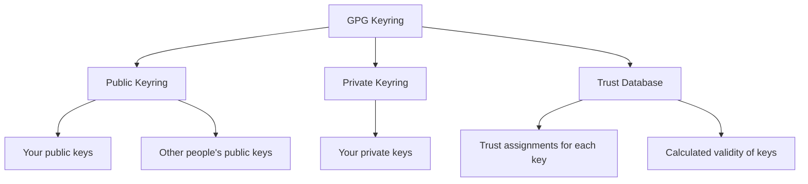
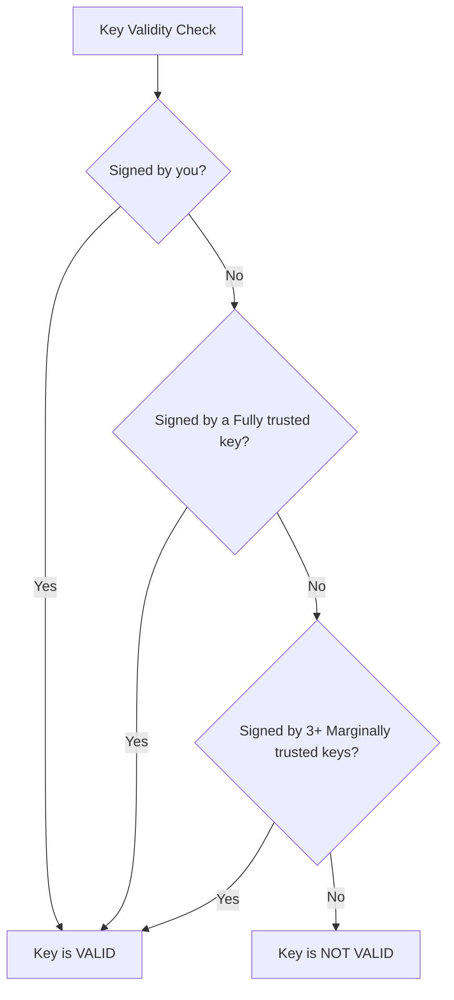

# How to Manage GPG Keyrings and Trust Levels on RHEL

Author: [nawazdhandala](https://www.github.com/nawazdhandala)

Tags: RHEL, GPG, Keyrings, Trust, Key Management, Security, Linux

Description: Manage GPG keyrings and configure trust levels on RHEL to maintain a reliable web of trust for encryption and signature verification.

---

GPG keyrings store your public and private keys along with trust information about each key. Properly managing your keyring and setting appropriate trust levels is essential for reliable encryption and signature verification. This guide covers keyring management tasks on RHEL.

## Understanding GPG Keyrings



On RHEL, GPG stores keyring data in `~/.gnupg/`:

```bash
# View the keyring directory
ls -la ~/.gnupg/

# Key files:
# pubring.kbx    - Public keyring (keybox format)
# trustdb.gpg    - Trust database
# private-keys-v1.d/ - Private key storage
```

## Listing Keys in Your Keyring

### List Public Keys

```bash
# List all public keys
gpg --list-keys

# List with fingerprints
gpg --list-keys --fingerprint

# List with key IDs in long format
gpg --list-keys --keyid-format long

# List a specific key
gpg --list-keys user@example.com
```

### List Private Keys

```bash
# List your private (secret) keys
gpg --list-secret-keys

# With fingerprints
gpg --list-secret-keys --fingerprint
```

### Detailed Key Information

```bash
# Show all key details including subkeys
gpg --list-keys --with-colons user@example.com

# Show key signatures
gpg --list-sigs user@example.com

# Check key fingerprint
gpg --fingerprint user@example.com
```

## Importing Keys

### Import from a File

```bash
# Import a public key from a file
gpg --import colleague-public-key.asc

# Import a private key (for backup restoration)
gpg --import my-private-key.asc

# Import with verbose output
gpg --import --verbose key-file.asc
```

### Import from a Keyserver

```bash
# Search for a key on a keyserver
gpg --keyserver hkps://keys.openpgp.org --search-keys user@example.com

# Receive a specific key by ID
gpg --keyserver hkps://keys.openpgp.org --recv-keys 0xKEY_ID_HERE

# Refresh all keys from the keyserver (update expiration, revocations)
gpg --keyserver hkps://keys.openpgp.org --refresh-keys
```

## Exporting Keys

```bash
# Export a public key
gpg --armor --export user@example.com > user-public.asc

# Export all public keys
gpg --armor --export --output all-public-keys.asc

# Export a private key (handle with extreme care)
gpg --armor --export-secret-keys user@example.com > user-private.asc

# Export only specific subkeys
gpg --armor --export-secret-subkeys user@example.com > user-subkeys.asc
```

## Understanding Trust Levels

GPG uses a trust model to determine how much you trust each key owner to properly verify other keys. There are five trust levels:

| Level | Meaning |
|-------|---------|
| Unknown | You have not assigned trust |
| Never | You do not trust this person to verify keys |
| Marginal | You somewhat trust this person's key verification |
| Full | You fully trust this person's key verification |
| Ultimate | Reserved for your own keys |

### How Trust Affects Key Validity

A key is considered valid if:
- You have signed it yourself, OR
- It has been signed by a key you trust at the "Full" level, OR
- It has been signed by three or more keys you trust at the "Marginal" level



## Setting Trust Levels

### Interactive Trust Assignment

```bash
# Edit a key to set its trust level
gpg --edit-key user@example.com

# At the gpg> prompt, type:
gpg> trust

# You will see:
# 1 = I don't know or won't say
# 2 = I do NOT trust
# 3 = I trust marginally
# 4 = I trust fully
# 5 = I trust ultimately

# Choose the appropriate level and confirm
# Then save and quit:
gpg> save
```

### Signing Keys to Validate Them

When you personally verify someone's identity and key fingerprint, you sign their key:

```bash
# Sign a key (certify that you verified the owner's identity)
gpg --sign-key user@example.com

# Local signature only (not exported to keyservers)
gpg --lsign-key user@example.com
```

### Check Trust Database

```bash
# View the trust database
gpg --export-ownertrust

# Check validity of all keys
gpg --check-trustdb

# Update the trust database
gpg --update-trustdb
```

## Deleting Keys

### Delete a Public Key

```bash
# Delete a public key
gpg --delete-keys user@example.com

# If the key also has a private key, you must delete that first
gpg --delete-secret-keys user@example.com
gpg --delete-keys user@example.com
```

### Delete Both Public and Private Keys

```bash
# Delete secret and public key in one step
gpg --delete-secret-and-public-keys user@example.com
```

## Managing Subkeys

Subkeys are secondary keys associated with your primary key. They are used for specific purposes like encryption or signing:

```bash
# Edit your key to manage subkeys
gpg --edit-key your@email.com

# At the gpg> prompt:
gpg> list          # Show all subkeys

# Add a new subkey
gpg> addkey
# Follow prompts to choose type, size, and expiration

# Revoke a subkey
gpg> key 2         # Select subkey number 2
gpg> revkey        # Revoke the selected subkey

# Save changes
gpg> save
```

## Key Expiration Management

### Extend Key Expiration

```bash
gpg --edit-key your@email.com

gpg> expire
# Enter new expiration period (e.g., 2y for 2 years)
# Confirm with your passphrase

# Also update subkey expiration
gpg> key 1         # Select first subkey
gpg> expire
# Enter new expiration

gpg> save
```

### Revoking a Key

If a key is compromised:

```bash
# If you have a revocation certificate
gpg --import revocation-cert.asc

# Or generate one now and import it
gpg --gen-revoke your@email.com | gpg --import

# Then publish the revocation
gpg --keyserver hkps://keys.openpgp.org --send-keys YOUR_KEY_ID
```

## Backing Up Your Keyring

```bash
# Back up the entire keyring directory
tar czf gnupg-backup-$(date +%Y%m%d).tar.gz -C ~/ .gnupg/

# Or export individually
gpg --armor --export --output public-keys-backup.asc
gpg --armor --export-secret-keys --output private-keys-backup.asc
gpg --export-ownertrust > trust-backup.txt
```

### Restore from Backup

```bash
# Restore the keyring
gpg --import public-keys-backup.asc
gpg --import private-keys-backup.asc
gpg --import-ownertrust trust-backup.txt
```

## Summary

Managing GPG keyrings and trust levels on RHEL involves importing and exporting keys, setting appropriate trust levels for contacts, signing keys you have verified, and regularly maintaining your keyring through expiration updates and backups. A well-maintained keyring with proper trust assignments ensures that GPG can reliably determine which keys are valid for encryption and signature verification.
