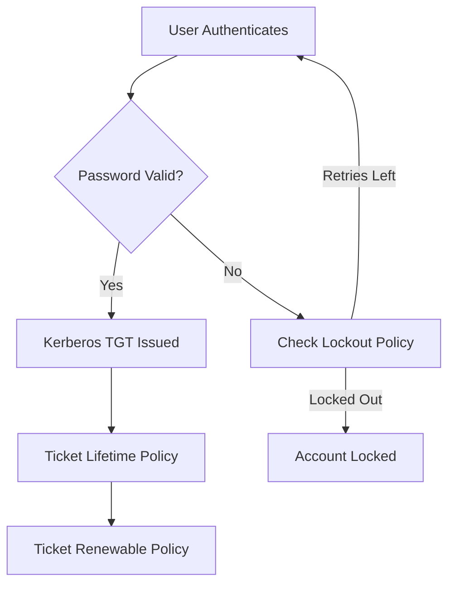

# How to Manage IdM Password Policies and Kerberos Ticket Policies on RHEL 9

Author: [nawazdhandala](https://www.github.com/nawazdhandala)

Tags: RHEL, IdM, Password Policy, Kerberos, Linux

Description: A practical walkthrough of managing password policies and Kerberos ticket policies in Red Hat Identity Management on RHEL 9, including group-based policies and real-world tuning advice.

---

Password policies and Kerberos ticket lifetimes are two sides of the same coin in IdM. The password policy controls complexity, expiration, and lockout rules. The Kerberos ticket policy controls how long a TGT lives and how long it can be renewed. Getting both right reduces help desk calls and keeps your environment secure without annoying users more than necessary.

## How Password and Ticket Policies Work Together



## Managing Password Policies

IdM supports multiple password policies assigned to different groups. The policy with the lowest priority number wins when a user belongs to multiple groups.

### View Existing Password Policies

```bash
# List all password policies
ipa pwpolicy-find

# Show the global (default) password policy
ipa pwpolicy-show global_policy
```

### Modify the Global Password Policy

The global policy applies to all users unless they have a group-specific policy with higher priority.

```bash
# Set minimum password length to 12 characters
ipa pwpolicy-mod global_policy --minlength=12

# Require at least one character from 3 different classes
# (uppercase, lowercase, digits, special characters)
ipa pwpolicy-mod global_policy --minclasses=3

# Set password expiration to 90 days
ipa pwpolicy-mod global_policy --maxlife=90

# Set minimum password age to 1 day (prevent rapid changes)
ipa pwpolicy-mod global_policy --minlife=1

# Set password history to remember last 6 passwords
ipa pwpolicy-mod global_policy --history=6
```

### Create Group-Specific Password Policies

You often want different policies for admins versus regular users. Create a stricter policy for the admin group.

```bash
# Create a password policy for the admins group
# Priority 1 means it takes precedence over the global policy (priority 0 is highest)
ipa pwpolicy-add admins \
  --priority=1 \
  --minlength=16 \
  --minclasses=4 \
  --maxlife=60 \
  --minlife=1 \
  --history=12

# Create a relaxed policy for service accounts
ipa pwpolicy-add service_accounts \
  --priority=5 \
  --minlength=20 \
  --maxlife=365 \
  --minlife=0 \
  --history=0
```

### Configure Account Lockout

Account lockout protects against brute-force attacks. Be careful with the settings, as aggressive lockout policies can cause denial-of-service issues.

```bash
# Set lockout after 5 failed attempts
ipa pwpolicy-mod global_policy --maxfail=5

# Set lockout duration to 10 minutes (600 seconds)
ipa pwpolicy-mod global_policy --lockouttime=600

# Set the failure reset interval to 5 minutes (300 seconds)
ipa pwpolicy-mod global_policy --failinterval=300
```

### Check a User's Effective Policy

When a user belongs to multiple groups, you need to know which policy actually applies.

```bash
# Show the effective policy for a specific user
ipa pwpolicy-show --user=jsmith
```

## Managing Kerberos Ticket Policies

Kerberos ticket policies control how long tickets remain valid. This affects how often users need to re-authenticate.

### View the Global Kerberos Ticket Policy

```bash
# Show the global Kerberos ticket policy
ipa krbtpolicy-show
```

### Modify the Global Ticket Policy

```bash
# Set maximum ticket lifetime to 24 hours (86400 seconds)
ipa krbtpolicy-mod --maxlife=86400

# Set maximum renewable lifetime to 7 days (604800 seconds)
ipa krbtpolicy-mod --maxrenew=604800
```

### Set Per-User Ticket Policies

Some users, like service accounts, need longer ticket lifetimes. Set per-user overrides.

```bash
# Give a service account a 48-hour ticket lifetime
ipa krbtpolicy-mod svc_backup --maxlife=172800 --maxrenew=604800

# Give an admin shorter ticket lifetime for security
ipa krbtpolicy-mod admin --maxlife=28800 --maxrenew=86400
```

### Reset a User's Ticket Policy to Global Default

```bash
# Reset a user's ticket policy to the global defaults
ipa krbtpolicy-reset jsmith
```

## Working with Password Expiration

### Check When a Password Expires

```bash
# Check a user's password expiration
ipa user-show jsmith --all | grep -i "password expiration"

# Check from the Kerberos side
ipa user-show jsmith --all | grep krbPasswordExpiration
```

### Force a Password Reset

```bash
# Force a user to change their password at next login
ipa user-mod jsmith --setattr=krbPasswordExpiration=20260101000000Z

# Or use the simpler approach - reset the password
# The user will be forced to change it on next login
ipa passwd jsmith
```

### Extend Password Expiration for a Specific User

Sometimes you need to buy time during a migration or outage.

```bash
# Set a specific expiration date (YYYYMMDD format in the attribute)
ipa user-mod jsmith --setattr=krbPasswordExpiration=20270101000000Z
```

## Practical Policy Recommendations

Here is a set of policies that balances security with usability for most organizations:

| Setting | Regular Users | Admins | Service Accounts |
|---------|--------------|--------|-----------------|
| Min Length | 12 | 16 | 24 |
| Character Classes | 3 | 4 | 2 |
| Max Lifetime (days) | 90 | 60 | 365 |
| History | 6 | 12 | 0 |
| Lockout Attempts | 5 | 3 | 10 |
| Lockout Duration | 10 min | 30 min | 5 min |
| Ticket Lifetime | 24 hours | 8 hours | 48 hours |
| Renewable Lifetime | 7 days | 1 day | 7 days |

## Monitoring Policy Compliance

Keep an eye on password expirations and lockouts with these commands:

```bash
# Find users with passwords expiring in the next 7 days
ipa user-find --all --raw | grep -B5 "krbPasswordExpiration"

# Check for locked accounts
ipa user-find --locked=True

# Unlock a locked account
ipa user-unlock jsmith
```

You can also set up a simple script to report on upcoming expirations:

```bash
#!/bin/bash
# Report users with passwords expiring in the next 14 days
EXPIRY_DATE=$(date -d "+14 days" +%Y%m%d)
for user in $(ipa user-find --sizelimit=0 --raw | grep "uid:" | awk '{print $2}'); do
  exp=$(ipa user-show "$user" --raw | grep krbPasswordExpiration | awk '{print $2}' | cut -c1-8)
  if [[ "$exp" < "$EXPIRY_DATE" ]] && [[ -n "$exp" ]]; then
    echo "User $user password expires: $exp"
  fi
done
```

## Troubleshooting Password and Ticket Issues

### Password Change Rejected

If a user cannot change their password, check the minimum age setting:

```bash
# Check if the minimum password age has passed
ipa pwpolicy-show --user=jsmith | grep "Min lifetime"
```

### Ticket Renewal Fails

If `kinit -R` fails, verify the renewable lifetime:

```bash
# Check the current ticket details
klist -f

# Verify the policy allows renewal
ipa krbtpolicy-show --user=jsmith
```

### Account Locked But User Did Not Fail

Sometimes a misconfigured application repeatedly fails authentication with a user's credentials. Check the KDC log:

```bash
# Check for failed authentication attempts
sudo journalctl -u krb5kdc | grep "LOCKED_OUT"
```

Password policies and ticket policies need periodic review. What works for 50 users may not work for 5000. Revisit these settings at least annually and after any significant change in your user base or security requirements.
