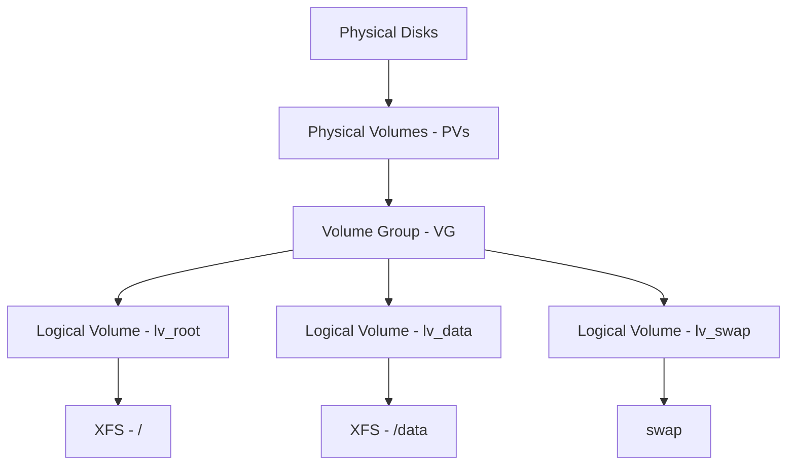

# How to Manage LVM Volume Groups Using the Cockpit Web Console on RHEL

Author: [nawazdhandala](https://www.github.com/nawazdhandala)

Tags: RHEL, Cockpit, LVM, Storage, Linux

Description: A hands-on guide to creating and managing LVM volume groups, logical volumes, and snapshots using the Cockpit web console on RHEL.

---

LVM (Logical Volume Manager) is the storage layer that gives you flexibility to resize, snapshot, and reorganize your disks without downtime. It's the default for RHEL installations, and Cockpit's storage page gives you full control over volume groups, logical volumes, and physical volumes through a visual interface.

## LVM Architecture

Before diving into Cockpit, here's how the LVM layers stack up:



- **Physical Volumes (PVs)** - raw disks or partitions marked for LVM use
- **Volume Groups (VGs)** - pools of storage made from one or more PVs
- **Logical Volumes (LVs)** - the actual "partitions" you format and mount

The key advantage is that VGs can span multiple physical disks, and LVs can be resized on the fly.

## Viewing Existing LVM Configuration

In Cockpit, go to Storage. If your RHEL system was installed with the default layout, you'll see a volume group (typically named `rhel` or `cs`) with logical volumes for root, swap, and possibly home.

From the CLI:

```bash
# Show physical volumes
sudo pvs

# Show volume groups
sudo vgs

# Show logical volumes
sudo lvs

# Detailed view of everything
sudo pvdisplay
sudo vgdisplay
sudo lvdisplay
```

## Creating a Physical Volume

To use a new disk with LVM, you first need to initialize it as a physical volume. In Cockpit, when you create a new volume group, you select the disks and Cockpit handles the PV creation automatically.

From the CLI:

```bash
# Initialize a disk as a physical volume
sudo pvcreate /dev/sdb

# Verify
sudo pvs
```

## Creating a Volume Group in Cockpit

On the Storage page, click "Create volume group" (or the "+" button near the Volume Groups section). Fill in:

- **Name** - a descriptive name for the VG (e.g., `data_vg`)
- **Disks** - select one or more disks to include

Click "Create" and the volume group appears on the storage page.

```bash
# CLI equivalent
sudo pvcreate /dev/sdb /dev/sdc
sudo vgcreate data_vg /dev/sdb /dev/sdc

# Verify
sudo vgs
```

## Creating a Logical Volume in Cockpit

Click on the volume group, then click "Create new logical volume." Specify:

- **Name** - the LV name (e.g., `lv_data`)
- **Purpose** - Block device or filesystem (choose filesystem for most cases)
- **Size** - how much space to allocate
- **Filesystem** - XFS, ext4, etc.
- **Mount point** - where to mount it

Cockpit creates the LV, formats it, mounts it, and adds the fstab entry.

```bash
# CLI equivalent: create a 100GB logical volume
sudo lvcreate -n lv_data -L 100G data_vg

# Format with XFS
sudo mkfs.xfs /dev/data_vg/lv_data

# Create mount point and mount
sudo mkdir -p /data
sudo mount /dev/data_vg/lv_data /data

# Add to fstab
echo '/dev/data_vg/lv_data /data xfs defaults 0 0' | sudo tee -a /etc/fstab
```

## Resizing a Logical Volume

This is where LVM really shines. You can grow a logical volume and its filesystem without unmounting.

In Cockpit, click on the logical volume and click "Resize." Drag the slider or enter the new size.

Growing a volume (the common case):

```bash
# Extend the logical volume by 50GB
sudo lvextend -L +50G /dev/data_vg/lv_data

# Grow the XFS filesystem to fill the new space
sudo xfs_growfs /data

# Or for ext4 filesystems
# sudo resize2fs /dev/data_vg/lv_data
```

You can also use `lvextend -r` to extend and resize the filesystem in one command:

```bash
# Extend and resize filesystem in one step
sudo lvextend -r -L +50G /dev/data_vg/lv_data
```

Shrinking works too, but only for ext4 (XFS cannot be shrunk):

```bash
# Shrink an ext4 logical volume (must unmount first)
sudo umount /data
sudo e2fsck -f /dev/data_vg/lv_data
sudo resize2fs /dev/data_vg/lv_data 50G
sudo lvreduce -L 50G /dev/data_vg/lv_data
sudo mount /data
```

## Extending a Volume Group

When you run out of space in a volume group, add another physical disk. In Cockpit, click on the volume group and select "Add disk."

```bash
# Add a new disk to an existing volume group
sudo pvcreate /dev/sdd
sudo vgextend data_vg /dev/sdd

# Verify the new size
sudo vgs
```

Now you have more space available for creating or expanding logical volumes.

## Creating LVM Snapshots

Snapshots capture the state of a logical volume at a point in time. They're useful for backups and testing changes safely.

In Cockpit, some versions support snapshot creation from the LV detail page.

```bash
# Create a snapshot of lv_data (allocate 10GB for changes)
sudo lvcreate -s -n lv_data_snap -L 10G /dev/data_vg/lv_data

# List snapshots
sudo lvs -o name,lv_attr,origin,snap_percent

# Mount the snapshot read-only for backup
sudo mkdir -p /mnt/snapshot
sudo mount -o ro /dev/data_vg/lv_data_snap /mnt/snapshot
```

Revert to a snapshot (destroys current data):

```bash
# Unmount the LV and the snapshot
sudo umount /data
sudo umount /mnt/snapshot

# Merge the snapshot back (reverts to snapshot state)
sudo lvconvert --merge /dev/data_vg/lv_data_snap

# Remount
sudo mount /data
```

Remove a snapshot when you no longer need it:

```bash
sudo umount /mnt/snapshot
sudo lvremove /dev/data_vg/lv_data_snap
```

## Thin Provisioning

Thin provisioning lets you over-allocate storage. You create a thin pool, then create thin volumes from it that only consume space as data is written.

```bash
# Create a thin pool using 80% of the VG
sudo lvcreate -T -l 80%VG -n thin_pool data_vg

# Create thin volumes (can exceed pool size)
sudo lvcreate -T -n thin_vol1 -V 100G data_vg/thin_pool
sudo lvcreate -T -n thin_vol2 -V 100G data_vg/thin_pool

# Check actual usage
sudo lvs -o name,lv_size,data_percent data_vg
```

Cockpit displays thin pools and thin volumes in the storage view, making it easy to monitor actual usage versus allocated size.

## Deleting Logical Volumes

In Cockpit, click on the logical volume and select "Delete." Cockpit unmounts the filesystem and removes the fstab entry.

```bash
# Unmount first
sudo umount /data

# Remove the logical volume
sudo lvremove /dev/data_vg/lv_data

# Remove the fstab entry manually
sudo vi /etc/fstab
```

## Deleting a Volume Group

Remove all logical volumes first, then delete the VG:

```bash
# Remove the volume group
sudo vgremove data_vg

# Remove the physical volume labels
sudo pvremove /dev/sdb /dev/sdc
```

## Moving Data Between Physical Volumes

If you need to replace a disk in a volume group, move the data off it first:

```bash
# Move all data from sdb to sdc within the same VG
sudo pvmove /dev/sdb /dev/sdc

# Monitor the progress
sudo pvmove -v /dev/sdb

# Once complete, remove the old disk from the VG
sudo vgreduce data_vg /dev/sdb
sudo pvremove /dev/sdb
```

## LVM Quick Reference

| Task | CLI Command |
|------|-------------|
| Create PV | `pvcreate /dev/sdX` |
| Create VG | `vgcreate vg_name /dev/sdX` |
| Create LV | `lvcreate -n lv_name -L size vg_name` |
| Extend LV | `lvextend -r -L +size /dev/vg/lv` |
| Add disk to VG | `vgextend vg_name /dev/sdX` |
| Create snapshot | `lvcreate -s -n snap -L size /dev/vg/lv` |
| Show all | `pvs`, `vgs`, `lvs` |

## Wrapping Up

Cockpit's LVM management makes volume operations visual and intuitive. Creating volume groups, allocating logical volumes, and resizing them are all point-and-click operations. For snapshots, thin provisioning, and data migration between physical volumes, you may need the CLI, but the basics are well covered in the web interface. The ability to resize logical volumes without downtime is one of LVM's biggest advantages, and Cockpit makes it accessible to anyone who can use a web browser.
