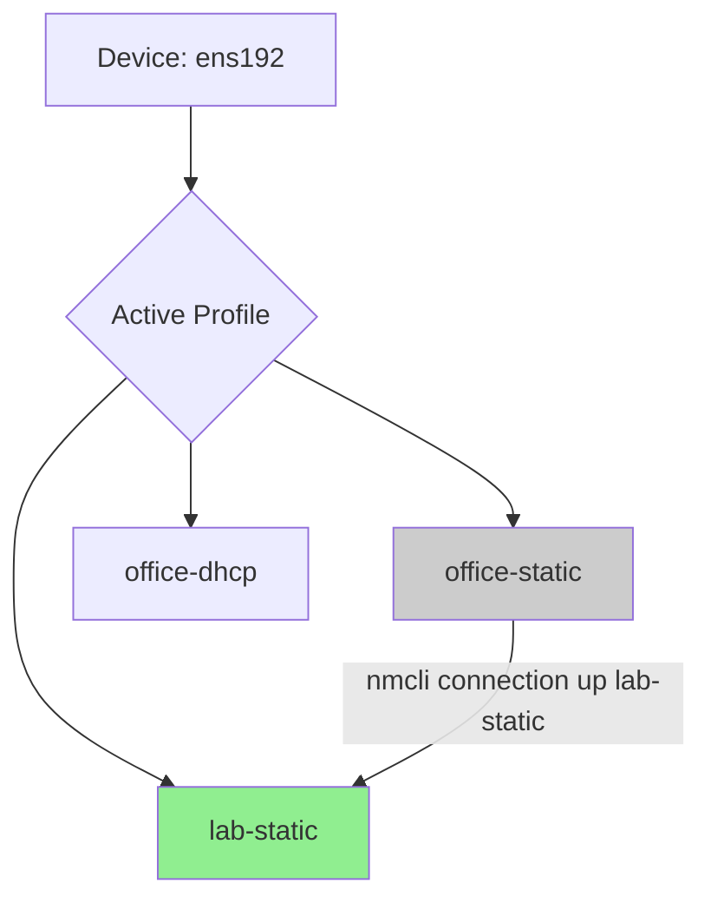

# How to Manage Network Connections with nmcli on RHEL

Author: [nawazdhandala](https://www.github.com/nawazdhandala)

Tags: RHEL, Nmcli, Network Connections, Linux

Description: A comprehensive guide to managing network connections on RHEL using the nmcli command-line tool, covering everything from listing and creating connections to advanced management tasks.

---

The nmcli tool is the primary command-line interface for NetworkManager on RHEL. Whether you are configuring a single server or scripting network setups across hundreds of machines, nmcli gives you full control over every aspect of your network connections. This post covers the day-to-day operations you will use most often.

## Getting Started with nmcli

The nmcli command follows a consistent pattern: `nmcli <object> <action> [arguments]`. The main objects you will work with are `connection`, `device`, `general`, and `networking`.

### Checking Overall Network Status

```bash
# Show the general NetworkManager status
nmcli general status

# Check if networking is enabled
nmcli networking

# Show connectivity state (none, portal, limited, full)
nmcli networking connectivity
```

## Listing Connections and Devices

```bash
# List all configured connection profiles
nmcli connection show

# List only active connections
nmcli connection show --active

# List all network devices
nmcli device status
```

The difference between connections and devices is important. A device is a physical or virtual network interface. A connection is a configuration profile that can be applied to a device. You can have multiple connection profiles for a single device, but only one can be active at a time.

## Creating New Connections

### Basic Ethernet Connection with DHCP

```bash
# Create a DHCP-based ethernet connection
nmcli connection add \
  con-name "office-dhcp" \
  ifname ens192 \
  type ethernet \
  ipv4.method auto
```

### Static IP Connection

```bash
# Create a connection with a static IP
nmcli connection add \
  con-name "office-static" \
  ifname ens192 \
  type ethernet \
  ipv4.method manual \
  ipv4.addresses 10.0.1.50/24 \
  ipv4.gateway 10.0.1.1 \
  ipv4.dns "10.0.1.2,10.0.1.3"
```

### VLAN Connection

```bash
# Create a VLAN connection on top of an ethernet interface
nmcli connection add \
  con-name "vlan100" \
  ifname vlan100 \
  type vlan \
  vlan.parent ens192 \
  vlan.id 100 \
  ipv4.method manual \
  ipv4.addresses 10.100.0.50/24
```

## Modifying Existing Connections

The `connection modify` subcommand lets you change any property of a connection profile:

```bash
# Change the DNS servers
nmcli connection modify office-static ipv4.dns "1.1.1.1,1.0.0.1"

# Add a secondary DNS search domain
nmcli connection modify office-static +ipv4.dns-search "internal.example.com"

# Remove a specific DNS server
nmcli connection modify office-static -ipv4.dns "1.0.0.1"

# Disable IPv6
nmcli connection modify office-static ipv6.method disabled

# Set the connection to auto-connect on boot
nmcli connection modify office-static connection.autoconnect yes

# Set connection priority (higher number = higher priority)
nmcli connection modify office-static connection.autoconnect-priority 100
```

Note the `+` and `-` prefixes. Using `+` appends a value to a list property, while `-` removes a value from a list.

## Activating and Deactivating Connections

```bash
# Activate a connection profile
nmcli connection up office-static

# Deactivate a connection (the interface goes down)
nmcli connection down office-static

# Activate a connection on a specific device
nmcli connection up office-static ifname ens192
```

## Switching Between Connection Profiles

A common pattern is to have multiple profiles for the same interface - for example, one for the office network and one for a lab network:

```bash
# Switch from one profile to another on the same device
nmcli connection up lab-static
```

When you activate a new connection on a device that already has an active connection, the old one is deactivated automatically.



## Deleting Connections

```bash
# Delete a connection profile
nmcli connection delete office-dhcp

# Delete multiple connections at once
nmcli connection delete office-dhcp lab-static
```

## Viewing Connection Details

```bash
# Show all properties of a connection
nmcli connection show office-static

# Filter for specific properties
nmcli connection show office-static | grep ipv4

# Show connection details in a key-value format useful for scripting
nmcli -t -f ipv4.addresses,ipv4.gateway connection show office-static
```

## Working with Devices

```bash
# Show detailed info about a device
nmcli device show ens192

# Disconnect a device (no connection will be active)
nmcli device disconnect ens192

# Connect a device (activates the best available profile)
nmcli device connect ens192

# Set a device as managed or unmanaged by NetworkManager
nmcli device set ens192 managed yes
```

## Using nmcli for Scripting

The `-t` (terse) flag and `-f` (fields) flag are essential for scripting:

```bash
# Get just the IP address in a script-friendly format
nmcli -t -f IP4.ADDRESS device show ens192

# List connection names only, one per line
nmcli -t -f NAME connection show

# Get the active connection name for a specific device
nmcli -t -f GENERAL.CONNECTION device show ens192
```

You can also use the `--wait` flag for operations that might take time:

```bash
# Wait up to 30 seconds for the connection to activate
nmcli --wait 30 connection up office-static
```

## Monitoring Network Changes

nmcli has a built-in monitor mode that watches for changes in real time:

```bash
# Monitor all NetworkManager events
nmcli monitor

# Monitor connection changes specifically
nmcli connection monitor office-static
```

This is useful for debugging connectivity issues or watching how the system responds to cable plugs and unplugs.

## Connection Properties Reference

Here are some of the most commonly used connection properties:

| Property | Description | Example |
|---|---|---|
| `ipv4.method` | How to obtain an IPv4 address | `auto`, `manual`, `disabled` |
| `ipv4.addresses` | Static IP address(es) | `192.168.1.100/24` |
| `ipv4.gateway` | Default gateway | `192.168.1.1` |
| `ipv4.dns` | DNS servers | `8.8.8.8,8.8.4.4` |
| `ipv4.dns-search` | DNS search domains | `example.com` |
| `connection.autoconnect` | Auto-activate on boot | `yes`, `no` |
| `connection.autoconnect-priority` | Priority for auto-activation | `0` to `999` |
| `802-3-ethernet.mtu` | Interface MTU | `9000` |

## Practical Tips

**Tab completion works.** If you have bash-completion installed, nmcli supports tab completion for subcommands, connection names, and even property names.

**Use `nmcli connection load` after manual edits.** If you edit a keyfile directly in `/etc/NetworkManager/system-connections/`, tell NetworkManager to reload it:

```bash
# Reload a specific connection file after manual edit
nmcli connection load /etc/NetworkManager/system-connections/office-static.nmconnection
```

**Check the logs when things go wrong.** NetworkManager logs extensively to the journal:

```bash
# View recent NetworkManager logs
journalctl -u NetworkManager --since "5 minutes ago" --no-pager
```

## Wrapping Up

nmcli is a powerful tool that covers the full lifecycle of network connection management on RHEL. Once you get comfortable with the `connection` and `device` subcommands, you can handle pretty much any networking task from the command line. The terse output mode makes it easy to integrate into shell scripts and automation tools, and the monitor mode is invaluable for real-time troubleshooting.
