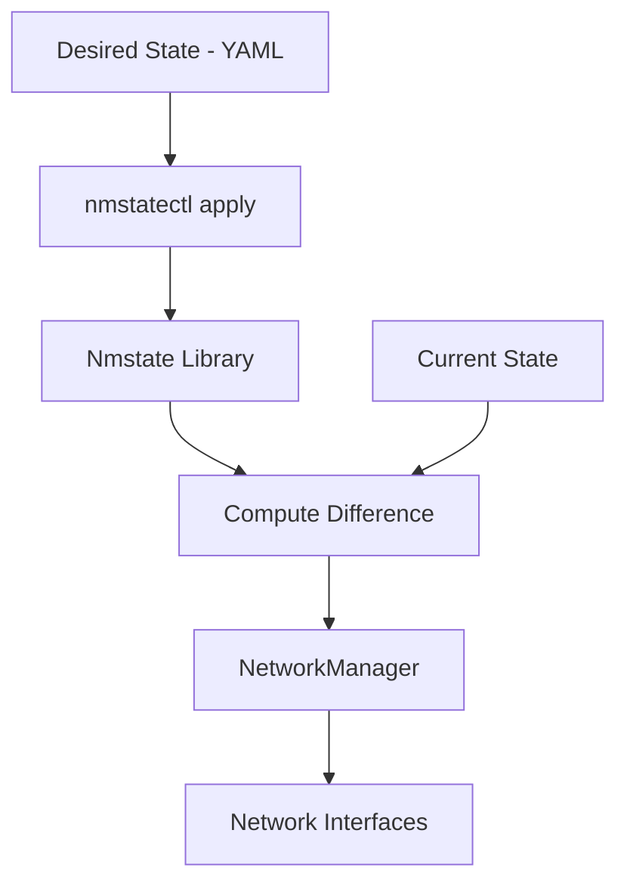

# How to Manage Network Interfaces Using Nmstate (nmstatectl) on RHEL

Author: [nawazdhandala](https://www.github.com/nawazdhandala)

Tags: RHEL, Nmstate, nmstatectl, Networking, Linux

Description: Learn how to use Nmstate and nmstatectl for declarative network configuration on RHEL, using YAML-based state definitions for reproducible network setups.

---

If you have ever wished you could describe your desired network state in a YAML file and just apply it, Nmstate is exactly what you are looking for. It is a declarative network management library that comes with RHEL and provides a higher-level abstraction over NetworkManager. Instead of running a sequence of nmcli commands, you define what you want the network to look like, and Nmstate figures out how to get there.

## What is Nmstate?

Nmstate is a network state management library that:

- Reads the current network state as structured data (YAML or JSON)
- Accepts a desired state definition
- Computes the difference and applies only the necessary changes
- Works through NetworkManager under the hood

The command-line tool for Nmstate is `nmstatectl`.



## Installing Nmstate

Nmstate is available in the default RHEL repositories:

```bash
# Install nmstate
dnf install nmstate -y

# Verify the installation
nmstatectl version
```

## Viewing the Current Network State

```bash
# Show the full current network state
nmstatectl show

# Show the state of a specific interface
nmstatectl show ens192

# Output as JSON instead of YAML
nmstatectl show --json
```

The output is a YAML document describing every aspect of your current network configuration:

```yaml
---
dns-resolver:
  config:
    server:
    - 10.0.1.2
    search:
    - example.com
routes:
  config:
  - destination: 0.0.0.0/0
    next-hop-address: 10.0.1.1
    next-hop-interface: ens192
interfaces:
- name: ens192
  type: ethernet
  state: up
  ipv4:
    enabled: true
    dhcp: false
    address:
    - ip: 10.0.1.50
      prefix-length: 24
  ipv6:
    enabled: true
    dhcp: true
    autoconf: true
```

## Applying a Desired State

The core workflow is: define your desired state in a YAML file, then apply it.

### Basic Static IP Configuration

```bash
# Create a desired state file
cat > /tmp/static-ip.yaml << 'EOF'
---
dns-resolver:
  config:
    server:
    - 10.0.1.2
    - 10.0.1.3
    search:
    - example.com
routes:
  config:
  - destination: 0.0.0.0/0
    next-hop-address: 10.0.1.1
    next-hop-interface: ens192
interfaces:
- name: ens192
  type: ethernet
  state: up
  ipv4:
    enabled: true
    dhcp: false
    address:
    - ip: 10.0.1.50
      prefix-length: 24
  ipv6:
    enabled: false
EOF

# Apply the desired state
nmstatectl apply /tmp/static-ip.yaml
```

Nmstate reads the file, compares it to the current state, and makes only the changes necessary to reach the desired state.

### DHCP Configuration

```bash
cat > /tmp/dhcp.yaml << 'EOF'
---
interfaces:
- name: ens192
  type: ethernet
  state: up
  ipv4:
    enabled: true
    dhcp: true
  ipv6:
    enabled: true
    dhcp: true
    autoconf: true
EOF

nmstatectl apply /tmp/dhcp.yaml
```

## Partial State Application

One of the best features of Nmstate is that you only need to specify the parts of the state you want to change. Everything else stays as it is:

```bash
# Only change the DNS servers, leave everything else alone
cat > /tmp/dns-only.yaml << 'EOF'
---
dns-resolver:
  config:
    server:
    - 1.1.1.1
    - 1.0.0.1
EOF

nmstatectl apply /tmp/dns-only.yaml
```

## Configuring Bonds

Nmstate makes complex configurations like bonds much cleaner:

```bash
cat > /tmp/bond.yaml << 'EOF'
---
interfaces:
- name: bond0
  type: bond
  state: up
  link-aggregation:
    mode: active-backup
    options:
      miimon: 100
      primary: ens192
    port:
    - ens192
    - ens224
  ipv4:
    enabled: true
    dhcp: false
    address:
    - ip: 10.0.1.50
      prefix-length: 24
  ipv6:
    enabled: false
routes:
  config:
  - destination: 0.0.0.0/0
    next-hop-address: 10.0.1.1
    next-hop-interface: bond0
EOF

nmstatectl apply /tmp/bond.yaml
```

## Configuring VLANs

```bash
cat > /tmp/vlan.yaml << 'EOF'
---
interfaces:
- name: ens192.100
  type: vlan
  state: up
  vlan:
    base-iface: ens192
    id: 100
  ipv4:
    enabled: true
    dhcp: false
    address:
    - ip: 10.100.0.50
      prefix-length: 24
EOF

nmstatectl apply /tmp/vlan.yaml
```

## Configuring Linux Bridges

```bash
cat > /tmp/bridge.yaml << 'EOF'
---
interfaces:
- name: br0
  type: linux-bridge
  state: up
  bridge:
    port:
    - name: ens192
      stp-hairpin-mode: false
      stp-path-cost: 100
    options:
      stp:
        enabled: true
  ipv4:
    enabled: true
    dhcp: false
    address:
    - ip: 10.0.1.50
      prefix-length: 24
EOF

nmstatectl apply /tmp/bridge.yaml
```

## Rolling Back Changes

Nmstate supports rollback. When you apply a state, it creates a checkpoint. If something goes wrong, the system automatically rolls back after a timeout:

```bash
# Apply with a 60-second auto-rollback timeout
nmstatectl apply /tmp/new-config.yaml --no-commit

# If everything looks good within 60 seconds, commit the changes
nmstatectl commit

# Or explicitly rollback
nmstatectl rollback
```

This is incredibly useful for remote servers where a bad network change could lock you out. If you do not commit within the timeout period, the changes revert automatically.

## Verifying State

After applying a state, verify that reality matches your desired state:

```bash
# Show the current state
nmstatectl show ens192

# Compare current state against a desired state file
nmstatectl show > /tmp/current-state.yaml
diff /tmp/desired-state.yaml /tmp/current-state.yaml
```

## Using Nmstate with Ansible

Nmstate integrates well with Ansible through the `nmstate` role:

```yaml
# Ansible playbook example
- name: Configure network with Nmstate
  hosts: webservers
  roles:
    - role: rhel-system-roles.network
      network_state:
        interfaces:
        - name: ens192
          type: ethernet
          state: up
          ipv4:
            enabled: true
            dhcp: false
            address:
            - ip: "{{ ansible_host }}"
              prefix-length: 24
```

## Nmstate vs. nmcli

| Feature | nmstatectl | nmcli |
|---|---|---|
| Configuration style | Declarative (YAML) | Imperative (commands) |
| Partial updates | Yes | Yes |
| Rollback support | Built-in | Manual |
| Complex configs (bonds, bridges) | Single file | Multiple commands |
| Scripting | YAML files | Shell commands |
| Learning curve | Moderate | Moderate |
| Version control friendly | Very (YAML files) | Less (shell scripts) |

## Practical Workflow

Here is how I typically use Nmstate in production:

```bash
# 1. Capture the current state
nmstatectl show > /tmp/before.yaml

# 2. Create your desired state file
vi /tmp/desired.yaml

# 3. Apply with no-commit for safety
nmstatectl apply /tmp/desired.yaml --no-commit

# 4. Verify connectivity
ping -c 3 10.0.1.1
ssh user@remote-server "echo reachable"

# 5. If everything works, commit
nmstatectl commit

# 6. Save the applied state for documentation
nmstatectl show > /etc/nmstate/ens192-config.yaml
```

## Removing an Interface

To bring down and remove an interface configuration:

```bash
cat > /tmp/remove-vlan.yaml << 'EOF'
---
interfaces:
- name: ens192.100
  type: vlan
  state: absent
EOF

nmstatectl apply /tmp/remove-vlan.yaml
```

Setting `state: absent` tells Nmstate to remove the interface configuration.

## Wrapping Up

Nmstate brings a declarative, state-based approach to network configuration on RHEL. It is particularly valuable for complex setups involving bonds, bridges, and VLANs where a single YAML file is much clearer than a sequence of nmcli commands. The built-in rollback feature makes it safe to use on remote servers, and the YAML format makes your network configurations easy to version control and review. If you are managing more than a handful of servers, Nmstate is worth adding to your toolkit.
