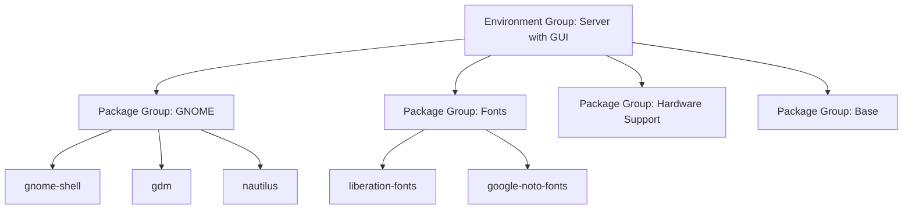

# How to Manage Package Groups and Environment Groups with DNF on RHEL

Author: [nawazdhandala](https://www.github.com/nawazdhandala)

Tags: RHEL, DNF, Package Groups, Linux, System Administration

Description: Learn how to work with DNF package groups and environment groups on RHEL to install, manage, and remove collections of related packages efficiently.

---

Installing packages one at a time is fine when you need a single tool, but when you are setting up a server for a specific role, you often need a whole set of related packages. That is what package groups are for. RHEL ships with groups for common workloads like web servers, development tools, and graphical desktops. This guide covers how to find, install, and manage them.

## What Are Package Groups?

A package group is a named collection of RPM packages that serve a common purpose. Instead of remembering every individual package you need for C development, you install the "Development Tools" group and get gcc, make, gdb, and everything else in one shot.

RHEL has two levels of grouping:

- **Package Groups** - Collections of packages for a specific task (e.g., "Development Tools," "System Tools")
- **Environment Groups** - Larger collections that define an entire system role (e.g., "Server with GUI," "Minimal Install"), which can include multiple package groups



## Listing Available Groups

### List All Package Groups

```bash
# Show all available package groups
dnf group list
```

This output is divided into "Available Environment Groups" and "Available Groups." Groups you have already installed show under "Installed" sections.

### Show Hidden Groups

Some groups are hidden by default. To see everything:

```bash
# List all groups including hidden ones
dnf group list --hidden
```

### List with Group IDs

Group names can contain spaces, which makes them awkward to use on the command line. Use `--ids` to see the machine-friendly identifiers:

```bash
# Show group IDs alongside names
dnf group list --ids
```

You will see output like:

```bash
Available Groups:
   RPM Development Tools (rpm-development-tools)
   Development Tools (development)
   System Tools (system-tools)
```

The string in parentheses is the group ID, which is easier to use in commands and scripts.

## Getting Group Information

Before installing a group, look at what is inside:

```bash
# Show the packages in a group
dnf group info "Development Tools"
```

The output categorizes packages into three types:

- **Mandatory** - Always installed with the group
- **Default** - Installed by default, but can be excluded
- **Optional** - Not installed by default, but available as part of the group

Example output:

```bash
Group: Development Tools
 Mandatory Packages:
   autoconf
   automake
   gcc
   gcc-c++
   make
 Default Packages:
   bison
   flex
   gdb
   libtool
   strace
 Optional Packages:
   cmake
   ccache
   valgrind
```

## Installing Package Groups

### Install with Default Packages

```bash
# Install the Development Tools group (mandatory + default packages)
sudo dnf group install "Development Tools"
```

Or use the group ID:

```bash
# Same thing using the group ID
sudo dnf group install development
```

### Install with Optional Packages

If you want everything, including optional packages:

```bash
# Install the group with optional packages included
sudo dnf group install --with-optional "Development Tools"
```

### Install Only Mandatory Packages

To get the minimum viable set:

```bash
# Install mandatory packages only, skip defaults
sudo dnf group install --setopt=group_package_types=mandatory "Development Tools"
```

### Install Using the @ Shorthand

DNF supports a convenient shorthand with the `@` prefix:

```bash
# The @ prefix is shorthand for group install
sudo dnf install @development

# For environment groups, use @^ prefix
sudo dnf install @"Development Tools"
```

## Working with Environment Groups

Environment groups are bigger collections that define a full system role. They are typically chosen during installation, but you can switch or augment them afterward.

### List Environment Groups

```bash
# List available environment groups
dnf group list --ids | head -20
```

Common environment groups in RHEL:

- `server-product-environment` - Server
- `graphical-server-environment` - Server with GUI
- `minimal-environment` - Minimal Install
- `workstation-product-environment` - Workstation

### Install an Environment Group

```bash
# Add a graphical desktop to a minimal server installation
sudo dnf group install "Server with GUI"
```

This can install hundreds of packages, so review the transaction summary carefully.

### View Environment Group Contents

```bash
# See which package groups make up the Server with GUI environment
dnf group info "Server with GUI"
```

## Removing Package Groups

### Remove a Group

```bash
# Remove the Development Tools group and its packages
sudo dnf group remove "Development Tools"
```

This removes packages that were installed as part of the group, but it will not remove packages that are still required by other installed packages or groups.

### What Actually Gets Removed?

DNF tracks which packages were installed as part of a group. When you remove a group:

- Packages exclusive to that group get removed
- Packages shared with other installed groups stay
- Packages you installed individually outside the group stay

```bash
# Check which packages are associated with a group
dnf group info --installed "Development Tools"
```

## Updating Groups

When a group definition changes (new packages added to mandatory or default lists), you can bring your installation in sync:

```bash
# Update a group to match the current definition
sudo dnf group upgrade "Development Tools"
```

This installs any newly added mandatory and default packages without touching what is already there.

## Practical Scenarios

### Setting Up a Web Server

```bash
# Check what is in the web server group
dnf group info "Basic Web Server"

# Install it
sudo dnf group install "Basic Web Server"

# Verify httpd is installed and start it
rpm -q httpd
sudo systemctl enable --now httpd
```

### Adding Development Tools to a Minimal Install

A common pattern: you installed a minimal system and now need to compile something.

```bash
# Install development tools
sudo dnf group install development -y

# Verify gcc is available
gcc --version
```

### Converting a Minimal Install to a GUI Desktop

```bash
# Install the full GUI environment
sudo dnf group install "Server with GUI" -y

# Set the default boot target to graphical
sudo systemctl set-default graphical.target

# Reboot into the GUI
sudo systemctl reboot
```

## Tracking Group Status

### See What Groups Are Installed

```bash
# List installed groups
dnf group list --installed
```

### Check Group Installation Status

```bash
# Detailed status of a specific group
dnf group info --installed "Development Tools"
```

### The Group Mark Commands

If you installed packages manually that happen to match a group's package list, DNF does not know the group is "installed." You can mark it:

```bash
# Mark a group as installed without installing packages
sudo dnf group mark install "Development Tools"

# Mark a group as not installed (for cleanup)
sudo dnf group mark remove "Development Tools"
```

This is useful for tracking purposes and for `dnf group upgrade` to work correctly.

## Tips for Managing Groups

1. **Check before you install.** Always run `dnf group info` first. Some groups install more than you expect, especially environment groups that can pull in hundreds of packages.

2. **Use group IDs in scripts.** Group names can change between minor releases. Group IDs are more stable and do not require quoting.

3. **Keep track of your groups.** Run `dnf group list --installed` periodically and document why each group is there.

4. **Use `--with-optional` sparingly.** Optional packages are optional for a reason. They add bulk and attack surface.

5. **Prefer groups over manual package lists.** When a group exists for your use case, use it. Red Hat updates group definitions to include new dependencies and tools, which you get for free with `dnf group upgrade`.

Package groups are a productivity multiplier for sysadmins. They codify the "what do I need for X?" question into a single command. Once you get comfortable with them, setting up new servers goes from a 20-minute checklist to a couple of commands.
