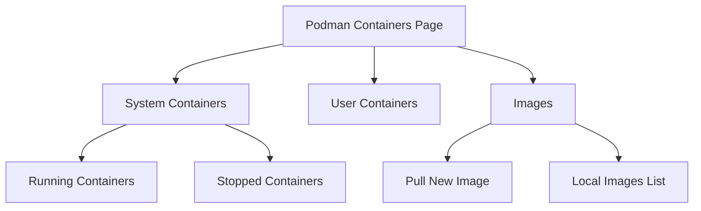

# How to Manage Podman Containers Using the Cockpit Web Console on RHEL 9

Author: [nawazdhandala](https://www.github.com/nawazdhandala)

Tags: RHEL, Cockpit, Podman, Containers, Linux

Description: Learn how to manage Podman containers through the Cockpit web console on RHEL 9, including pulling images, running containers, and managing container lifecycles.

---

Podman is the default container runtime on RHEL 9, and the Cockpit integration gives you a clean interface for managing containers without memorizing all the CLI flags. It's especially handy for quick deployments and for team members who are more comfortable with a visual interface than a terminal.

## Installing the Cockpit Podman Module

The Podman module for Cockpit isn't installed by default. You need both Podman and the Cockpit add-on.

Install the required packages:

```bash
# Install Podman if not already present
sudo dnf install podman -y

# Install the Cockpit Podman integration
sudo dnf install cockpit-podman -y
```

Refresh your browser after installation. A "Podman containers" entry will appear in the sidebar.

## The Podman Containers Page

The page is divided into sections:

- **Containers** - all running and stopped containers
- **Images** - locally available container images

You can switch between viewing system containers (run as root) and user containers (run as your login user). This maps directly to Podman's rootful vs rootless modes.



## Pulling Container Images

Click on "Images" and then "Download new image" (or "Pull"). Enter the image name, for example:

- `docker.io/library/nginx`
- `registry.access.redhat.com/ubi9/ubi`
- `docker.io/library/postgres:16`

Cockpit pulls the image and shows progress. The CLI equivalent:

```bash
# Pull an image from a registry
podman pull docker.io/library/nginx:latest

# Pull a Red Hat Universal Base Image
podman pull registry.access.redhat.com/ubi9/ubi

# List local images
podman images
```

## Creating and Running a Container

Click "Create container" and fill in the details:

- **Image** - select from locally available images
- **Name** - a friendly container name
- **Command** - override the default command (optional)
- **Port mapping** - map host ports to container ports
- **Volumes** - mount host directories into the container
- **Environment variables** - pass configuration values

For example, to run an nginx web server:

- Image: `docker.io/library/nginx`
- Name: `my-nginx`
- Port mapping: 8080 (host) to 80 (container)

The CLI equivalent:

```bash
# Run an nginx container with port mapping
podman run -d \
    --name my-nginx \
    -p 8080:80 \
    docker.io/library/nginx:latest

# Verify it's running
podman ps
```

## Managing Container Lifecycle

Each container in the list has action buttons for:

- **Start** - start a stopped container
- **Stop** - gracefully stop a running container
- **Restart** - stop and start
- **Delete** - remove the container
- **Commit** - save the current state as a new image

```bash
# CLI equivalents
podman start my-nginx
podman stop my-nginx
podman restart my-nginx
podman rm my-nginx
podman commit my-nginx my-custom-nginx
```

## Viewing Container Logs

Click on a container name to see its detail page. The "Logs" tab shows the container's stdout/stderr output in real time. This is the same as:

```bash
# Follow container logs
podman logs -f my-nginx

# Show the last 50 lines
podman logs --tail 50 my-nginx
```

The Cockpit log viewer shows timestamps and lets you scroll through the history.

## Accessing a Container Shell

On the container detail page, there's a "Console" tab that gives you a shell inside the container. This is equivalent to:

```bash
# Open a bash shell in a running container
podman exec -it my-nginx /bin/bash

# Or sh if bash isn't available
podman exec -it my-nginx /bin/sh
```

This is useful for debugging issues inside the container without leaving the browser.

## Container Resource Usage

The container detail page shows CPU and memory usage for the running container. For more detailed stats from the CLI:

```bash
# Real-time resource usage
podman stats my-nginx

# One-shot stats for all containers
podman stats --no-stream
```

## Working with Volumes

When creating a container in Cockpit, you can add volume mounts. Specify the host path and the container path.

```bash
# Run a container with a volume mount
podman run -d \
    --name my-nginx \
    -p 8080:80 \
    -v /srv/www:/usr/share/nginx/html:Z \
    docker.io/library/nginx:latest
```

The `:Z` suffix is important on SELinux-enabled RHEL systems. It tells Podman to relabel the files for container access. Cockpit's form includes an option for this.

## Environment Variables

You can pass environment variables when creating a container. This is common for database containers that need initial configuration.

```bash
# Run PostgreSQL with environment variables
podman run -d \
    --name my-postgres \
    -p 5432:5432 \
    -e POSTGRES_USER=admin \
    -e POSTGRES_PASSWORD=secretpass \
    -e POSTGRES_DB=myapp \
    docker.io/library/postgres:16
```

In Cockpit, there's an "Environment variables" section in the container creation form where you add key-value pairs.

## Managing Images

The Images section shows all locally stored images with their tags, sizes, and creation dates. You can:

- **Delete** unused images to free disk space
- **Pull** new images from registries

```bash
# List all local images
podman images

# Remove an unused image
podman rmi docker.io/library/nginx:latest

# Remove all unused images
podman image prune -a
```

## Running Containers as systemd Services

For production use, you want containers to start automatically on boot. Podman integrates with systemd to make this possible.

Generate a systemd unit file for a container:

```bash
# Generate a systemd service file for an existing container
podman generate systemd --name my-nginx --new --files

# Move the generated file to the systemd directory
sudo mv container-my-nginx.service /etc/systemd/system/

# Enable and start the service
sudo systemctl daemon-reload
sudo systemctl enable --now container-my-nginx.service
```

For rootless containers, place the unit file in `~/.config/systemd/user/` and use `systemctl --user`.

## Practical Example: Running a Multi-Container Application

Let's set up a simple web application with nginx and a backend.

Create a pod and run containers in it:

```bash
# Create a pod with port mapping
podman pod create --name webapp -p 8080:80

# Run nginx in the pod
podman run -d --pod webapp \
    --name webapp-nginx \
    docker.io/library/nginx:latest

# Run a second container in the same pod
podman run -d --pod webapp \
    --name webapp-api \
    registry.access.redhat.com/ubi9/ubi \
    sleep infinity
```

Cockpit shows pods and their member containers, making it easy to see the relationship between them.

## Configuring Container Registries

If you use private registries, configure them in the Podman registries configuration:

```bash
# Edit the registries configuration
sudo vi /etc/containers/registries.conf

# Add your registry to the search list
# unqualified-search-registries = ["registry.access.redhat.com", "docker.io", "your-registry.example.com"]
```

## Wrapping Up

The Cockpit Podman integration makes container management accessible through a browser. Pulling images, running containers, viewing logs, and accessing shells are all a click away. It doesn't replace the Podman CLI for scripting and automation, but for interactive management and monitoring, it reduces the learning curve significantly. Combined with systemd integration for production deployments, you get a solid container workflow on RHEL 9.
