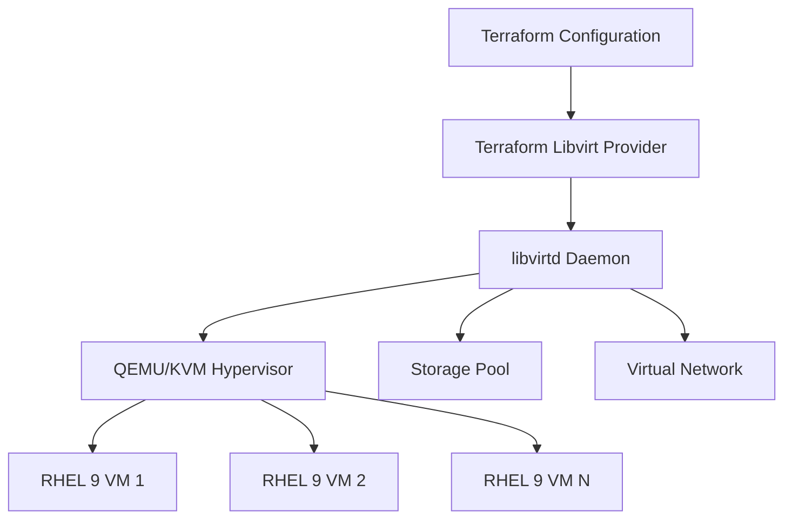

# How to Manage RHEL 9 Virtual Machines with Terraform and Libvirt

Author: [nawazdhandala](https://www.github.com/nawazdhandala)

Tags: RHEL, Terraform, Libvirt, KVM, Virtualization, Linux

Description: Learn how to use Terraform with the libvirt provider to create and manage RHEL 9 virtual machines on KVM hypervisors.

---

If you run KVM-based virtualization on RHEL, managing VMs through virt-manager or virsh commands gets tedious fast. Terraform brings declarative infrastructure management to your local hypervisor through the libvirt provider. You define what you want, and Terraform makes it happen.

## Architecture Overview



## Prerequisites

Install the required packages on your RHEL 9 hypervisor:

```bash
# Install KVM and libvirt
sudo dnf install -y qemu-kvm libvirt virt-install

# Start and enable libvirtd
sudo systemctl enable --now libvirtd

# Verify KVM support
lsmod | grep kvm
```

## Install Terraform

```bash
# Add the HashiCorp repository
sudo dnf install -y dnf-plugins-core
sudo dnf config-manager --add-repo https://rpm.releases.hashicorp.com/RHEL/hashicorp.repo

# Install Terraform
sudo dnf install -y terraform

# Verify the installation
terraform version
```

## Configure the Libvirt Provider

Create a project directory and define the provider:

```bash
# Create a working directory
mkdir -p ~/terraform-libvirt && cd ~/terraform-libvirt
```

Create `main.tf`:

```hcl
# main.tf - Define the libvirt provider and connection
terraform {
  required_providers {
    libvirt = {
      source  = "dmacvicar/libvirt"
      version = "~> 0.7"
    }
  }
}

# Connect to the local libvirt daemon
provider "libvirt" {
  uri = "qemu:///system"
}
```

## Define a Storage Pool and Volume

```hcl
# storage.tf - Create a storage pool and VM disk

# Define a storage pool for VM images
resource "libvirt_pool" "rhel_pool" {
  name = "rhel_pool"
  type = "dir"
  path = "/var/lib/libvirt/rhel_pool"
}

# Create a base volume from the RHEL 9 cloud image
resource "libvirt_volume" "rhel9_base" {
  name   = "rhel9-base.qcow2"
  pool   = libvirt_pool.rhel_pool.name
  source = "/var/lib/libvirt/images/rhel-9-base.qcow2"
  format = "qcow2"
}

# Create a VM disk based on the base image
resource "libvirt_volume" "rhel9_vm_disk" {
  name           = "rhel9-vm1.qcow2"
  pool           = libvirt_pool.rhel_pool.name
  base_volume_id = libvirt_volume.rhel9_base.id
  size           = 21474836480  # 20 GB in bytes
}
```

## Configure Cloud-Init

```hcl
# cloudinit.tf - Configure cloud-init for the VM

# Cloud-init configuration for user setup
data "template_file" "user_data" {
  template = <<-EOF
    #cloud-config
    hostname: rhel9-vm1
    users:
      - name: admin
        sudo: ALL=(ALL) NOPASSWD:ALL
        shell: /bin/bash
        ssh_authorized_keys:
          - ${file("~/.ssh/id_rsa.pub")}
    packages:
      - vim
      - curl
      - wget
    runcmd:
      - [ systemctl, enable, --now, sshd ]
  EOF
}

# Network configuration for the VM
data "template_file" "network_config" {
  template = <<-EOF
    version: 2
    ethernets:
      eth0:
        dhcp4: true
  EOF
}

# Create the cloud-init disk
resource "libvirt_cloudinit_disk" "vm_init" {
  name           = "rhel9-vm1-init.iso"
  pool           = libvirt_pool.rhel_pool.name
  user_data      = data.template_file.user_data.rendered
  network_config = data.template_file.network_config.rendered
}
```

## Define the Virtual Machine

```hcl
# vm.tf - Define the RHEL 9 virtual machine

resource "libvirt_domain" "rhel9_vm" {
  name   = "rhel9-vm1"
  memory = "2048"   # 2 GB RAM
  vcpu   = 2        # 2 virtual CPUs

  # Attach the cloud-init disk
  cloudinit = libvirt_cloudinit_disk.vm_init.id

  # Attach the main disk
  disk {
    volume_id = libvirt_volume.rhel9_vm_disk.id
  }

  # Connect to the default network
  network_interface {
    network_name   = "default"
    wait_for_lease = true
  }

  # Enable the serial console
  console {
    type        = "pty"
    target_port = "0"
    target_type = "serial"
  }

  # Graphics configuration
  graphics {
    type        = "spice"
    listen_type = "address"
    autoport    = true
  }
}

# Output the VM's IP address
output "vm_ip" {
  value = libvirt_domain.rhel9_vm.network_interface[0].addresses
}
```

## Deploy the Virtual Machine

```bash
# Initialize the Terraform project
terraform init

# Preview the changes
terraform plan

# Create the VM
terraform apply -auto-approve

# Check the VM's IP address
terraform output vm_ip
```

## Scale to Multiple VMs

Use a `count` parameter or `for_each` to create multiple VMs:

```hcl
# multi-vm.tf - Create multiple RHEL 9 VMs

variable "vm_count" {
  description = "Number of VMs to create"
  default     = 3
}

# Create a disk for each VM
resource "libvirt_volume" "rhel9_disks" {
  count          = var.vm_count
  name           = "rhel9-node-${count.index}.qcow2"
  pool           = libvirt_pool.rhel_pool.name
  base_volume_id = libvirt_volume.rhel9_base.id
  size           = 21474836480
}

# Create a VM for each disk
resource "libvirt_domain" "rhel9_nodes" {
  count  = var.vm_count
  name   = "rhel9-node-${count.index}"
  memory = "2048"
  vcpu   = 2

  disk {
    volume_id = libvirt_volume.rhel9_disks[count.index].id
  }

  network_interface {
    network_name   = "default"
    wait_for_lease = true
  }

  console {
    type        = "pty"
    target_port = "0"
    target_type = "serial"
  }
}
```

## Clean Up

```bash
# Destroy all managed resources
terraform destroy -auto-approve
```

## Troubleshooting

If Terraform cannot connect to libvirt, check the socket permissions:

```bash
# Verify libvirtd is running
sudo systemctl status libvirtd

# Check your user is in the libvirt group
groups $USER

# Add yourself to the libvirt group if needed
sudo usermod -aG libvirt $USER
newgrp libvirt
```

With Terraform and the libvirt provider, you can version-control your VM infrastructure and recreate it reliably. This approach works well for development labs, CI/CD test environments, and any scenario where you need reproducible KVM-based virtual machines on RHEL 9.
