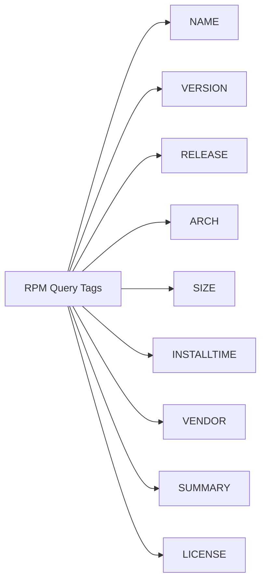

# How to Manage RPM Packages Directly with the rpm Command on RHEL

Author: [nawazdhandala](https://www.github.com/nawazdhandala)

Tags: RHEL, RPM, Package Management, Linux

Description: A hands-on guide to using the rpm command on RHEL for installing, querying, verifying, and removing RPM packages directly, with practical examples and best practices.

---

Most of the time you will use `dnf` to manage packages on RHEL. It handles dependencies, pulls from repositories, and makes life easy. But there are plenty of situations where you need to work with RPM files directly. Maybe you have a vendor-supplied `.rpm` file, you need to query what is installed on a system without network access, or you want to verify file integrity. That is where the `rpm` command comes in.

I still reach for `rpm` regularly, especially when troubleshooting or working on systems that are not fully connected. Here is everything you need to know.

## Installing Packages with rpm

The most basic operation is installing a package from a local `.rpm` file.

```bash
# Install a package from a local RPM file
sudo rpm -ivh /tmp/custom-agent-2.1.0-1.el9.x86_64.rpm
```

The flags break down like this:
- `-i` installs the package
- `-v` gives verbose output
- `-h` shows a progress bar with hash marks

### Upgrading a Package

If you have a newer version of an already-installed package:

```bash
# Upgrade a package (installs if not present, upgrades if older version exists)
sudo rpm -Uvh /tmp/custom-agent-2.2.0-1.el9.x86_64.rpm
```

The `-U` flag is generally safer than `-i` because it handles both fresh installs and upgrades. Most of the time, you should use `-Uvh` instead of `-ivh`.

### Freshening a Package

If you only want to upgrade a package that is already installed (skip if not present):

```bash
# Only upgrade if the package is already installed
sudo rpm -Fvh /tmp/custom-agent-2.2.0-1.el9.x86_64.rpm
```

## Querying Installed Packages

This is where `rpm` really shines. The query capabilities are powerful and work entirely offline.

### List All Installed Packages

```bash
# List every installed package
rpm -qa

# Sort the output alphabetically
rpm -qa --qf '%{NAME}-%{VERSION}-%{RELEASE}.%{ARCH}\n' | sort
```

### Get Package Information

```bash
# Show detailed information about an installed package
rpm -qi httpd
```

This gives you the name, version, release, architecture, install date, vendor, description, and more.

### List Files Owned by a Package

```bash
# Show all files installed by the httpd package
rpm -ql httpd
```

### Find Which Package Owns a File

This one is incredibly useful when troubleshooting:

```bash
# Find out which package installed a specific file
rpm -qf /usr/sbin/httpd
```

```bash
# Find the package that owns a configuration file
rpm -qf /etc/ssh/sshd_config
```

### List Configuration Files for a Package

```bash
# Show only configuration files belonging to a package
rpm -qc openssh-server
```

### List Documentation Files

```bash
# Show documentation files for a package
rpm -qd openssh-server
```

### Query an Uninstalled RPM File

You can query an `.rpm` file without installing it:

```bash
# Show info about an RPM file without installing
rpm -qip /tmp/custom-agent-2.1.0-1.el9.x86_64.rpm

# List files contained in an RPM file
rpm -qlp /tmp/custom-agent-2.1.0-1.el9.x86_64.rpm

# Show dependencies required by the RPM
rpm -qRp /tmp/custom-agent-2.1.0-1.el9.x86_64.rpm
```

The `-p` flag tells rpm to query the package file rather than the installed database.

## Custom Query Formats

The `--qf` (query format) option lets you extract exactly the fields you need:

```bash
# List all packages with their install dates
rpm -qa --qf '%{NAME}\t%{INSTALLTIME:date}\n' | sort -t$'\t' -k2

# List packages sorted by size (largest first)
rpm -qa --qf '%{SIZE}\t%{NAME}\n' | sort -rn | head -20

# Show the vendor for all installed packages
rpm -qa --qf '%{NAME}\t%{VENDOR}\n' | sort
```

Here is a quick reference of common query tags:



## Verifying Packages

The verify function checks installed files against the RPM database. This is great for catching unauthorized modifications.

```bash
# Verify all files installed by the openssh-server package
rpm -V openssh-server
```

If everything is fine, there is no output. If files have been modified, you get output like:

```bash
S.5....T.  c /etc/ssh/sshd_config
```

Each character in the output means something:

| Character | Meaning |
|---|---|
| S | File size changed |
| M | Mode (permissions) changed |
| 5 | MD5 checksum changed |
| D | Device major/minor changed |
| L | Symlink path changed |
| U | User ownership changed |
| G | Group ownership changed |
| T | Modification time changed |
| P | Capabilities changed |
| . | Test passed |
| c | Configuration file |

```bash
# Verify ALL installed packages (this takes a while)
rpm -Va

# Verify all packages and show only modified files
rpm -Va | grep -v "^$"
```

## Verifying Package Signatures

Before installing a third-party RPM, verify its GPG signature:

```bash
# Import Red Hat's GPG key
sudo rpm --import /etc/pki/rpm-gpg/RPM-GPG-KEY-redhat-release

# Verify the signature of an RPM file
rpm -K /tmp/custom-agent-2.1.0-1.el9.x86_64.rpm
```

A good signature looks like:

```bash
/tmp/custom-agent-2.1.0-1.el9.x86_64.rpm: digests signatures OK
```

## Removing Packages

```bash
# Remove a package
sudo rpm -e custom-agent

# Remove a package and show verbose output
sudo rpm -ev custom-agent
```

### The --nodeps Flag (Use with Caution)

Sometimes rpm refuses to remove a package because other packages depend on it:

```bash
# Force removal without checking dependencies (DANGEROUS)
sudo rpm -e --nodeps some-library
```

I cannot stress this enough: `--nodeps` is a last resort. If you remove a library that other packages depend on, those packages will break. Only use this when you know exactly what you are doing, like when you are about to install a replacement immediately after.

The same goes for installing with `--nodeps`:

```bash
# Force install without checking dependencies (DANGEROUS)
sudo rpm -ivh --nodeps /tmp/some-package.rpm
```

This skips dependency resolution entirely. The package might install but could fail at runtime because shared libraries or other requirements are missing.

## Rebuilding the RPM Database

If the RPM database gets corrupted (it happens, especially after unclean shutdowns), you can rebuild it:

```bash
# Back up the current RPM database
sudo cp -a /var/lib/rpm /var/lib/rpm.backup

# Rebuild the RPM database
sudo rpm --rebuilddb
```

Before rebuilding, make sure no other package management tools are running.

## Practical Use Cases

### Finding Recently Installed Packages

```bash
# Show packages installed in the last 7 days
rpm -qa --qf '%{INSTALLTIME}\t%{INSTALLTIME:date}\t%{NAME}-%{VERSION}\n' | \
  awk -v cutoff=$(date -d '7 days ago' +%s) '$1 > cutoff' | \
  sort -n | cut -f2-
```

### Checking What Changed Before and After an Install

```bash
# Take a snapshot of installed packages
rpm -qa --qf '%{NAME}-%{VERSION}-%{RELEASE}.%{ARCH}\n' | sort > /tmp/before.txt

# ... install something ...

# Take another snapshot and diff
rpm -qa --qf '%{NAME}-%{VERSION}-%{RELEASE}.%{ARCH}\n' | sort > /tmp/after.txt
diff /tmp/before.txt /tmp/after.txt
```

### Extracting Files from an RPM Without Installing

```bash
# Extract files from an RPM to the current directory
rpm2cpio /tmp/custom-agent-2.1.0-1.el9.x86_64.rpm | cpio -idmv
```

This is handy when you need a specific file from a package but do not want to install the whole thing.

## rpm vs dnf: When to Use Which

Use `dnf` when:
- Installing from repositories
- You need automatic dependency resolution
- Managing updates across the system

Use `rpm` when:
- Installing standalone .rpm files from vendors
- Querying the package database offline
- Verifying file integrity
- You need detailed package metadata
- Troubleshooting broken packages

## Summary

The `rpm` command is a fundamental tool on any RHEL system. While `dnf` handles the day-to-day package management, `rpm` gives you low-level control and powerful querying capabilities. The query and verify features alone make it worth knowing well. Just be careful with `--nodeps` and `--force`, and you will be fine.
