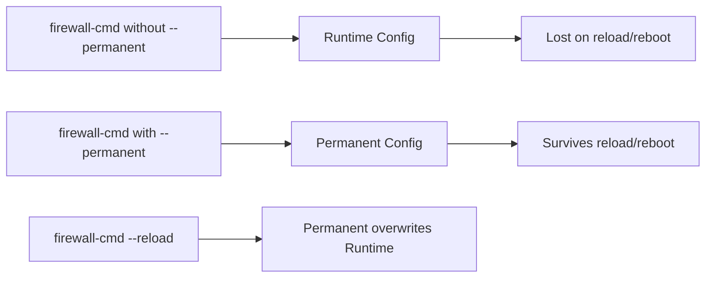

# How to Manage Runtime vs Permanent Firewall Rules on RHEL

Author: [nawazdhandala](https://www.github.com/nawazdhandala)

Tags: RHEL, Firewalld, Runtime, Permanent, Linux

Description: Understanding the difference between runtime and permanent firewalld rules on RHEL, and how to use this dual-layer system effectively for safe firewall changes.

---

Firewalld has a two-layer configuration system: runtime and permanent. This is not a quirk or a complication. It is actually a safety feature that can save you from locking yourself out of a remote server. Understanding how these two layers interact is essential for anyone managing RHEL firewalls.

## Runtime vs Permanent



- **Runtime**: Active right now, lost on reload or reboot
- **Permanent**: Saved to disk, loaded on reload or reboot

## The Safety Net

Here is why this matters. Say you are configuring a firewall on a remote server via SSH. If you add a rule that accidentally blocks your SSH session, you are locked out. But if you added it as a runtime-only rule, a reboot or firewall reload will clear it.

The safe workflow:

```bash
# Step 1: Make changes to runtime only (no --permanent)
firewall-cmd --zone=public --add-service=http

# Step 2: Test that everything works
curl http://localhost

# Step 3: If it works, save to permanent
firewall-cmd --runtime-to-permanent

# Step 4: If something breaks, reload to revert
firewall-cmd --reload
```

## Adding Runtime-Only Rules

```bash
# Add a service to the runtime config only
firewall-cmd --zone=public --add-service=http

# Add a port to runtime only
firewall-cmd --zone=public --add-port=8080/tcp

# These are active immediately but will disappear on reload
```

## Adding Permanent Rules

```bash
# Add a service to the permanent config
firewall-cmd --zone=public --add-service=http --permanent

# This is NOT active yet - it is only saved to disk
# You need to reload for it to take effect
firewall-cmd --reload
```

Or add to both at once:

```bash
# Add to permanent, then reload to also make it runtime
firewall-cmd --zone=public --add-service=https --permanent
firewall-cmd --reload
```

## Comparing Runtime and Permanent

Check what is different between the two configs:

```bash
# Show current runtime configuration
firewall-cmd --zone=public --list-all

# Show permanent configuration
firewall-cmd --zone=public --list-all --permanent
```

Compare the output. Any differences mean the runtime and permanent configs are out of sync.

## Syncing Configurations

### Runtime to Permanent

When you have been testing runtime changes and want to keep them:

```bash
# Save all current runtime rules as permanent
firewall-cmd --runtime-to-permanent
```

### Permanent to Runtime (Reload)

When you want to discard runtime changes and go back to permanent config:

```bash
# Reload - replaces runtime with permanent config
firewall-cmd --reload
```

### Complete Restart

If you want a full restart of firewalld (drops all state):

```bash
# Full restart - reloads permanent config and resets state
firewall-cmd --complete-reload
```

This is more disruptive than `--reload` because it also drops existing connections that were allowed by state tracking.

## Common Workflow: Testing a New Service

```bash
# 1. Check the current state
firewall-cmd --zone=public --list-all

# 2. Add the new service to runtime only
firewall-cmd --zone=public --add-service=http

# 3. Verify it is in the runtime config
firewall-cmd --zone=public --list-services

# 4. Test from a client machine
curl http://your-server

# 5. It works - make it permanent
firewall-cmd --runtime-to-permanent

# 6. Double-check permanent config
firewall-cmd --zone=public --list-all --permanent
```

## Common Workflow: Emergency Lockdown

You discover your server is being attacked and need to block an IP immediately:

```bash
# Block the IP in runtime (takes effect instantly)
firewall-cmd --zone=public --add-rich-rule='rule family="ipv4" source address="203.0.113.50" drop'

# Verify it is blocked
firewall-cmd --zone=public --list-rich-rules

# After investigating, make it permanent if needed
firewall-cmd --runtime-to-permanent
```

## What Happens on Reboot

On reboot:
1. firewalld starts
2. It loads the permanent configuration
3. Runtime configuration starts fresh from permanent

Any runtime-only changes are gone. This is why production rules must always be saved with `--permanent`.

## Checking If Rules Are Persistent

A quick way to see if your rules will survive a reboot:

```bash
# Check a specific service in permanent config
firewall-cmd --zone=public --query-service=http --permanent
# Returns "yes" or "no"

# Check a port
firewall-cmd --zone=public --query-port=8080/tcp --permanent
```

## The --permanent Flag Gotcha

A very common mistake: adding a rule with `--permanent` and expecting it to work immediately.

```bash
# This ONLY saves to disk, it is NOT active yet
firewall-cmd --zone=public --add-service=http --permanent

# You MUST reload to activate
firewall-cmd --reload
```

The alternative is to run the command twice, once without and once with `--permanent`:

```bash
# Make it active now AND permanent
firewall-cmd --zone=public --add-service=http
firewall-cmd --zone=public --add-service=http --permanent
```

## Scripting with Proper Handling

When writing automation scripts, always use `--permanent` with a reload at the end:

```bash
#!/bin/bash
# Configure firewall for a web server

# All changes to permanent config
firewall-cmd --zone=public --add-service=http --permanent
firewall-cmd --zone=public --add-service=https --permanent
firewall-cmd --zone=public --remove-service=ssh --permanent

firewall-cmd --zone=internal --add-service=ssh --permanent
firewall-cmd --zone=internal --add-port=9090/tcp --permanent

# Single reload at the end to apply everything
firewall-cmd --reload

# Verify
echo "Public zone:"
firewall-cmd --zone=public --list-all
echo "Internal zone:"
firewall-cmd --zone=internal --list-all
```

## Summary

The runtime/permanent split in firewalld is a safety feature, not a complication. Use runtime-only changes for testing, then save with `--runtime-to-permanent` once verified. Use `--reload` to revert to the permanent config if something goes wrong. For automation, use `--permanent` on every command and reload once at the end. Always verify both runtime and permanent configs match before walking away from a firewall change.
