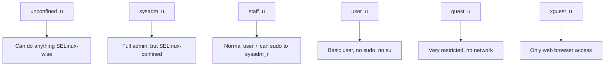

# How to Manage SELinux Confined and Unconfined Users on RHEL

Author: [nawazdhandala](https://www.github.com/nawazdhandala)

Tags: RHEL, SELinux, Users, Security, Linux

Description: Understand the difference between confined and unconfined SELinux users on RHEL and learn how to manage user confinement for better security.

---

## Confined vs Unconfined

On a default RHEL installation, most users and processes run as `unconfined_u` in the `unconfined_t` domain. This means SELinux is enforcing, but these users are essentially exempt from most restrictions. They can run any program, access the network, and perform administrative tasks (if they have the right Unix permissions).

Confined users and processes, on the other hand, are restricted by SELinux to specific actions. A confined web server can only serve web content. A confined user can only access their home directory and run basic programs.

The goal is to move as many users and services as possible from unconfined to confined.

## Checking Current User Status

```bash
# See your current SELinux context
id -Z

# Example output for unconfined user:
# unconfined_u:unconfined_r:unconfined_t:s0-s0:c0.c1023

# Example output for confined user:
# user_u:user_r:user_t:s0
```

## Listing SELinux Users and Mappings

```bash
# Show all SELinux users
sudo semanage user -l
```

Output:

```
                Labeling   MLS/       MLS/
SELinux User    Prefix     MLS Level  MLS Range                      SELinux Roles

guest_u         user       s0         s0                             guest_r
root            user       s0         s0-s0:c0.c1023                 staff_r sysadm_r system_r unconfined_r
staff_u         user       s0         s0-s0:c0.c1023                 staff_r sysadm_r unconfined_r
sysadm_u        user       s0         s0-s0:c0.c1023                 sysadm_r
system_u        user       s0         s0-s0:c0.c1023                 system_r unconfined_r
unconfined_u    user       s0         s0-s0:c0.c1023                 system_r unconfined_r
user_u          user       s0         s0                             user_r
xguest_u        user       s0         s0                             xguest_r
```

```bash
# Show Linux user to SELinux user mappings
sudo semanage login -l
```

## Understanding SELinux User Capabilities



### Detailed Comparison

| Capability | unconfined_u | sysadm_u | staff_u | user_u | guest_u |
|---|---|---|---|---|---|
| Run any program | Yes | Yes | Yes | Yes | Limited |
| Use sudo | Yes | Yes | Yes | No | No |
| Use su | Yes | Yes | No | No | No |
| Network access | Yes | Yes | Yes | Yes | No |
| Run setuid programs | Yes | Yes | Yes | No | No |
| Execute in /tmp | Yes | Yes | Yes | Depends | No |
| Execute in ~/  | Yes | Yes | Yes | Depends | No |

## Mapping Users to Confined SELinux Users

### Map Individual Users

```bash
# Confine a regular user
sudo semanage login -a -s user_u regularuser

# Map an admin to staff_u
sudo semanage login -a -s staff_u adminuser

# Map a guest
sudo semanage login -a -s guest_u guestuser
```

### Change the System-Wide Default

```bash
# Confine all unmapped users as user_u
sudo semanage login -m -s user_u __default__
```

This is a powerful change. Every new user automatically gets confined.

## Working with Confined Processes

### Check Process Contexts

```bash
# Show SELinux context for all running processes
ps -eZ

# Filter for a specific service
ps -eZ | grep httpd

# Show context for a specific PID
ls -Z /proc/PID/exe
```

### Confined vs Unconfined Processes

```bash
# Show all unconfined processes
ps -eZ | grep unconfined_t

# Show confined httpd processes
ps -eZ | grep httpd_t
```

Services installed from RPM packages (Apache, Postfix, SSH) run in their own confined domains. Manually installed or third-party software often runs as `unconfined_t` until you create a policy for it.

## Transitioning from Unconfined to Confined

### Phase 1: Audit

```bash
# List all unconfined processes
ps -eZ | grep unconfined_t | grep -v "unconfined_u:unconfined_r"
```

### Phase 2: Confine Users

```bash
# Start with the default mapping
sudo semanage login -m -s user_u __default__

# Map specific admins
sudo semanage login -a -s staff_u admin1
sudo semanage login -a -s staff_u admin2
```

### Phase 3: Confine Services

For third-party services running as unconfined:

```bash
# Generate a policy for the service
sepolicy generate --init /usr/local/bin/myservice

# Build and install the policy
./myservice.sh

# Verify the service now runs confined
sudo systemctl restart myservice
ps -eZ | grep myservice
```

## Managing Confined User Booleans

Fine-tune what confined users can do:

```bash
# Allow confined users to run content from home directory
sudo setsebool -P user_exec_content on

# Allow confined users to manage crontab
sudo setsebool -P user_cron_spool_job on

# Prevent confined users from running executables in /tmp
sudo setsebool -P user_exec_content off

# Allow staff to run unconfined applications
sudo setsebool -P staff_exec_content on
```

## Checking Locally Modified Settings

```bash
# Show all custom login mappings
sudo semanage login -l -C

# Show all custom user settings
sudo semanage user -l -C

# Show all modified booleans
sudo semanage boolean -l -C
```

## Troubleshooting Confined Users

### User Cannot Log In

```bash
# Check for denials
sudo ausearch -m avc -ts recent | grep login

# Relabel the user's home directory
sudo restorecon -RvF /home/username/
```

### User Cannot Run Expected Commands

```bash
# Check what the user's context allows
sudo sesearch --allow -s user_t -t bin_t -c file

# Check for specific denials
sudo ausearch -m avc -c bash -ts recent
```

### Staff User Cannot Use sudo

The `staff_u` user needs to transition to `sysadm_r` when using sudo. Make sure sudoers is configured:

```bash
# In /etc/sudoers, ensure the user has access
admin1 ALL=(ALL) ALL
```

And the SELinux boolean is set:

```bash
sudo setsebool -P staff_exec_content on
```

## Reverting to Unconfined

If confinement causes too many issues during transition:

```bash
# Revert default mapping
sudo semanage login -m -s unconfined_u __default__

# Remove individual mappings
sudo semanage login -d username
```

## Wrapping Up

Moving from unconfined to confined is the single biggest security improvement you can make with SELinux. Start by changing the `__default__` mapping to `user_u` and explicitly mapping administrators to `staff_u`. Monitor the audit logs during the transition and address denials as they come up. The result is a system where compromising a user account gives the attacker far fewer capabilities than they would have on an unconfined system.
