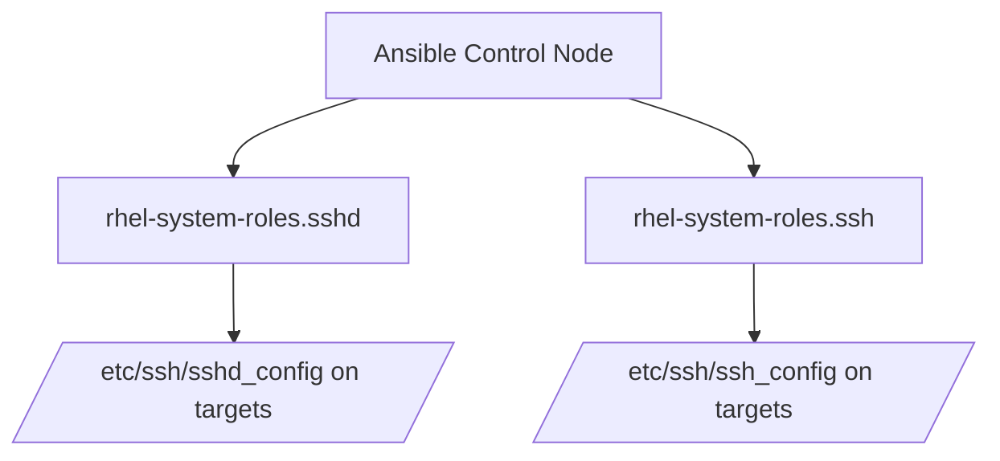

# How to Manage SSH Configuration with RHEL System Roles

Author: [nawazdhandala](https://www.github.com/nawazdhandala)

Tags: RHEL, System Roles, SSH, Ansible, Security, Linux

Description: Automate SSH client and server configuration across your RHEL fleet using the sshd and ssh RHEL System Roles with Ansible.

---

SSH configuration drift is a real problem at scale. One server allows root login, another uses weak ciphers, a third has a non-standard port. The RHEL sshd system role lets you define your SSH configuration in one place and push it everywhere consistently.

## The Two SSH System Roles

RHEL provides two separate roles for SSH:

- `rhel-system-roles.sshd` - configures the SSH **server** (sshd)
- `rhel-system-roles.ssh` - configures the SSH **client**



## Prerequisites

```bash
# Install system roles on the control node
sudo dnf install rhel-system-roles
```

## Configuring the SSH Server (sshd)

Here is a playbook that hardens the SSH server configuration:

```yaml
# playbook-sshd.yml
# Harden SSH server configuration across all managed hosts
---
- name: Configure SSH server
  hosts: all
  become: true
  vars:
    sshd:
      # Disable root login
      PermitRootLogin: "no"
      # Only allow key-based authentication
      PasswordAuthentication: "no"
      PubkeyAuthentication: "yes"
      # Disable empty passwords
      PermitEmptyPasswords: "no"
      # Disable X11 forwarding
      X11Forwarding: "no"
      # Set idle timeout to 5 minutes
      ClientAliveInterval: 300
      ClientAliveCountMax: 0
      # Limit authentication attempts
      MaxAuthTries: 3
      # Use only strong ciphers
      Ciphers: "aes256-gcm@openssh.com,chacha20-poly1305@openssh.com,aes256-ctr"
      # Use only strong MACs
      MACs: "hmac-sha2-512-etm@openssh.com,hmac-sha2-256-etm@openssh.com"
      # Use only strong key exchange algorithms
      KexAlgorithms: "curve25519-sha256,curve25519-sha256@libssh.org,ecdh-sha2-nistp521"

  roles:
    - rhel-system-roles.sshd
```

Run the playbook:

```bash
# Apply SSH hardening to all servers
ansible-playbook -i inventory playbook-sshd.yml
```

## Allowing Specific Users and Groups

You can restrict SSH access to certain users or groups:

```yaml
# playbook-sshd-access.yml
# Restrict SSH access to specific users and groups
---
- name: Configure SSH access restrictions
  hosts: all
  become: true
  vars:
    sshd:
      PermitRootLogin: "no"
      PasswordAuthentication: "no"
      # Only allow these users to SSH in
      AllowUsers: "admin deployer monitoring"
      # Or restrict by group
      AllowGroups: "sshusers wheel"

  roles:
    - rhel-system-roles.sshd
```

## Configuring SSH with Match Blocks

The role supports Match blocks for conditional configuration:

```yaml
# playbook-sshd-match.yml
# Use Match blocks for different access policies
---
- name: Configure SSH with match blocks
  hosts: all
  become: true
  vars:
    sshd:
      PermitRootLogin: "no"
      PasswordAuthentication: "no"
    # Match blocks for specific conditions
    sshd_match:
      - condition: "Group sftp-users"
        PermitRootLogin: "no"
        ChrootDirectory: "/data/sftp/%u"
        ForceCommand: "internal-sftp"
        AllowTcpForwarding: "no"
      - condition: "Address 10.0.0.0/8"
        PasswordAuthentication: "yes"

  roles:
    - rhel-system-roles.sshd
```

## Configuring the SSH Client

The SSH client role manages `/etc/ssh/ssh_config`:

```yaml
# playbook-ssh-client.yml
# Configure SSH client defaults
---
- name: Configure SSH client
  hosts: all
  become: true
  vars:
    ssh:
      # Global SSH client settings
      ServerAliveInterval: 60
      ServerAliveCountMax: 3
      StrictHostKeyChecking: "ask"
      # Use strong ciphers on the client side too
      Ciphers: "aes256-gcm@openssh.com,chacha20-poly1305@openssh.com"

    # Host-specific client configuration
    ssh_host:
      - host: "*.internal.example.com"
        ProxyJump: "bastion.example.com"
        User: "admin"
      - host: "bastion.example.com"
        User: "jumpuser"
        Port: 2222

  roles:
    - rhel-system-roles.ssh
```

## Using Drop-in Configuration

Instead of replacing the entire sshd_config, you can use drop-in files:

```yaml
# playbook-sshd-dropin.yml
# Add configuration via drop-in file instead of replacing sshd_config
---
- name: Configure SSH server with drop-in
  hosts: all
  become: true
  vars:
    # Use a drop-in configuration file
    sshd_config_file: /etc/ssh/sshd_config.d/50-hardening.conf
    sshd:
      PermitRootLogin: "no"
      PasswordAuthentication: "no"
      MaxAuthTries: 3

  roles:
    - rhel-system-roles.sshd
```

This is safer because it does not touch the main sshd_config file.

## Verifying the Configuration

After running the playbook, verify on the target hosts:

```bash
# Check the sshd configuration for syntax errors
sudo sshd -t

# View the active configuration
sudo sshd -T

# Check the sshd service status
sudo systemctl status sshd

# Test a connection from another machine
ssh -v user@target-host
```

## Complete Hardening Example

Here is a production-ready playbook combining server and client configuration:

```yaml
# playbook-ssh-complete.yml
# Complete SSH hardening for server and client
---
- name: Harden SSH across the fleet
  hosts: all
  become: true
  vars:
    # Server configuration
    sshd:
      Port: 22
      PermitRootLogin: "no"
      PasswordAuthentication: "no"
      PubkeyAuthentication: "yes"
      PermitEmptyPasswords: "no"
      X11Forwarding: "no"
      ClientAliveInterval: 300
      ClientAliveCountMax: 2
      MaxAuthTries: 3
      MaxSessions: 5
      LoginGraceTime: 30
      Banner: /etc/ssh/banner
      Ciphers: "aes256-gcm@openssh.com,chacha20-poly1305@openssh.com,aes256-ctr"
      MACs: "hmac-sha2-512-etm@openssh.com,hmac-sha2-256-etm@openssh.com"
      KexAlgorithms: "curve25519-sha256,curve25519-sha256@libssh.org"
      LogLevel: "VERBOSE"

    # Client configuration
    ssh:
      ServerAliveInterval: 60
      ServerAliveCountMax: 3

  roles:
    - rhel-system-roles.sshd
    - rhel-system-roles.ssh
```

## Wrapping Up

The SSH system roles give you a declarative way to manage SSH configuration across your entire RHEL fleet. The biggest advantage is consistency. Every server gets the same ciphers, the same authentication rules, and the same timeout values. When a new security recommendation comes out, you update one playbook and roll it out everywhere. The drop-in configuration approach is worth considering for production since it reduces the risk of breaking existing configurations.
