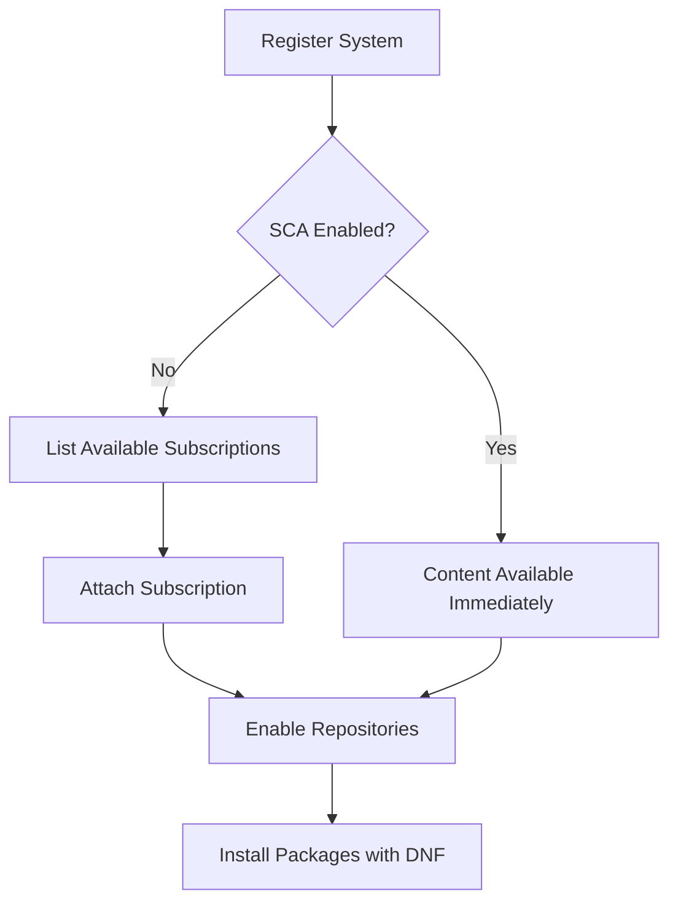

# How to Manage Software Subscriptions and Repositories with subscription-manager on RHEL 9

Author: [nawazdhandala](https://www.github.com/nawazdhandala)

Tags: RHEL, Subscription Manager, Repositories, Red Hat, Linux

Description: A practical guide to managing RHEL 9 subscriptions, attaching entitlements, enabling repositories, and troubleshooting common subscription-manager issues.

---

One of the first things you deal with on any RHEL system is subscriptions. Unlike community distros where you just point at a mirror and go, RHEL needs a valid subscription to pull packages from Red Hat's CDN. The `subscription-manager` tool handles all of that, and understanding it well saves you a lot of headaches down the road.

I have set up hundreds of RHEL systems over the years, and subscription issues are still one of the most common reasons people get stuck during initial setup. Let me walk through the whole workflow.

## Registering Your System

Before you can do anything, the system needs to be registered with Red Hat. You can register against Red Hat's customer portal or a local Satellite server.

```bash
# Register the system with Red Hat using your credentials
sudo subscription-manager register --username your-rh-username --password your-rh-password
```

If you are using an organization ID and activation key (common in automated deployments):

```bash
# Register using an activation key and org ID
sudo subscription-manager register --org=your-org-id --activationkey=your-key-name
```

Check your registration status:

```bash
# Verify the system is registered
sudo subscription-manager status
```

## Understanding Simple Content Access

Starting with recent RHEL versions, Red Hat introduced Simple Content Access (SCA). If your account has SCA enabled, you do not need to manually attach subscriptions. Once registered, you automatically get access to all the content your subscription entitles you to.

```bash
# Check if Simple Content Access is enabled
sudo subscription-manager status
```

If you see "Content Access Mode is set to Simple Content Access," you are good. No need to attach anything manually.



## Attaching Subscriptions (Non-SCA)

If your account does not use SCA, you need to attach a subscription manually.

```bash
# List all available subscriptions for your account
sudo subscription-manager list --available

# Auto-attach the best matching subscription
sudo subscription-manager attach --auto

# Or attach a specific subscription by pool ID
sudo subscription-manager attach --pool=8a85f98c60c2c2b40160c324e54f1234
```

Check what is currently attached:

```bash
# List currently attached subscriptions
sudo subscription-manager list --consumed
```

## Managing Repositories

This is where you spend most of your time with subscription-manager. Repositories control what packages are available to DNF.

### Listing Repositories

```bash
# Show all currently enabled repositories
sudo subscription-manager repos --list-enabled

# Show all available repositories (enabled and disabled)
sudo subscription-manager repos --list
```

The output can be long. If you want to filter it, pipe through grep:

```bash
# Find repositories related to a specific product
sudo subscription-manager repos --list | grep -A 4 "codeready"
```

### Enabling and Disabling Repositories

```bash
# Enable the CodeReady Linux Builder repository (common need for dev packages)
sudo subscription-manager repos --enable=codeready-builder-for-rhel-9-x86_64-rpms

# Disable a repository you do not need
sudo subscription-manager repos --disable=rhel-9-for-x86_64-supplementary-rpms
```

You can enable or disable multiple repos at once:

```bash
# Enable multiple repositories in one command
sudo subscription-manager repos \
  --enable=rhel-9-for-x86_64-baseos-rpms \
  --enable=rhel-9-for-x86_64-appstream-rpms \
  --enable=codeready-builder-for-rhel-9-x86_64-rpms
```

### Common RHEL 9 Repositories

Here are the repos you will use most often:

| Repository ID | Purpose |
|---|---|
| rhel-9-for-x86_64-baseos-rpms | Core OS packages |
| rhel-9-for-x86_64-appstream-rpms | Applications and developer tools |
| codeready-builder-for-rhel-9-x86_64-rpms | Build dependencies, dev headers |
| rhel-9-for-x86_64-supplementary-rpms | Supplementary packages |

## Setting a Release Version

Sometimes you need to lock your system to a specific RHEL minor release. This is common in environments where you need to stay on, say, RHEL 9.2 and not jump to 9.3.

```bash
# Lock the system to RHEL 9.2
sudo subscription-manager release --set=9.2

# Check the current release setting
sudo subscription-manager release --show

# List all available releases
sudo subscription-manager release --list

# Remove the release lock to get the latest minor version
sudo subscription-manager release --unset
```

When you set a release, subscription-manager adjusts the repository URLs to point at that specific minor version's content. Keep in mind that older minor releases eventually stop receiving updates, so only pin when you have a real reason to.

## Refreshing Subscription Data

If your subscription was just renewed or changed, the local system might not know about it yet.

```bash
# Refresh the subscription data from the server
sudo subscription-manager refresh

# Also clean and regenerate the local cache
sudo subscription-manager clean
sudo subscription-manager register --username your-rh-username --password your-rh-password
```

Note that `subscription-manager clean` removes all local subscription data. You will need to re-register afterward. Use it only when you are actually troubleshooting - `refresh` is usually enough.

## Viewing System Identity and Facts

```bash
# Show the system identity (UUID, org, etc.)
sudo subscription-manager identity

# Show system facts that subscription-manager reports
sudo subscription-manager facts --list

# Update facts if hardware has changed
sudo subscription-manager facts --update
```

System facts include things like CPU count, memory, and architecture. These matter because some subscriptions are socket-based or core-based.

## Working with Proxies

If your RHEL system accesses the internet through a proxy, subscription-manager needs to know about it:

```bash
# Configure proxy settings for subscription-manager
sudo subscription-manager config --server.proxy_hostname=proxy.mycompany.com \
  --server.proxy_port=3128 \
  --server.proxy_user=proxyuser \
  --server.proxy_password=proxypass
```

Check the current configuration:

```bash
# Display the full subscription-manager configuration
sudo subscription-manager config --list
```

## Unregistering a System

When you decommission a server, unregister it to free up the subscription entitlement:

```bash
# Remove all subscriptions and unregister the system
sudo subscription-manager unregister
```

This removes the system from your Red Hat account and cleans up the local certificates.

## Troubleshooting Common Issues

### "This system is not registered"

You see this when running `dnf` and the system lost its registration:

```bash
# Check if the system is registered
sudo subscription-manager identity

# If not registered, re-register
sudo subscription-manager register --username your-rh-username --password your-rh-password
sudo subscription-manager attach --auto
```

### Certificate Errors

Sometimes the entitlement certificates get corrupted or expire:

```bash
# Remove old certificates and refresh
sudo rm -f /etc/pki/entitlement/*.pem
sudo subscription-manager refresh
```

### Checking Repo Configuration Files

Subscription-manager generates repo files in `/etc/yum.repos.d/`. If something looks wrong:

```bash
# Check the generated repo file
cat /etc/yum.repos.d/redhat.repo

# Regenerate it by refreshing
sudo subscription-manager refresh
```

## Automating Registration in Kickstart

For automated deployments, put the registration in your kickstart file:

```bash
# Kickstart post-install section for subscription registration
%post
subscription-manager register --org=myorg --activationkey=my-rhel9-key
subscription-manager repos --enable=codeready-builder-for-rhel-9-x86_64-rpms
%end
```

Activation keys are the way to go for automation. They let you register without exposing passwords and can pre-assign subscriptions, repos, and service levels.

## Summary

Subscription-manager is the gateway to getting packages on RHEL. Whether you are using Simple Content Access or traditional entitlements, the workflow is straightforward once you understand the pieces: register, attach (if needed), enable your repos, and go. Keep your systems registered, refresh when subscriptions change, and unregister when decommissioning. That keeps your entitlement pool clean and your systems happy.
