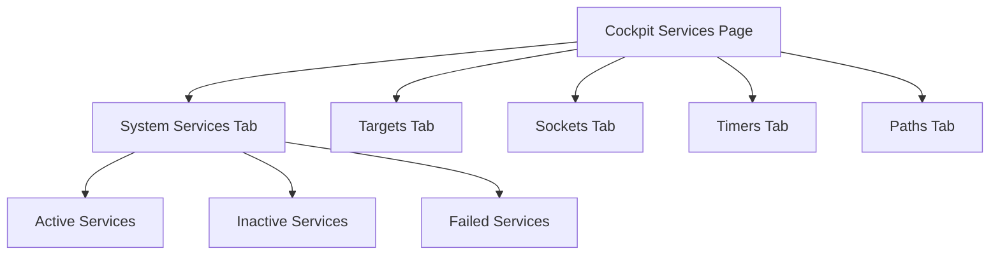
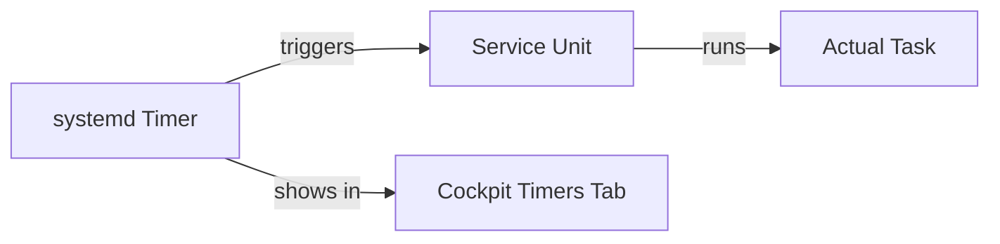

# How to Manage System Services Using the RHEL 9 Web Console

Author: [nawazdhandala](https://www.github.com/nawazdhandala)

Tags: RHEL, Cockpit, Services, systemd, Linux

Description: A practical guide to managing systemd services through the Cockpit web console on RHEL 9, including starting, stopping, enabling, and troubleshooting services.

---

Managing systemd services from the command line is second nature for most sysadmins. But when you need to quickly scan through dozens of services, check their status, and read their logs all in one place, the Cockpit web console makes the process faster. It's especially useful when you're onboarding someone who isn't fluent in systemctl yet.

## Accessing the Services Page

After logging into Cockpit at `https://your-server:9090`, click on "Services" in the left sidebar. You'll see a tabbed view that separates services into several categories:

- **System Services** - core daemons and background processes
- **Targets** - systemd target units (groups of services)
- **Sockets** - socket-activated units
- **Timers** - scheduled tasks (the systemd alternative to cron)
- **Paths** - path-based activation units



## Viewing Service Status

The main services list shows each unit with its current state, whether it's enabled at boot, and a brief description. Services that have failed are highlighted, making it easy to spot problems at a glance.

Click on any service name to open its detail page. Here you'll find:

- The current status (active, inactive, failed)
- The full unit file path
- Resource usage if available
- Recent log entries for that specific service

This is the equivalent of running these commands combined:

```bash
# What Cockpit shows you in one click
systemctl status httpd.service
journalctl -u httpd.service --no-pager -n 20
systemctl is-enabled httpd.service
```

## Starting and Stopping Services

On the service detail page, you'll see action buttons at the top. To start a stopped service, click the play button. To stop a running one, click stop. Cockpit sends the corresponding systemctl command under the hood.

If you prefer to verify from the terminal what Cockpit just did:

```bash
# Check if the service started successfully
systemctl is-active httpd.service

# View the most recent journal entries
journalctl -u httpd.service -n 10 --no-pager
```

Cockpit also shows a "Restart" button for running services, which is identical to:

```bash
systemctl restart httpd.service
```

## Enabling and Disabling Services at Boot

Below the service name on the detail page, there's a toggle or dropdown that lets you enable or disable the service at boot. When you enable a service, Cockpit runs the equivalent of:

```bash
# Enable the service to start on boot
systemctl enable httpd.service

# Disable it from starting on boot
systemctl disable httpd.service
```

The interface shows whether the service is "enabled", "disabled", or "static" (meaning it can't be enabled directly because it's triggered by another unit).

## Filtering and Searching Services

The top of the services page has a search box and filter options. You can filter by:

- **All** - shows everything
- **Enabled** - only services configured to start at boot
- **Disabled** - services not starting at boot
- **Static** - units that are dependencies of other units

This is particularly useful on servers running a lot of services. Instead of piping systemctl through grep:

```bash
# The CLI equivalent of Cockpit's filter
systemctl list-unit-files --type=service --state=enabled
```

You just type in the search box and the list updates instantly.

## Handling Failed Services

Failed services show up with a red indicator. Cockpit makes these easy to spot. When you click on a failed service, the logs section at the bottom of the detail page shows you exactly what went wrong.

On the command line, you'd investigate like this:

```bash
# List all failed units
systemctl --failed

# Check the logs for a failed service
journalctl -u failed-service.service -b --no-pager

# After fixing the issue, reset the failed state
systemctl reset-failed failed-service.service
```

In Cockpit, the "Start" button on a failed service attempts to restart it. If it fails again, the logs update in real time so you can see the new error.

## Working with Timers

The Timers tab shows all systemd timer units, which are the modern replacement for cron jobs. Each entry shows when the timer last fired and when it's scheduled to fire next.



Clicking on a timer shows its schedule configuration and the associated service unit. The CLI equivalents:

```bash
# List all active timers with their schedules
systemctl list-timers --all

# Check a specific timer's configuration
systemctl cat logrotate.timer
```

## Working with Sockets

The Sockets tab lists all socket-activated services. Cockpit itself uses this pattern - the `cockpit.socket` unit activates the web service only when a connection comes in.

You can start, stop, and enable sockets from this tab just like regular services. This is useful for managing services that should only run on demand.

## Practical Example: Setting Up and Managing a Web Server

Let's walk through a realistic scenario. You need to install and manage Apache httpd through Cockpit.

First, install the package (from the Cockpit terminal or SSH):

```bash
# Install Apache
sudo dnf install httpd -y
```

Now in Cockpit:

1. Go to the Services page
2. Search for "httpd"
3. Click on `httpd.service`
4. Click "Start" to start the service
5. Toggle the "Enabled" switch to make it start on boot

Verify the result from the terminal:

```bash
# Confirm it's running and enabled
systemctl status httpd.service

# Check it's listening on port 80
ss -tlnp | grep :80
```

## Viewing Service Logs in Context

One of the most useful features is the integrated log view. When you open a service's detail page, the bottom section shows that service's journal entries. You can adjust the time range and severity level.

This saves time compared to the terminal approach, where you'd need to:

```bash
# Get logs for the last hour
journalctl -u httpd.service --since "1 hour ago" --no-pager

# Get only error-level messages
journalctl -u httpd.service -p err --no-pager
```

In Cockpit, it's just a dropdown change.

## Masking Services

Cockpit lets you mask services, which prevents them from being started manually or automatically. This is stronger than just disabling them.

The CLI equivalent:

```bash
# Mask a service so it cannot be started at all
sudo systemctl mask bluetooth.service

# Unmask it when you need it back
sudo systemctl unmask bluetooth.service
```

In Cockpit, the mask option appears in the service detail view under the actions dropdown.

## Limitations to Know About

Cockpit's service management covers the vast majority of what you need, but there are a few things it doesn't do:

- You can't edit unit files directly from the services page (use the terminal for that)
- Drop-in override files need to be created from the command line
- Complex service dependencies are visible but not editable through the UI

For editing unit overrides, you'll still need:

```bash
# Create an override file for a service
sudo systemctl edit httpd.service
```

This opens an editor where you can add directives that override the default unit file.

## Wrapping Up

The Cockpit services page gives you a unified view of every systemd unit on your system. For quick status checks, starting and stopping services, and reading logs, it's faster than running multiple systemctl and journalctl commands. It doesn't replace the command line for advanced configuration, but it handles the routine stuff well and gives less experienced team members a safe way to manage services.
