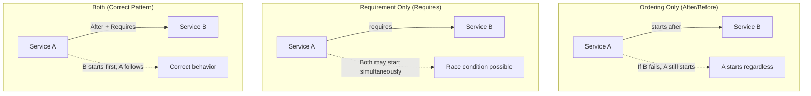
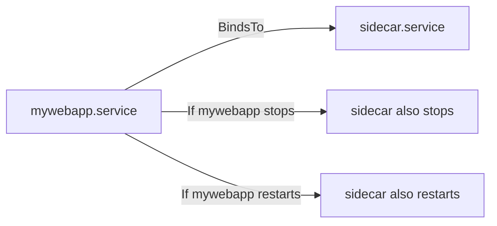
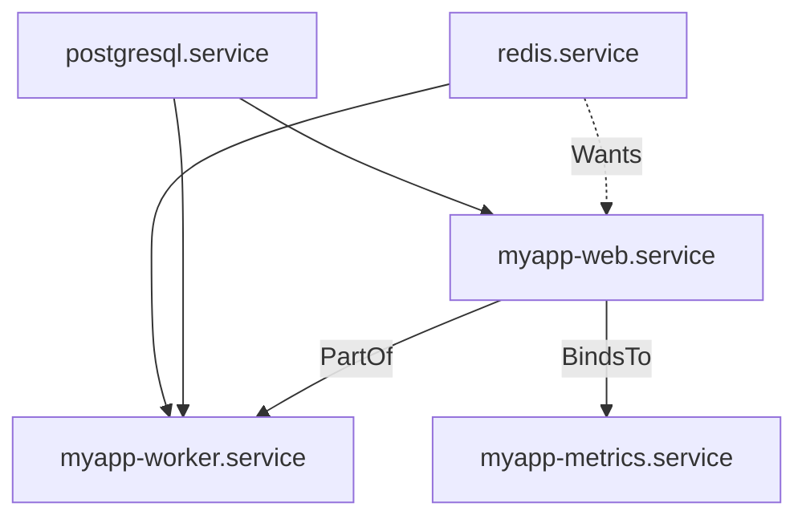

# How to Manage systemd Service Dependencies on RHEL 9

Author: [nawazdhandala](https://www.github.com/nawazdhandala)

Tags: RHEL, systemd, Dependencies, Services, Linux

Description: Understand and configure systemd service dependencies on RHEL 9, including ordering, requirement, and binding directives, plus tools to visualize and debug dependency trees.

---

One of systemd's biggest advantages over the old SysVinit system is its dependency management. Instead of numbered runlevel scripts that start in sequence, systemd understands relationships between services. It knows that your web application needs the database to be running first, that your monitoring agent should stop when the main application stops, and that your network must be up before anything else.

Getting dependencies right means your services start in the correct order, fail gracefully when something they depend on fails, and shut down cleanly. Getting them wrong means race conditions, startup failures, and confusing error messages. Let's sort this out.

---

## Ordering vs. Requirements

The first thing to understand is that systemd separates two concepts that people often confuse:

- **Ordering** (After/Before): Controls the sequence. "Start A after B is started."
- **Requirements** (Requires/Wants): Controls whether to start at all. "A needs B to be running."

These are independent. You can have ordering without requirements, or requirements without ordering. Usually you want both.



---

## After and Before: Controlling Start Order

The `After` directive tells systemd to wait for another unit to finish starting before starting this one:

```ini
[Unit]
Description=My Web Application
After=network-online.target postgresql.service
```

This means: "Start my web app only after the network is ready AND PostgreSQL has started."

`Before` is the reverse. It is less commonly used in custom services but works the same way:

```ini
[Unit]
Description=Pre-flight Check
Before=mywebapp.service
```

This means: "Start this unit before mywebapp starts."

Note that `After` only affects ordering, not whether the other service starts at all. If PostgreSQL is not enabled, using `After=postgresql.service` will not magically start PostgreSQL. For that, you need a requirement directive.

---

## Requires: Hard Dependencies

`Requires` creates a hard dependency. If the required unit fails to start, the requiring unit also fails:

```ini
[Unit]
Description=My Web Application
After=postgresql.service
Requires=postgresql.service
```

With this configuration:
- If PostgreSQL fails to start, the web app will not start either
- If PostgreSQL is stopped while the web app is running, systemd will also stop the web app

That second behavior catches people off guard. If you do not want the web app to be stopped when PostgreSQL stops, use `Wants` instead.

---

## Wants: Soft Dependencies

`Wants` is a weaker version of `Requires`. It tells systemd to try to start the wanted unit, but the requiring unit will start regardless of whether the wanted unit succeeds:

```ini
[Unit]
Description=My Web Application
After=postgresql.service redis.service
Wants=redis.service
Requires=postgresql.service
```

In this example:
- PostgreSQL is a hard dependency. If it fails, the web app fails.
- Redis is a soft dependency. systemd will try to start it, but the web app will start even if Redis is unavailable.

`Wants` is the right choice when the dependency is "nice to have" rather than "essential."

---

## BindsTo: Tight Coupling

`BindsTo` is even stronger than `Requires`. If the bound unit stops, is restarted, or enters a failed state, the binding unit is stopped too:

```ini
[Unit]
Description=Application Sidecar
BindsTo=mywebapp.service
After=mywebapp.service
```

This is useful for sidecar processes, log shippers, or monitoring agents that have no purpose without the main service:



---

## PartOf: Restart Together

`PartOf` is similar to `BindsTo` but only for restart and stop operations. If the parent service is restarted or stopped, the PartOf service is also restarted or stopped:

```ini
[Unit]
Description=PHP-FPM Workers
PartOf=httpd.service
After=httpd.service
```

With this setup, restarting Apache also restarts PHP-FPM. But if PHP-FPM crashes on its own, Apache keeps running. This is useful for groups of services that should be managed together.

---

## Conflicts: Mutual Exclusion

`Conflicts` ensures two services cannot run at the same time:

```ini
[Unit]
Description=iptables Firewall
Conflicts=firewalld.service
```

Starting iptables will stop firewalld, and starting firewalld will stop iptables. Use this when two services provide the same functionality and running both would cause problems.

---

## Viewing Dependency Trees

systemd provides several tools to inspect how services relate to each other.

### List Dependencies

```bash
# Show what httpd depends on (what it needs)
systemctl list-dependencies httpd
```

This displays a tree view of all dependencies. To see reverse dependencies (what depends on httpd):

```bash
# Show what depends on httpd
systemctl list-dependencies --reverse httpd
```

### Analyze Boot Order

The `systemd-analyze` tool is fantastic for understanding startup dependencies:

```bash
# Show the overall boot time
systemd-analyze

# Show how long each service took to start
systemd-analyze blame

# Generate a SVG diagram of the boot process
systemd-analyze plot > boot-plot.svg
```

To check if there are any dependency cycles:

```bash
# Verify unit files for dependency issues
systemd-analyze verify /etc/systemd/system/mywebapp.service
```

This command catches common mistakes like circular dependencies or referencing units that do not exist.

### Critical Chain

To see the critical path of your boot process (the chain of units that determined your total boot time):

```bash
# Show the critical chain of the boot process
systemd-analyze critical-chain
```

For a specific service:

```bash
# Show the critical chain for reaching httpd
systemd-analyze critical-chain httpd.service
```

---

## Practical Example: Multi-Service Application

Let's put it all together with a realistic application stack. You have a web app that needs PostgreSQL, Redis, and a background worker:

```ini
# /etc/systemd/system/myapp-web.service
[Unit]
Description=MyApp Web Server
After=network-online.target postgresql.service redis.service
Wants=network-online.target
Requires=postgresql.service
Wants=redis.service

[Service]
Type=simple
User=myapp
ExecStart=/opt/myapp/bin/web-server
Restart=on-failure
RestartSec=5

[Install]
WantedBy=multi-user.target
```

```ini
# /etc/systemd/system/myapp-worker.service
[Unit]
Description=MyApp Background Worker
After=myapp-web.service postgresql.service redis.service
Requires=postgresql.service redis.service
PartOf=myapp-web.service

[Service]
Type=simple
User=myapp
ExecStart=/opt/myapp/bin/worker
Restart=on-failure
RestartSec=5

[Install]
WantedBy=multi-user.target
```

```ini
# /etc/systemd/system/myapp-metrics.service
[Unit]
Description=MyApp Metrics Exporter
After=myapp-web.service
BindsTo=myapp-web.service

[Service]
Type=simple
User=myapp
ExecStart=/opt/myapp/bin/metrics-exporter
Restart=on-failure

[Install]
WantedBy=multi-user.target
```

The dependency relationships:



With this setup:
- The web server requires PostgreSQL but only wants Redis
- The worker requires both PostgreSQL and Redis
- Restarting the web server also restarts the worker (PartOf)
- If the web server stops, the metrics exporter stops too (BindsTo)

Verify the dependency tree:

```bash
# Check the full dependency tree
systemctl list-dependencies myapp-web.service

# Verify the unit files
systemd-analyze verify /etc/systemd/system/myapp-*.service
```

---

## Common Mistakes

**Using After without Requires.** `After=postgresql.service` does not start PostgreSQL. It only says "if PostgreSQL is starting, wait for it." If you need PostgreSQL to be running, add `Requires=` or `Wants=` as well.

**Circular dependencies.** If A depends on B and B depends on A, systemd will break the cycle but the result is unpredictable. Use `systemd-analyze verify` to catch these before they bite you.

**Over-using Requires.** If a non-critical dependency fails, you probably do not want your main service to fail too. Use `Wants` for optional dependencies and reserve `Requires` for things that truly must be running.

---

## Wrapping Up

systemd's dependency system is one of its best features, but only if you use it correctly. The key distinctions are: After/Before for ordering, Requires/Wants for whether to start, BindsTo/PartOf for lifecycle coupling, and Conflicts for mutual exclusion. Use `systemd-analyze verify` to catch mistakes early, and `systemctl list-dependencies` to understand the relationships in your running system. Well-configured dependencies mean reliable startups and clean shutdowns.
