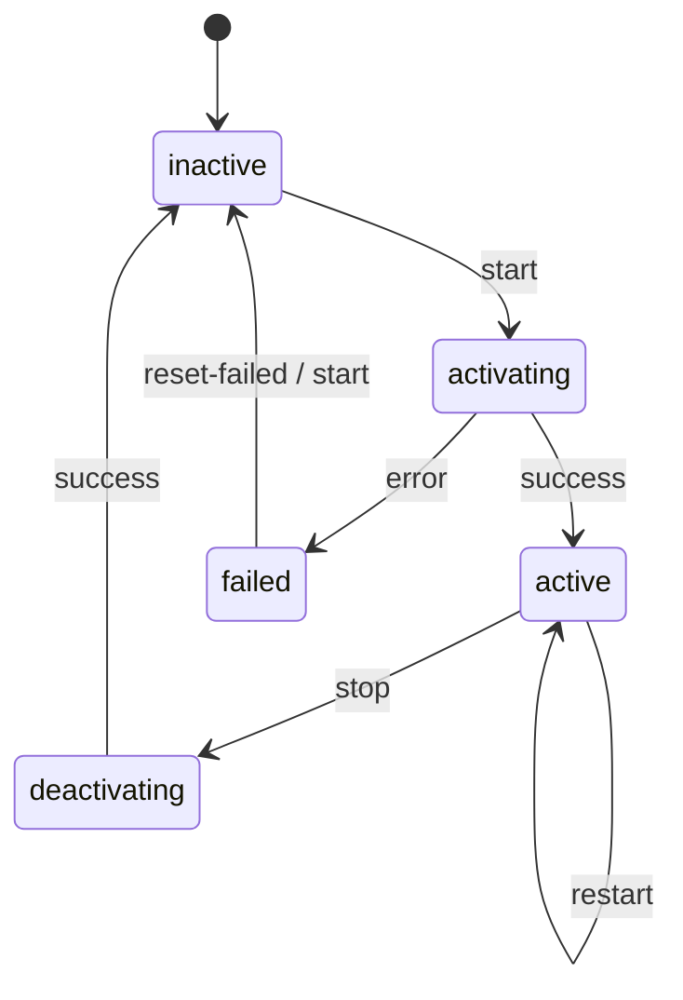

# How to Manage systemd Services and Units on RHEL

Author: [nawazdhandala](https://www.github.com/nawazdhandala)

Tags: RHEL, systemd, Services, Linux, System Administration

Description: A hands-on guide to managing systemd services and units on RHEL, covering systemctl commands, unit types, custom service files, targets, and dependency management.

---

systemd is the init system and service manager on RHEL. Whether you're starting a web server, enabling a database at boot, or debugging why a service won't come up, you'll be working with systemd every day. This guide covers the practical commands and concepts you need to manage services effectively.

## Understanding Unit Types

systemd manages "units," and services are just one type. Here are the unit types you'll encounter most often:

| Unit Type | Extension | Purpose |
|-----------|-----------|---------|
| Service | `.service` | Daemons and processes |
| Socket | `.socket` | IPC and network socket activation |
| Target | `.target` | Groups of units (like runlevels) |
| Timer | `.timer` | Scheduled activation of units |
| Mount | `.mount` | Filesystem mount points |
| Path | `.path` | File/directory monitoring |
| Slice | `.slice` | Resource management (cgroups) |

## Essential systemctl Commands

These are the commands I use daily. They cover 90% of what you'll need.

### Starting, Stopping, and Restarting Services

```bash
# Start a service right now
sudo systemctl start httpd.service

# Stop a service
sudo systemctl stop httpd.service

# Restart a service (stop then start)
sudo systemctl restart httpd.service

# Reload the service configuration without full restart
# (only works if the service supports it)
sudo systemctl reload httpd.service

# Reload if supported, otherwise restart
sudo systemctl reload-or-restart httpd.service
```

### Enabling and Disabling Services at Boot

```bash
# Enable a service to start at boot
sudo systemctl enable httpd.service

# Disable a service from starting at boot
sudo systemctl disable httpd.service

# Enable AND start in one command
sudo systemctl enable --now httpd.service

# Disable AND stop in one command
sudo systemctl disable --now httpd.service
```

### Checking Service Status

```bash
# Show detailed status of a service
systemctl status httpd.service

# Check if a service is currently running
systemctl is-active httpd.service

# Check if a service is enabled at boot
systemctl is-enabled httpd.service

# Check if a service has failed
systemctl is-failed httpd.service
```

### Listing Units

```bash
# List all active units
systemctl list-units

# List only service units
systemctl list-units --type=service

# List all installed service unit files (including disabled)
systemctl list-unit-files --type=service

# List all failed units
systemctl list-units --state=failed
```

## Understanding Service States



## Reading Service Unit Files

Unit files live in a few locations, listed by priority (highest first):

- `/etc/systemd/system/` - Local admin overrides (your custom stuff)
- `/run/systemd/system/` - Runtime units (transient)
- `/usr/lib/systemd/system/` - Installed by packages (don't edit these directly)

To see the contents of a unit file:

```bash
# Show the unit file for a service
systemctl cat httpd.service

# Find where the unit file lives on disk
systemctl show -p FragmentPath httpd.service
```

## Creating a Custom Service File

Let's say you have an application at `/opt/myapp/myapp` that you want to run as a service. Here's how to create a proper unit file for it.

Create the unit file at `/etc/systemd/system/myapp.service`:

```ini
[Unit]
# Brief description of what this service does
Description=My Custom Application
# Start after the network is available
After=network.target
# Optional: start after a database if your app needs one
After=postgresql.service
Wants=postgresql.service

[Service]
# Type=simple means systemd considers the service started
# as soon as the main process is forked
Type=simple
# Run the service as a dedicated user
User=myapp
Group=myapp
# Working directory for the process
WorkingDirectory=/opt/myapp
# The actual command to run
ExecStart=/opt/myapp/myapp --config /etc/myapp/config.yaml
# Command to reload configuration (optional)
ExecReload=/bin/kill -HUP $MAINPID
# Restart the service if it crashes
Restart=on-failure
# Wait 5 seconds before restarting
RestartSec=5
# Set a timeout for startup
TimeoutStartSec=30
# Environment variables
Environment=APP_ENV=production
# Or load from a file
EnvironmentFile=/etc/myapp/env

[Install]
# This makes "systemctl enable" link the service into multi-user.target
WantedBy=multi-user.target
```

After creating or modifying a unit file, always reload the daemon:

```bash
# Tell systemd to re-read unit files
sudo systemctl daemon-reload

# Now enable and start your new service
sudo systemctl enable --now myapp.service

# Check that it's running
systemctl status myapp.service
```

## Service Dependencies

systemd handles dependencies through directives in the `[Unit]` section. The main ones you'll use:

```ini
[Unit]
# Wants - soft dependency (start the other unit, but don't fail if it can't)
Wants=redis.service

# Requires - hard dependency (fail if the dependency can't start)
Requires=postgresql.service

# After - ordering (start this service AFTER the listed units)
After=network.target postgresql.service

# Before - ordering (start this service BEFORE the listed units)
Before=nginx.service
```

The difference between `Wants`/`Requires` and `After`/`Before` is important. `Wants` and `Requires` control whether units are pulled in. `After` and `Before` control the order. You usually need both:

```ini
# Pull in postgresql AND wait for it to start before starting this service
Requires=postgresql.service
After=postgresql.service
```

Check a service's dependencies:

```bash
# Show what a service depends on
systemctl list-dependencies httpd.service

# Show reverse dependencies (what depends on this service)
systemctl list-dependencies --reverse httpd.service
```

## Overriding Package-Provided Unit Files

Never edit files in `/usr/lib/systemd/system/` directly. Package updates will overwrite your changes. Instead, use drop-in files:

```bash
# Create a drop-in override for a service
sudo systemctl edit httpd.service
```

This opens an editor and creates a file at `/etc/systemd/system/httpd.service.d/override.conf`. You only need to include the sections and directives you want to change:

```ini
[Service]
# Increase the timeout for slow startups
TimeoutStartSec=120
# Add extra environment variables
Environment=LANG=en_US.UTF-8
```

If you need to replace the entire unit file (not just add overrides):

```bash
# Copy the vendor unit file to the override location
sudo cp /usr/lib/systemd/system/httpd.service /etc/systemd/system/httpd.service

# Edit your local copy
sudo vim /etc/systemd/system/httpd.service

# Reload after any changes
sudo systemctl daemon-reload
```

## Working with Targets

Targets are groups of units. They replaced the old SysV runlevel concept. The ones you'll see most:

| Target | Rough Equivalent | Purpose |
|--------|-----------------|---------|
| `poweroff.target` | Runlevel 0 | Shut down |
| `rescue.target` | Runlevel 1 | Single-user mode |
| `multi-user.target` | Runlevel 3 | Multi-user, no GUI |
| `graphical.target` | Runlevel 5 | Multi-user with GUI |
| `reboot.target` | Runlevel 6 | Reboot |

```bash
# See the current default target
systemctl get-default

# Switch to a different target immediately
sudo systemctl isolate multi-user.target

# Set the default boot target
sudo systemctl set-default multi-user.target
```

## Troubleshooting Failed Services

When a service won't start, here's my debugging workflow:

```bash
# Step 1: Check the service status for error messages
systemctl status myapp.service -l

# Step 2: Check the journal for detailed logs
journalctl -u myapp.service --no-pager -n 50

# Step 3: Follow logs in real time while you try to start the service
journalctl -u myapp.service -f

# Step 4: Check for any failed units system-wide
systemctl list-units --state=failed

# Step 5: After fixing the issue, reset the failed state
sudo systemctl reset-failed myapp.service
```

## Masking Services

If you want to completely prevent a service from being started, even manually, use masking:

```bash
# Mask a service (creates a symlink to /dev/null)
sudo systemctl mask bluetooth.service

# Unmask it later if needed
sudo systemctl unmask bluetooth.service
```

This is stronger than `disable`. A disabled service can still be started manually or pulled in as a dependency. A masked service cannot be started at all.

## Summary

systemd is a big system, but for daily operations you really only need a handful of commands. Get comfortable with `start`, `stop`, `enable`, `status`, and `journalctl`, and you'll handle most situations. When you need to go deeper, custom unit files and drop-in overrides give you fine-grained control over how services behave on your RHEL systems.
