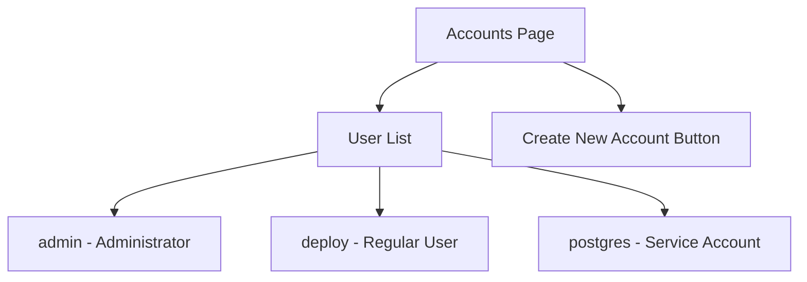

# How to Manage User Accounts Using the RHEL 9 Web Console

Author: [nawazdhandala](https://www.github.com/nawazdhandala)

Tags: RHEL, Cockpit, User Management, Linux

Description: Learn how to create, modify, and manage local user accounts through the Cockpit web console on RHEL 9, including password policies and SSH key management.

---

User account management is one of those tasks that seems simple until you need to manage dozens of accounts, enforce password policies, and keep track of who has sudo access. Cockpit's Accounts page makes the common stuff quick and visual, while still letting you drop to the terminal for the edge cases.

## Accessing the Accounts Page

Click "Accounts" in the Cockpit sidebar. You'll see a list of all local user accounts on the system, including:

- Username
- Full name
- Account status (active or locked)
- Group memberships



## Creating a New User Account

Click "Create new account" and fill in:

- **Full name** - the user's real name
- **User name** - the login name
- **Password** - set an initial password
- **Access level** - Server Administrator (adds to wheel group for sudo) or Regular User

Cockpit creates the account immediately. The CLI equivalent:

```bash
# Create a new user
sudo useradd -m -c "John Smith" jsmith

# Set the password
sudo passwd jsmith

# Add to the wheel group for sudo access
sudo usermod -aG wheel jsmith
```

## Viewing and Editing User Details

Click on any username to see their detail page. Here you can:

- Change the full name
- Reset the password
- Lock or unlock the account
- View and modify group memberships
- Set password expiration policies
- Add authorized SSH keys

## Changing a User's Password

On the user detail page, click "Set password" and enter the new password. This is the equivalent of:

```bash
# Change a user's password
sudo passwd jsmith

# Force the user to change password on next login
sudo passwd -e jsmith
```

Cockpit also has a checkbox option to force password change on next login, which is good practice when creating new accounts.

## Locking and Unlocking Accounts

When an employee leaves or an account needs to be temporarily disabled, locking is better than deleting. A locked account keeps its home directory and files intact but prevents login.

In Cockpit, there's a "Lock account" toggle on the user detail page.

```bash
# Lock an account
sudo usermod -L jsmith

# Unlock an account
sudo usermod -U jsmith

# Verify the lock status
sudo passwd -S jsmith
```

The output of `passwd -S` shows `L` (locked) or `P` (password set) as the second field.

## Managing Group Memberships

On the user detail page, you can see which groups the user belongs to and add or remove them. The most important group on RHEL 9 is `wheel`, which grants sudo access.

```bash
# List a user's groups
groups jsmith

# Add a user to a group
sudo usermod -aG wheel jsmith

# Remove a user from a group
sudo gpasswd -d jsmith wheel
```

Common groups and their purposes:

| Group | Purpose |
|-------|---------|
| wheel | Sudo/administrator access |
| libvirt | Can manage virtual machines |
| docker/podman | Container management (if configured) |
| audio | Audio device access |
| video | Video device access |

## Password Expiration Policies

Cockpit lets you set password expiration on the user detail page. You can configure:

- **Password expiration** - number of days before the password must be changed
- **Account expiration** - a specific date when the account becomes inactive

The CLI equivalents:

```bash
# Set password to expire after 90 days
sudo chage -M 90 jsmith

# Set account to expire on a specific date
sudo chage -E 2026-12-31 jsmith

# View current aging information
sudo chage -l jsmith

# Set minimum days between password changes
sudo chage -m 7 jsmith

# Set warning days before expiration
sudo chage -W 14 jsmith
```

## Adding SSH Authorized Keys

On the user detail page, there's a section for SSH authorized keys. Click "Add key" and paste the public key. Cockpit writes it to `~/.ssh/authorized_keys` for that user.

```bash
# The manual way to add an SSH key
sudo mkdir -p /home/jsmith/.ssh
sudo chmod 700 /home/jsmith/.ssh

# Add the public key
echo "ssh-ed25519 AAAAC3NzaC1lZDI1NTE5AAAA... jsmith@laptop" | sudo tee -a /home/jsmith/.ssh/authorized_keys

sudo chmod 600 /home/jsmith/.ssh/authorized_keys
sudo chown -R jsmith:jsmith /home/jsmith/.ssh
```

Cockpit handles the permissions and ownership automatically.

## Deleting User Accounts

In Cockpit, click on the user and look for the delete option. You'll be asked whether to keep or remove the home directory.

```bash
# Delete a user but keep their home directory
sudo userdel jsmith

# Delete a user and their home directory
sudo userdel -r jsmith
```

Before deleting, consider locking the account instead. Keeping the home directory makes it possible to audit their files or transfer ownership later.

## Practical Example: Onboarding a New Team Member

Here's a typical workflow for setting up a new developer account:

1. In Cockpit, click "Create new account"
2. Enter their name and username
3. Set an initial password
4. Check "Server Administrator" if they need sudo
5. Click "Create"
6. On the user detail page, check "Require password change on next login"
7. Add their SSH public key

The equivalent script:

```bash
# Create the user with sudo access
sudo useradd -m -c "Jane Developer" jdev
sudo usermod -aG wheel jdev

# Set initial password
echo "jdev:TempPass123!" | sudo chpasswd

# Force password change on first login
sudo passwd -e jdev

# Add SSH key
sudo mkdir -p /home/jdev/.ssh
echo "ssh-ed25519 AAAAC3... jdev@workstation" | sudo tee /home/jdev/.ssh/authorized_keys
sudo chmod 700 /home/jdev/.ssh
sudo chmod 600 /home/jdev/.ssh/authorized_keys
sudo chown -R jdev:jdev /home/jdev/.ssh
```

## Practical Example: Offboarding

When someone leaves:

1. Lock their account in Cockpit (toggle the lock switch)
2. Remove them from the wheel group
3. Optionally set an account expiration date

```bash
# Lock the account immediately
sudo usermod -L jdev

# Remove sudo access
sudo gpasswd -d jdev wheel

# Set account to expire today
sudo chage -E 0 jdev
```

## Checking Active Sessions

Cockpit shows current sessions for logged-in users. You can also check from the CLI:

```bash
# Show who is logged in
who

# Show detailed session information
loginctl list-sessions

# Terminate a specific session
sudo loginctl terminate-session <session-id>
```

## System-Wide Password Policies

For organization-wide password requirements, configure PAM and pwquality:

```bash
# View current password quality settings
cat /etc/security/pwquality.conf

# Set minimum password length and complexity
sudo tee /etc/security/pwquality.conf.d/custom.conf << 'EOF'
minlen = 12
dcredit = -1
ucredit = -1
lcredit = -1
ocredit = -1
EOF
```

These settings apply to all users, including when passwords are set through Cockpit.

## Wrapping Up

Cockpit's account management covers the daily user admin tasks well. Creating accounts, managing passwords, handling group memberships, and adding SSH keys are all straightforward through the web interface. For bulk operations and scripting, the CLI tools are still the way to go. But for one-off account management and giving your team a self-service password reset option, the web console works cleanly.
