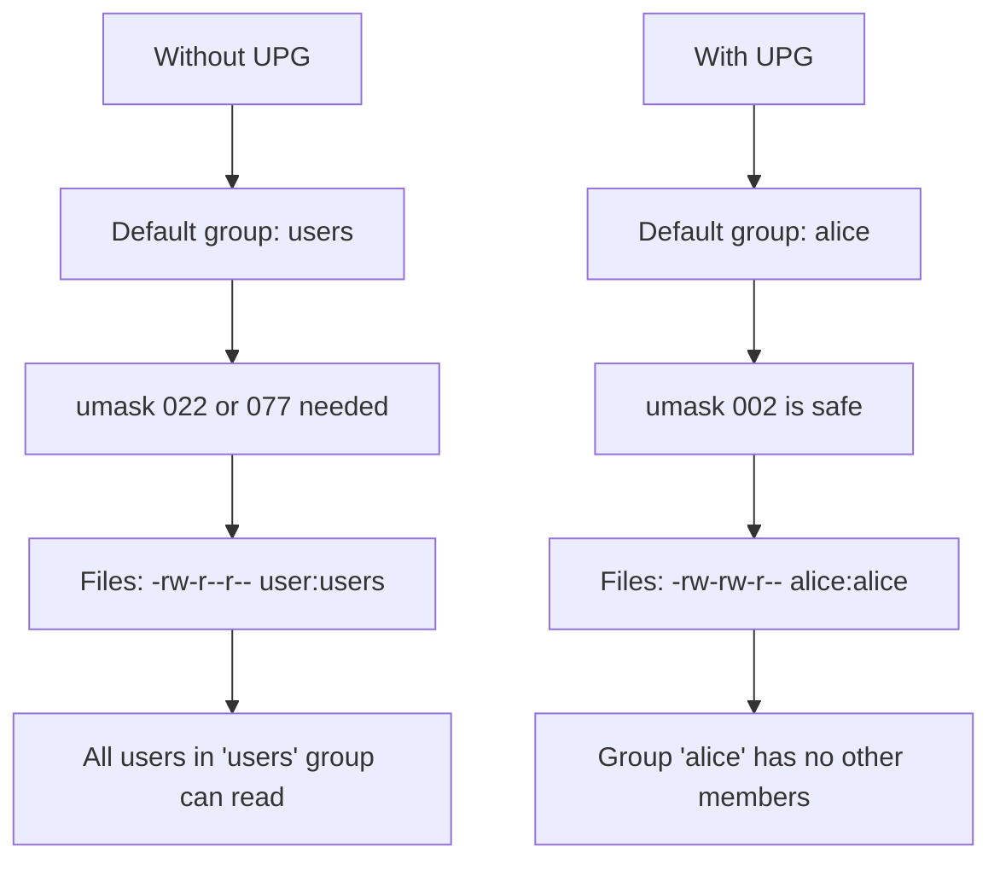

# How to Manage User Private Groups (UPG) on RHEL

Author: [nawazdhandala](https://www.github.com/nawazdhandala)

Tags: RHEL, User Private Groups, UPG, Linux, User Management

Description: An explanation of the User Private Group scheme on RHEL, how it works with file permissions, and how to leverage it for secure team collaboration directories.

---

## What is the UPG Scheme?

If you have ever created a user on RHEL and noticed that a group with the same name was automatically created, that is the User Private Group (UPG) scheme in action. It has been the default on Red Hat systems for decades, and it solves a subtle but important security problem.

Without UPG, all new users might share a common default group (like `users`). Any file created by one user would be group-readable by every other user in that group. UPG fixes this by giving each user their own private group, so the default group ownership of files is harmless.

## How UPG Works

When you create a user on RHEL:

```bash
# Create a new user
sudo useradd alice
```

The system automatically:
1. Creates a user named `alice`
2. Creates a group named `alice` (the private group)
3. Sets `alice` as the primary group for the `alice` user
4. The UID and GID are usually the same number

```bash
# Verify the user and group
id alice
# uid=1001(alice) gid=1001(alice) groups=1001(alice)

# The group exists in /etc/group
grep alice /etc/group
# alice:x:1001:
```

When alice creates a file:

```bash
# As alice
touch /tmp/alicefile.txt
ls -l /tmp/alicefile.txt
# -rw-r--r--. 1 alice alice 0 ... /tmp/alicefile.txt
```

The file is owned by `alice:alice`. Even though the group has read permission, nobody else is in the `alice` group, so the group permissions are effectively private.

## The Configuration Behind UPG

UPG behavior is controlled by two settings.

### /etc/login.defs

```bash
# Check the UPG setting in login.defs
grep USERGROUPS_ENAB /etc/login.defs
```

```bash
USERGROUPS_ENAB yes
```

When set to `yes`:
- `useradd` creates a group with the same name as the user
- `userdel` removes the user's private group (if no other members exist)

### /etc/default/useradd

```bash
# Check useradd defaults
cat /etc/default/useradd
```

You should see that `GROUP` is either commented out or set to a value. When `USERGROUPS_ENAB` is `yes`, the `GROUP` setting in `/etc/default/useradd` is ignored for regular users because each user gets their own group.

## UPG and Umask

The UPG scheme works hand-in-hand with a more permissive umask. Here is why.

On traditional Unix systems without UPG, you need a restrictive umask (like `077`) to prevent other users in your default group from reading your files. But with UPG, since your default group is private, you can safely use a more permissive umask (like `002`).



RHEL sets the default umask to `0022` in `/etc/profile` and `/etc/bashrc`. With UPG in place, you could safely change it to `0002` to make files group-writable by default, since the group is private anyway. This becomes useful when you set up collaboration directories.

## UPG and Collaboration Directories

This is where UPG really shines. The combination of UPG, SGID, and a `002` umask creates seamless shared directories.

### The Setup

Say you have a team of developers who need to share files in `/srv/project`:

```bash
# Create the shared group
sudo groupadd devteam

# Add users to the group
sudo usermod -aG devteam alice
sudo usermod -aG devteam bob
sudo usermod -aG devteam carol

# Create the shared directory
sudo mkdir -p /srv/project

# Set group ownership and SGID
sudo chown root:devteam /srv/project
sudo chmod 2775 /srv/project
```

The SGID bit (`2` in `2775`) ensures that new files inherit the `devteam` group.

### With umask 002

If users have umask `002`:

```bash
# As alice (member of devteam)
touch /srv/project/report.txt
ls -l /srv/project/report.txt
# -rw-rw-r--. 1 alice devteam 0 ... /srv/project/report.txt
```

The file is:
- Owned by `alice` (the creator)
- Group-owned by `devteam` (inherited from SGID directory)
- Group-writable (because umask is 002)

Bob and carol can now edit the file because they are in `devteam` and the file is group-writable. Without UPG, a umask of `002` would be a security risk because Alice's default group would contain other users. With UPG, Alice's default group is just `alice`, so the `002` umask is only "dangerous" for Alice's private group.

### With umask 022

If you keep the default umask of `022`, the collaboration setup still works, but files will not be group-writable:

```bash
# With umask 022
touch /srv/project/report.txt
ls -l /srv/project/report.txt
# -rw-r--r--. 1 alice devteam 0 ... /srv/project/report.txt
```

Bob can read but not write. To fix this, everyone would need to manually `chmod g+w` their files, which nobody will remember to do.

### Setting Umask Per-Directory with ACLs

If you do not want to change the system-wide umask, you can use default ACLs on the shared directory:

```bash
# Set default ACL so new files are group-readable and writable
sudo setfacl -d -m g::rwx /srv/project

# Verify
getfacl /srv/project
```

This overrides the umask for files created in that specific directory.

## Disabling UPG

Some organizations prefer a different group scheme. You can disable UPG:

```bash
# Edit login.defs to disable UPG
sudo vi /etc/login.defs
```

Change:

```bash
USERGROUPS_ENAB no
```

Then set a default group in `/etc/default/useradd`:

```bash
# Set a common default group
sudo vi /etc/default/useradd
```

```bash
GROUP=100
```

Group 100 is typically the `users` group. Now all new users will have `users` as their primary group instead of a personal group. If you go this route, make sure your umask is restrictive enough (at least `022`, preferably `077`).

## Managing Existing User Private Groups

### Listing All UPG Groups

User private groups follow a pattern: the group name matches the username and has exactly one member (or zero, since the primary group member is not listed in `/etc/group`).

```bash
# Find groups that match a username (likely UPG groups)
for group in $(cut -d: -f1 /etc/group); do
    if id "$group" &>/dev/null; then
        gid=$(getent group "$group" | cut -d: -f3)
        uid=$(id -u "$group" 2>/dev/null)
        if [ "$gid" = "$uid" ]; then
            echo "UPG: $group (UID=$uid, GID=$gid)"
        fi
    fi
done
```

### Deleting a User and Their UPG

When you remove a user, their private group is automatically removed if no other users have it as their primary group and `USERGROUPS_ENAB` is `yes`:

```bash
# Remove user and their home directory - UPG is also removed
sudo userdel -r alice

# Verify the group was removed
getent group alice
```

If other files on the system are owned by that GID, they will become orphaned. Clean them up:

```bash
# Find files owned by a now-deleted GID
sudo find / -nogroup -ls 2>/dev/null
```

## UPG with Network Authentication

If you use FreeIPA or LDAP for centralized authentication, UPG still works. FreeIPA creates user private groups by default. The key thing is to make sure your UID/GID ranges do not overlap between local and network accounts.

```bash
# In /etc/login.defs, keep local UIDs in one range
UID_MIN         5000
UID_MAX         9999

# FreeIPA/LDAP users use 10000+
```

## Wrapping Up

The UPG scheme is one of those features that works so well you forget it is there. Every user gets their own group, so the default group ownership of files is private by design. This lets you safely use a more permissive umask, which in turn makes shared directories work smoothly with SGID. If you are setting up team collaboration on RHEL, the combination of UPG, SGID directories, and a `002` umask (or default ACLs) is the right approach. It has been the recommended pattern on Red Hat systems for years, and it works.
