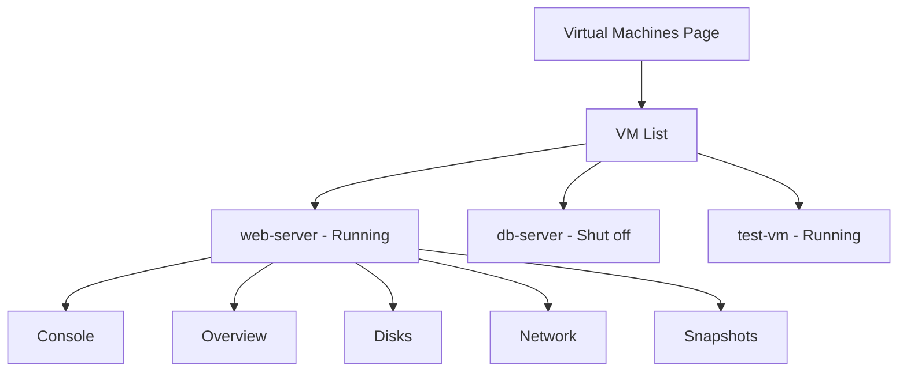
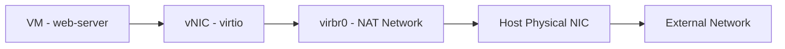

# How to Manage Virtual Machines Using the Cockpit Web Console on RHEL 9

Author: [nawazdhandala](https://www.github.com/nawazdhandala)

Tags: RHEL, Cockpit, KVM, Virtual Machines, Linux

Description: Learn how to create, manage, and monitor KVM virtual machines through the Cockpit web console on RHEL 9, including storage, networking, and snapshot management.

---

Running virtual machines on RHEL 9 with KVM is straightforward from the command line if you know virsh and virt-install. But managing VMs through Cockpit gives you a visual interface that's particularly useful for teams that aren't comfortable with libvirt's CLI tools. You get VM creation, console access, snapshot management, and resource monitoring all in one place.

## Prerequisites

Before you can manage VMs in Cockpit, you need the virtualization stack installed.

Install the virtualization packages and Cockpit VM module:

```bash
# Install the virtualization host group
sudo dnf install @virtualization-host-environment -y

# Install the Cockpit VM management module
sudo dnf install cockpit-machines -y

# Enable and start libvirtd
sudo systemctl enable --now libvirtd

# Verify KVM support
lsmod | grep kvm
```

You should see either `kvm_intel` or `kvm_amd` depending on your hardware. If neither appears, check that hardware virtualization is enabled in your BIOS/UEFI settings.

## The Virtual Machines Page

After installing `cockpit-machines`, a new "Virtual machines" entry appears in Cockpit's sidebar. This page shows:

- All defined VMs with their status (running, shut off, paused)
- CPU and memory allocation for each VM
- Quick action buttons for start, stop, restart, and console access



## Creating a New Virtual Machine

Click "Create VM" on the Virtual Machines page. You'll need to provide:

- **Name** - the VM name
- **Connection** - system or session (use system for production)
- **Installation source** - an ISO file, URL, or PXE boot
- **Operating system** - Cockpit auto-detects this from the ISO
- **Memory** - RAM allocation in MiB or GiB
- **Storage** - disk size and location
- **Immediately start VM** - toggle to boot after creation

For example, to create a RHEL 9 VM with 2 vCPUs, 4GB RAM, and a 20GB disk, fill in those values and point the installation source to your RHEL ISO.

The virt-install equivalent:

```bash
# Create a VM from an ISO
sudo virt-install \
    --name web-server \
    --memory 4096 \
    --vcpus 2 \
    --disk size=20 \
    --cdrom /var/lib/libvirt/images/rhel-9.4-x86_64-dvd.iso \
    --os-variant rhel9.4 \
    --network network=default
```

## Accessing the VM Console

Cockpit provides in-browser console access to your VMs. Click on a running VM and then click "Console." You'll get either:

- **VNC console** - a graphical console in the browser
- **Serial console** - a text-based console

The VNC console lets you interact with the VM's desktop or installation wizard directly in the browser. No separate VNC client needed.

From the CLI, you'd use:

```bash
# Open a graphical console
sudo virt-viewer web-server

# Open a serial/text console
sudo virsh console web-server
```

## Managing VM Resources

Click on a VM to see its detail page. The "Overview" tab shows:

- Current state and autostart setting
- vCPU count and model
- Memory allocation
- Boot order

You can change CPU count and memory allocation from this page. For a running VM, memory changes might require a reboot depending on whether the guest supports memory hotplug.

CLI equivalents:

```bash
# Change vCPU count (requires VM to be shut off)
sudo virsh setvcpus web-server 4 --config

# Change memory allocation
sudo virsh setmaxmem web-server 8G --config
sudo virsh setmem web-server 8G --config

# Set VM to auto-start on host boot
sudo virsh autostart web-server
```

## Managing VM Storage

The "Disks" tab shows all virtual disks attached to the VM. You can:

- Add new disks
- Remove existing disks
- Change the bus type (virtio, SATA, etc.)

To add a new disk through Cockpit, click "Add disk" and specify the size, format (qcow2 or raw), and storage pool.

```bash
# Create and attach a new disk from CLI
sudo qemu-img create -f qcow2 /var/lib/libvirt/images/web-server-data.qcow2 50G

sudo virsh attach-disk web-server \
    /var/lib/libvirt/images/web-server-data.qcow2 \
    vdb \
    --driver qemu \
    --subdriver qcow2 \
    --persistent
```

## Managing VM Networking

The "Network interfaces" tab shows the virtual NICs attached to the VM. You can:

- Add or remove network interfaces
- Change the network source (NAT, bridge, direct)
- Change the MAC address



CLI equivalents:

```bash
# List VM's network interfaces
sudo virsh domiflist web-server

# Attach a new NIC on a bridged network
sudo virsh attach-interface web-server \
    --type bridge \
    --source br0 \
    --model virtio \
    --persistent
```

## Creating and Managing Snapshots

The "Snapshots" tab lets you create point-in-time snapshots of a VM. This is invaluable before making risky changes.

Click "Create snapshot" and give it a name and description. Cockpit creates an internal snapshot that captures the VM's disk state and (if running) memory state.

```bash
# Create a snapshot from CLI
sudo virsh snapshot-create-as web-server \
    --name "before-upgrade" \
    --description "Snapshot before OS upgrade"

# List snapshots
sudo virsh snapshot-list web-server

# Revert to a snapshot
sudo virsh snapshot-revert web-server before-upgrade

# Delete a snapshot
sudo virsh snapshot-delete web-server before-upgrade
```

## Starting, Stopping, and Rebooting VMs

The VM list and detail pages have action buttons for:

- **Run** - start a stopped VM
- **Shut down** - graceful shutdown (sends ACPI signal)
- **Force shut down** - equivalent to pulling the power
- **Reboot** - graceful reboot
- **Pause/Resume** - suspend the VM in memory

```bash
# CLI equivalents
sudo virsh start web-server
sudo virsh shutdown web-server
sudo virsh destroy web-server    # force power off
sudo virsh reboot web-server
sudo virsh suspend web-server
sudo virsh resume web-server
```

## Managing Storage Pools

Cockpit lets you manage libvirt storage pools, which define where VM disk images are stored.

The default pool is at `/var/lib/libvirt/images/`. You can create additional pools for different storage backends.

```bash
# List storage pools
sudo virsh pool-list --all

# Create a new directory-based pool
sudo virsh pool-define-as data-pool dir --target /data/vms
sudo virsh pool-build data-pool
sudo virsh pool-start data-pool
sudo virsh pool-autostart data-pool
```

## Monitoring VM Performance

The VM detail page shows basic resource usage. For more detailed monitoring, check the host's performance graphs on the Cockpit overview page while the VM is running.

```bash
# Check VM resource usage from CLI
sudo virt-top

# Get detailed stats
sudo virsh domstats web-server
```

## Migrating VMs

Cockpit doesn't currently support live migration through the UI, but you can do it from the integrated terminal:

```bash
# Live migrate a VM to another host
sudo virsh migrate --live web-server \
    qemu+ssh://destination-host/system
```

## Wrapping Up

Cockpit's virtual machine management module turns browser-based VM administration into reality. For creating VMs, managing their resources, taking snapshots, and accessing consoles, it covers the common workflows well. It doesn't replace virsh for advanced operations like live migration or complex storage configurations, but for day-to-day VM management on a single host, it's a clean, efficient interface that reduces the barrier to entry for teams working with KVM.
