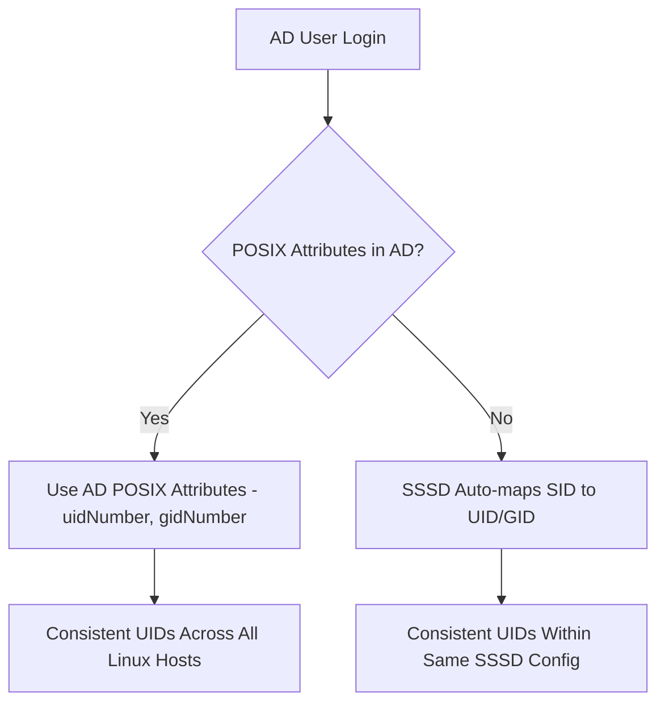

# How to Map Active Directory Users and Groups to RHEL POSIX Attributes

Author: [nawazdhandala](https://www.github.com/nawazdhandala)

Tags: RHEL, Active Directory, POSIX, ID Mapping, Linux

Description: A guide to mapping Active Directory users and groups to POSIX attributes on RHEL 9, covering SSSD ID mapping, AD POSIX extensions, and ID range management.

---

Linux needs POSIX attributes (UID, GID, home directory, shell) to work with user accounts. Active Directory does not provide these by default. When you join RHEL to AD, something needs to generate or look up these values. SSSD handles this through two main approaches: automatic ID mapping (algorithmic SID-to-UID conversion) or using POSIX attributes stored directly in AD. Each approach has tradeoffs, and choosing the right one depends on your environment.

## The Two Mapping Approaches



## Approach 1: Automatic ID Mapping (Default)

This is the default behavior when you join RHEL to AD with realmd. SSSD uses an algorithm to convert the AD SID (Security Identifier) to a POSIX UID/GID. No changes needed in AD.

### How It Works

SSSD takes the RID (the last portion of the SID) and adds it to a base ID to produce the UID. For example, if the base ID is 200000 and the user's RID is 1105, the UID becomes 201105.

```bash
# Check the current ID mapping configuration
sudo cat /etc/sssd/sssd.conf | grep -A 20 "\[domain/"
```

The relevant settings:

```ini
[domain/example.com]
id_provider = ad
# ldap_id_mapping = True is the default
ldap_id_mapping = True
ldap_idmap_range_min = 200000
ldap_idmap_range_max = 2000200000
ldap_idmap_range_size = 200000
```

### Verify Auto-Mapped IDs

```bash
# Check a user's mapped UID
id aduser@example.com

# Check a group's mapped GID
getent group "Domain Users@example.com"
```

### Advantages

- No AD schema changes required
- No need to manage POSIX attributes in AD
- Works immediately after domain join

### Disadvantages

- UIDs may differ across RHEL systems with different SSSD configurations
- NFSv3 file sharing between Linux hosts requires consistent UIDs (NFSv4 with Kerberos avoids this)
- Cannot choose specific UID values for users

## Approach 2: Using POSIX Attributes from AD

If you need consistent UIDs across all Linux systems (for NFS, for compliance, or for migration from another directory), store POSIX attributes directly in AD.

### Step 1 - Enable POSIX Extensions in AD

On the AD domain controller, install the "Identity Management for UNIX" role or manually populate the POSIX attributes. In modern AD (2016+), these attributes are available by default in the schema.

The key attributes to populate in AD:

| AD Attribute | Purpose | Example |
|-------------|---------|---------|
| uidNumber | POSIX UID | 10001 |
| gidNumber | Primary POSIX GID | 10000 |
| unixHomeDirectory | Home directory path | /home/jsmith |
| loginShell | Default shell | /bin/bash |

### Step 2 - Populate POSIX Attributes in AD

Using PowerShell on the AD domain controller:

```powershell
# Set POSIX attributes for a user
Set-ADUser -Identity jsmith -Replace @{
    uidNumber = 10001
    gidNumber = 10000
    unixHomeDirectory = "/home/jsmith"
    loginShell = "/bin/bash"
}
```

Or use Active Directory Users and Computers with the Unix Attributes tab.

### Step 3 - Configure SSSD to Use AD POSIX Attributes

Disable automatic ID mapping so SSSD reads the POSIX attributes from AD.

```bash
# Edit SSSD configuration
sudo vi /etc/sssd/sssd.conf
```

Change the domain section:

```ini
[domain/example.com]
id_provider = ad
# Disable automatic ID mapping
ldap_id_mapping = False

# Specify the home directory attribute
fallback_homedir = /home/%u
# Or use the AD attribute directly:
# ldap_user_home_directory = unixHomeDirectory

# Specify the shell attribute
ldap_user_shell = loginShell

# Override for users without POSIX attributes
default_shell = /bin/bash
```

Restart SSSD:

```bash
sudo sss_cache -E
sudo systemctl restart sssd
```

### Step 4 - Verify POSIX Attributes

```bash
# Check that the UID comes from AD
id jsmith
# Should show the uidNumber from AD (e.g., 10001)

# Check home directory and shell
getent passwd jsmith
# Should show: jsmith:*:10001:10000:John Smith:/home/jsmith:/bin/bash
```

## Handling Users Without POSIX Attributes

When using `ldap_id_mapping = False`, users without POSIX attributes in AD will not be resolvable on Linux. Configure fallbacks for these users.

```ini
[domain/example.com]
# Fall back to auto-mapping for users without POSIX attributes
# Unfortunately, this is not directly supported. You must choose one or the other.

# For users without a home directory attribute
fallback_homedir = /home/%u

# For users without a shell attribute
default_shell = /bin/bash
```

## Mapping AD Groups to POSIX Groups

AD groups also need GID numbers for Linux. The same two approaches apply.

### Auto-Mapped Group GIDs

```bash
# With ldap_id_mapping = True (default), groups get auto-mapped GIDs
getent group "Linux Admins@example.com"
```

### POSIX GIDs from AD

Set the `gidNumber` attribute on AD groups:

```powershell
# In PowerShell on the AD DC
Set-ADGroup -Identity "Linux Admins" -Replace @{gidNumber = 10100}
```

## Overriding AD Attributes with SSSD

SSSD allows per-user overrides on the client side, which is useful when you cannot modify AD.

```bash
# Override the UID for a specific user
sudo sss_override user-add jsmith@example.com --uid=10001 --gid=10000

# Override the home directory
sudo sss_override user-add jsmith@example.com --home=/home/jsmith

# Override the shell
sudo sss_override user-add jsmith@example.com --shell=/bin/bash

# Apply overrides
sudo systemctl restart sssd
```

List current overrides:

```bash
sudo sss_override user-find
```

## ID View Overrides with IdM Trust

If you use a FreeIPA trust to AD, you can set POSIX overrides centrally in IdM using ID views.

```bash
# Create an ID view
ipa idview-add linux_overrides

# Add a user override
ipa idoverrideuser-add linux_overrides \
  jsmith@ad.example.com \
  --uid=10001 --gid=10000 \
  --homedir=/home/jsmith \
  --shell=/bin/bash

# Apply the view to a host group
ipa idview-apply linux_overrides --hostgroups=linux_servers
```

## Best Practices

- Pick one approach (auto-mapping or AD POSIX) and stick with it across your environment
- If you use NFS between Linux hosts, POSIX attributes in AD give you consistent UIDs
- If you have no NFS and want simplicity, auto-mapping works well
- Document which UID ranges are used by AD mapping and which are used by local accounts to avoid collisions
- Reserve UID/GID ranges: local users (1000-9999), AD POSIX (10000-99999), auto-mapped (200000+)

The right approach depends on your existing infrastructure and requirements. Most environments that are new to Linux/AD integration start with auto-mapping and only switch to AD POSIX attributes when consistent UIDs become a hard requirement.
