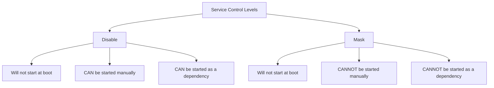

# How to Mask and Unmask Services to Prevent Accidental Startup on RHEL

Author: [nawazdhandala](https://www.github.com/nawazdhandala)

Tags: RHEL, systemd, Service Masking, Security, Linux

Description: Learn how to use systemctl mask and unmask on RHEL to completely prevent services from starting, even by accident or as a dependency.

---

Disabling a service with `systemctl disable` prevents it from starting at boot, but it can still be started manually or pulled in as a dependency by another service. If you need to make absolutely sure a service cannot start under any circumstances, you mask it.

I have used masking in a few situations: preventing a service from starting during a migration, locking down services that should never run on certain server types, and stopping a broken service from being restarted by monitoring tools. Here is how it works.

---

## What Masking Actually Does

When you mask a service, systemd creates a symbolic link from the service's unit file to `/dev/null`. Any attempt to start the service, whether manual, at boot, or as a dependency, hits `/dev/null` and fails.

```bash
# Mask the bluetooth service
sudo systemctl mask bluetooth
```

Output:

```
Created symlink /etc/systemd/system/bluetooth.service -> /dev/null.
```

Now try to start it:

```bash
# Attempting to start a masked service fails
sudo systemctl start bluetooth
```

You will get:

```
Failed to start bluetooth.service: Unit bluetooth.service is masked.
```

Nothing can start this service until you unmask it. Not systemctl, not a dependency chain, not a monitoring tool calling the D-Bus API. It is locked down.

---

## Masking vs. Disabling: What is the Difference?

This is the most common question, so let me lay it out clearly:



| Action | Boot Start | Manual Start | Dependency Start |
|--------|-----------|-------------|-----------------|
| Enabled | Yes | Yes | Yes |
| Disabled | No | Yes | Yes |
| Masked | No | No | No |

Think of it this way:
- **Disable** says "do not start this automatically"
- **Mask** says "this service must not run, period"

---

## Unmasking a Service

When you need the service to be available again:

```bash
# Unmask the bluetooth service
sudo systemctl unmask bluetooth
```

Output:

```
Removed /etc/systemd/system/bluetooth.service.
```

This removes the symlink to `/dev/null`, restoring the original behavior. After unmasking, the service is in a disabled state. You will need to enable and start it if you want it running:

```bash
# After unmasking, enable and start if needed
sudo systemctl enable --now bluetooth
```

---

## Checking if a Service is Masked

You can check the mask state with `is-enabled`:

```bash
# Check if a service is masked
systemctl is-enabled bluetooth
```

If masked, this returns `masked`. You can also see it in the full status output:

```bash
# Full status shows the mask state
sudo systemctl status bluetooth
```

The "Loaded" line will show the link to `/dev/null`:

```
bluetooth.service
     Loaded: masked (Reason: Unit bluetooth.service is masked.)
     Active: inactive (dead)
```

To list all masked services on the system:

```bash
# List all masked service unit files
systemctl list-unit-files --type=service --state=masked
```

---

## Use Cases for Masking

### Preventing iptables and firewalld Conflicts

If you are running firewalld, you definitely do not want iptables or nftables services starting independently:

```bash
# Mask iptables to prevent conflicts with firewalld
sudo systemctl mask iptables
sudo systemctl mask ip6tables
```

### Locking Down Server Roles

On a web server, there are services that have no business running. Mask them to prevent accidental activation:

```bash
# Mask services that should never run on a web server
sudo systemctl mask bluetooth
sudo systemctl mask cups
sudo systemctl mask avahi-daemon
```

### During Maintenance or Migration

When you are migrating a database to a new server, you might want to make sure the database service on the old server cannot be started accidentally:

```bash
# Prevent the database from starting during migration
sudo systemctl stop mariadb
sudo systemctl mask mariadb
```

After the migration is verified and the old server is being decommissioned, it does not matter. But during the transition period, masking prevents someone from accidentally starting the old database and causing a split-brain situation.

### Stopping Restart Loops

If a service is failing and systemd keeps restarting it (because the unit file has `Restart=always`), masking stops the loop immediately:

```bash
# Stop a failing service and prevent restart loop
sudo systemctl stop failing-service
sudo systemctl mask failing-service
```

This is faster and cleaner than editing the unit file to change the restart policy while you troubleshoot.

---

## Masking with the --now Flag

Just like enable and disable, mask supports the `--now` flag to combine the mask with an immediate stop:

```bash
# Mask and stop the service in one command
sudo systemctl mask --now bluetooth
```

And for unmask, though `--now` on unmask does not start the service, it just removes the mask:

```bash
# Unmask the service
sudo systemctl unmask bluetooth
```

---

## What Happens to Dependencies?

When you mask a service that other services depend on, those dependent services will fail to start if they use `Requires=` for the dependency. If they use `Wants=`, they will start without the masked service.

Here is an example:

```bash
# If service-a has Requires=service-b and you mask service-b
sudo systemctl mask service-b
sudo systemctl start service-a
# This fails because service-b is required but cannot start

# If service-a has Wants=service-b and you mask service-b
sudo systemctl mask service-b
sudo systemctl start service-a
# This succeeds, service-a starts without service-b
```

This is worth keeping in mind when you mask services. Check the dependency tree first:

```bash
# See what depends on a service before masking it
systemctl list-dependencies --reverse bluetooth
```

---

## Runtime Masking

There is also a runtime mask that does not persist across reboots:

```bash
# Mask only until the next reboot
sudo systemctl mask --runtime bluetooth
```

This creates the symlink in `/run/systemd/system/` instead of `/etc/systemd/system/`, so it disappears on reboot. Useful when you need a temporary lock during a maintenance window but want the service to come back normally afterward.

```bash
# Check where the mask link points
ls -la /run/systemd/system/bluetooth.service
```

---

## Audit Script: Find All Masked Services

Here is a quick script to audit which services are masked on a system:

```bash
# List all masked services and their mask targets
systemctl list-unit-files --type=service --state=masked --no-legend | while read -r unit state _; do
    echo "$unit -> $(readlink /etc/systemd/system/$unit 2>/dev/null || echo 'runtime mask')"
done
```

Run this periodically to make sure nothing unexpected has been masked.

---

## Common Mistakes

**Masking instead of disabling.** If you just want a service to not start at boot but still be available for manual starts, use disable. Masking is the heavy hammer.

**Forgetting you masked something.** Months later, someone tries to start the service and it fails. Document your masks. I keep a comment in my Ansible inventory noting which services are masked on which server roles.

**Masking before stopping.** If the service is running when you mask it, it keeps running until the next stop or reboot. Use `--now` to stop and mask simultaneously.

---

## Wrapping Up

Masking is a simple but powerful tool for service management on RHEL. It gives you absolute control over which services can run on a system. Use it for security hardening, conflict prevention, and maintenance scenarios where you need a guarantee that a service will not start. Just remember to document your masks, because "it's masked" is not obvious to the next person who logs into the server.
