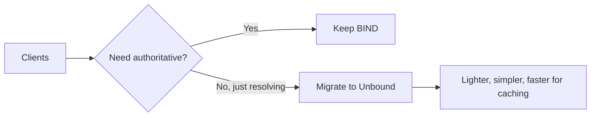

# How to Migrate from BIND to Unbound DNS Resolver on RHEL

Author: [nawazdhandala](https://www.github.com/nawazdhandala)

Tags: RHEL, BIND, Unbound, DNS, Migration, Linux

Description: Step-by-step guide to migrating your recursive DNS resolver from BIND to Unbound on RHEL, covering configuration mapping and validation.

---

BIND can do everything - authoritative serving, recursive resolution, caching. But if all you need is a recursive resolver, it's overkill. Unbound is purpose-built for recursive DNS resolution and caching. It's lighter, faster for that specific job, and has a smaller attack surface. If your BIND instance is just doing recursion and caching, migrating to Unbound is worth considering.

## BIND vs Unbound for Resolving

| Feature | BIND | Unbound |
|---------|------|---------|
| Authoritative serving | Yes | No |
| Recursive resolution | Yes | Yes |
| Caching | Yes | Yes (optimized) |
| DNSSEC validation | Yes | Yes |
| Memory footprint | Larger | Smaller |
| Configuration complexity | Higher | Lower |



## Step 1: Document Your BIND Resolver Configuration

Before migrating, capture what your BIND resolver is doing. Check named.conf for:

```bash
grep -E "forwarders|recursion|allow-recursion|allow-query|forward" /etc/named.conf
```

Note these settings:
- Forwarder addresses
- ACLs for who can query and recurse
- Any local zone overrides
- Cache size limits
- DNSSEC settings

## Step 2: Install Unbound

```bash
dnf install unbound -y
```

## Step 3: Configure Unbound

Unbound's config file is `/etc/unbound/unbound.conf`. Create a configuration that mirrors your BIND resolver:

```bash
cp /etc/unbound/unbound.conf /etc/unbound/unbound.conf.bak

cat > /etc/unbound/unbound.conf << 'EOF'
server:
    # Interface and access control
    interface: 0.0.0.0
    interface: ::0
    port: 53

    # Access control - match your BIND allow-query/allow-recursion
    access-control: 127.0.0.0/8 allow
    access-control: 10.0.0.0/8 allow
    access-control: 192.168.0.0/16 allow
    access-control: 172.16.0.0/12 allow
    access-control: 0.0.0.0/0 refuse

    # Performance tuning
    num-threads: 2
    msg-cache-slabs: 4
    rrset-cache-slabs: 4
    infra-cache-slabs: 4
    key-cache-slabs: 4

    # Cache sizes
    msg-cache-size: 128m
    rrset-cache-size: 256m

    # Cache TTL limits
    cache-max-ttl: 86400
    cache-min-ttl: 0

    # DNSSEC validation
    auto-trust-anchor-file: "/var/lib/unbound/root.key"

    # Hardening options
    hide-identity: yes
    hide-version: yes
    harden-glue: yes
    harden-dnssec-stripped: yes
    harden-referral-path: yes

    # Logging
    verbosity: 1
    log-queries: no
    logfile: "/var/log/unbound/unbound.log"
    use-syslog: no

    # Root hints
    root-hints: "/etc/unbound/root.hints"

    # Prefetch popular entries before they expire
    prefetch: yes
    prefetch-key: yes

    # Private address ranges - don't return private IPs for public queries
    private-address: 10.0.0.0/8
    private-address: 172.16.0.0/12
    private-address: 192.168.0.0/16
    private-address: 169.254.0.0/16

    # Local zone overrides (equivalent to BIND local zones)
    local-zone: "internal.corp." static
    local-data: "gitlab.internal.corp. IN A 192.168.1.70"
    local-data: "wiki.internal.corp. IN A 192.168.1.71"
    local-data: "jenkins.internal.corp. IN A 192.168.1.72"

    # Reverse lookups for local data
    local-data-ptr: "192.168.1.70 gitlab.internal.corp"
    local-data-ptr: "192.168.1.71 wiki.internal.corp"
    local-data-ptr: "192.168.1.72 jenkins.internal.corp"
EOF
```

## Step 4: Set Up Forwarding (If Used)

If your BIND config used forwarders, add a forward zone in Unbound:

```bash
cat >> /etc/unbound/unbound.conf << 'EOF'

# Forward all queries to upstream resolvers
# Comment this out for full recursive resolution from root
forward-zone:
    name: "."
    forward-addr: 8.8.8.8
    forward-addr: 8.8.4.4
    forward-addr: 1.1.1.1
EOF
```

If you only forwarded specific domains:

```bash
cat >> /etc/unbound/unbound.conf << 'EOF'

# Forward specific domain to internal DNS
forward-zone:
    name: "company.internal."
    forward-addr: 10.0.0.53
EOF
```

## Step 5: Download Root Hints

Get fresh root hints:

```bash
curl -o /etc/unbound/root.hints https://www.internic.net/domain/named.cache
```

## Step 6: Prepare the Environment

Create the log directory:

```bash
mkdir -p /var/log/unbound
chown unbound:unbound /var/log/unbound
```

Fetch the DNSSEC root trust anchor:

```bash
unbound-anchor -a /var/lib/unbound/root.key
```

Validate the configuration:

```bash
unbound-checkconf /etc/unbound/unbound.conf
```

## Step 7: Perform the Switch

Stop BIND:

```bash
systemctl stop named
systemctl disable named
```

Start Unbound:

```bash
systemctl enable --now unbound
```

Update the firewall if needed:

```bash
firewall-cmd --permanent --add-service=dns
firewall-cmd --reload
```

## Step 8: Test Resolution

Test basic resolution:

```bash
dig @localhost google.com
dig @localhost example.com MX
```

Test DNSSEC validation:

```bash
# This should work (valid DNSSEC)
dig @localhost dnssec-tools.org A +dnssec

# This should fail (deliberately broken DNSSEC)
dig @localhost dnssec-failed.org A
```

Test your local zone overrides:

```bash
dig @localhost gitlab.internal.corp A +short
dig @localhost -x 192.168.1.70 +short
```

Test cache performance:

```bash
# First query
dig @localhost wikipedia.org

# Second query (should be much faster)
dig @localhost wikipedia.org
```

## Step 9: Update Clients

If your clients point to the server by IP, no changes are needed. If they reference it by service name, verify DNS is responding on the expected address.

Test from a client:

```bash
dig @192.168.1.10 google.com
```

## Configuration Mapping Reference

Here's how common BIND directives map to Unbound:

| BIND | Unbound |
|------|---------|
| `allow-query { ... }` | `access-control: ... allow` |
| `allow-recursion { ... }` | Same as access-control |
| `forwarders { 8.8.8.8; }` | `forward-zone: name: "." forward-addr: 8.8.8.8` |
| `max-cache-size 256m` | `msg-cache-size: 128m` + `rrset-cache-size: 256m` |
| `dnssec-validation auto` | `auto-trust-anchor-file` |
| `zone "local" { ... }` (stub) | `local-zone` + `local-data` |
| `blackhole { ... }` | `access-control: ... refuse` |

## Monitoring Unbound

Check server statistics:

```bash
unbound-control stats_noreset
```

Dump the cache:

```bash
unbound-control dump_cache > /tmp/unbound-cache.txt
```

Flush the cache:

```bash
unbound-control flush_zone example.com
```

Flush everything:

```bash
unbound-control flush_requestlist
unbound-control flush_zone .
```

## Rollback Plan

If something goes wrong, rolling back is straightforward:

```bash
systemctl stop unbound
systemctl disable unbound
systemctl enable --now named
```

Keep your BIND configuration files until you're confident Unbound is working correctly. Give it at least a week of production use before cleaning up the old BIND config.

The migration from BIND to Unbound for resolving is typically smooth. The main work is translating your access controls and forwarder configuration. Once running, Unbound requires less maintenance and uses less memory for the same workload.
