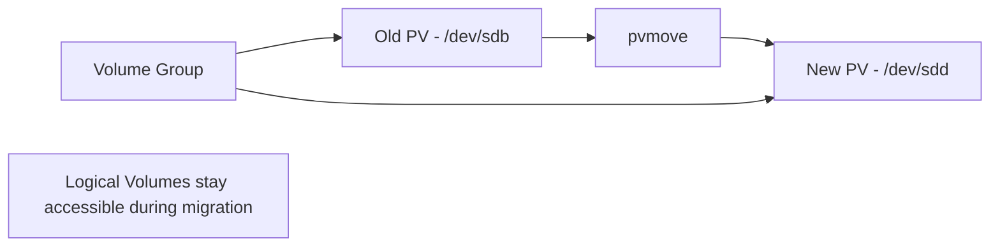

# How to Migrate Data Between LVM Physical Volumes on RHEL

Author: [nawazdhandala](https://www.github.com/nawazdhandala)

Tags: RHEL, LVM, Storage, Migration, Linux

Description: Learn how to move data between LVM physical volumes on RHEL for disk replacement or storage tier migration.

---

When you need to replace a failing disk, upgrade to larger storage, or move data to faster media, LVM makes it possible to migrate data between physical volumes without any downtime. The `pvmove` command handles the heavy lifting.

## The Migration Process



## Adding the Destination Disk

First, prepare and add the new disk to the volume group:

```bash
# Initialize the new disk as a PV
sudo pvcreate /dev/sdd

# Add it to the existing volume group
sudo vgextend datavg /dev/sdd

# Verify both PVs are in the VG
sudo pvs
```

## Moving All Data from One PV to Another

The simplest case is moving everything from the old disk:

```bash
# Move all extents from /dev/sdb to /dev/sdd
sudo pvmove /dev/sdb /dev/sdd
```

This runs in the foreground and shows progress. For large volumes, it can take hours. To run it in the background:

```bash
# Start the migration in the background
sudo pvmove -b /dev/sdb /dev/sdd

# Check progress
sudo pvmove --status
# Or use lvs
sudo lvs -o lv_name,copy_percent
```

## Moving a Specific Logical Volume

If you only want to move one LV:

```bash
# Move only the datalv from sdb to sdd
sudo pvmove -n datalv /dev/sdb /dev/sdd
```

## Removing the Old Disk

After migration completes, remove the old PV from the volume group:

```bash
# Verify the old PV has no allocated extents
sudo pvs /dev/sdb

# Remove it from the volume group
sudo vgreduce datavg /dev/sdb

# Wipe the PV metadata
sudo pvremove /dev/sdb

# Physically remove or repurpose the disk
```

## Migrating Between Storage Tiers

You can use tags to organize PVs by performance tier:

```bash
# Tag PVs by tier
sudo pvchange --addtag fast /dev/sdc    # SSD
sudo pvchange --addtag slow /dev/sdb    # HDD

# Move a hot LV to the SSD tier
sudo pvmove -n hotlv /dev/sdb /dev/sdc

# Move a cold LV to the HDD tier
sudo pvmove -n coldlv /dev/sdc /dev/sdb
```

## Handling Failures During Migration

If `pvmove` is interrupted (system crash, etc.), recovery is straightforward:

```bash
# Check the state of any incomplete moves
sudo lvs -a -o lv_name,copy_percent

# Resume an interrupted pvmove
sudo pvmove /dev/sdb /dev/sdd

# If you need to abort a pvmove in progress
sudo pvmove --abort
```

## Replacing a Failing Disk

When a disk shows signs of failure, act quickly:

```bash
# Check disk health
sudo smartctl -a /dev/sdb

# Add replacement disk
sudo pvcreate /dev/sdd
sudo vgextend datavg /dev/sdd

# Move everything off the failing disk
sudo pvmove /dev/sdb /dev/sdd

# Remove the failing disk from the VG
sudo vgreduce datavg /dev/sdb
sudo pvremove /dev/sdb
```

## Summary

LVM data migration with `pvmove` is one of the most powerful features of LVM on RHEL. It allows you to move data between physical volumes transparently while volumes remain mounted and accessible. This makes disk replacements, storage upgrades, and tier migrations seamless operations.

