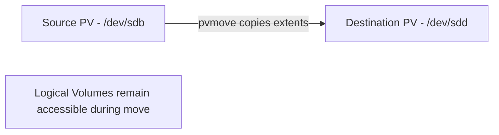

# How to Migrate Data Between Physical Volumes Using pvmove on RHEL

Author: [nawazdhandala](https://www.github.com/nawazdhandala)

Tags: RHEL, LVM, pvmove, Data Migration, Linux

Description: Use pvmove to live-migrate data between physical volumes in LVM on RHEL, enabling disk replacement and storage rebalancing without downtime.

---

The `pvmove` command is one of LVM's most powerful features. It lets you move data from one physical volume to another while the filesystems are mounted and applications are running. This is essential for replacing disks, migrating to faster storage, or rebalancing data across drives.

## How pvmove Works

pvmove copies data extent by extent from the source PV to the destination PV (or any available space in the VG). It is a live operation that does not require unmounting.



## Basic pvmove

Move all data off a physical volume:

```bash
# Move all data from /dev/sdb to any available space in the VG
sudo pvmove /dev/sdb
```

This distributes the data across all other PVs in the volume group.

## Move to a Specific Destination

```bash
# Move all data from /dev/sdb specifically to /dev/sdd
sudo pvmove /dev/sdb /dev/sdd
```

## Monitoring Progress

pvmove can take a long time for large amounts of data. Monitor progress:

```bash
# pvmove shows a progress indicator by default
sudo pvmove /dev/sdb /dev/sdd

# Or check the status from another terminal
sudo lvs -a -o+devices
```

## Moving a Specific Logical Volume

You can move just one LV instead of all data on a PV:

```bash
# Move only the "datalv" logical volume from sdb to sdd
sudo pvmove -n datalv /dev/sdb /dev/sdd
```

## Practical Example: Disk Replacement

Replace an old slow disk with a new fast one:

```bash
# Step 1: Add the new disk to the VG
sudo pvcreate /dev/sdd
sudo vgextend datavg /dev/sdd

# Step 2: Move all data from the old disk to the new one
sudo pvmove /dev/sdb /dev/sdd

# Step 3: Remove the old disk from the VG
sudo vgreduce datavg /dev/sdb

# Step 4: Remove the PV label
sudo pvremove /dev/sdb

# The old disk can now be physically removed
```

## Performance Considerations

pvmove is I/O intensive. Some tips:

```bash
# Run pvmove during off-peak hours if possible
# Monitor I/O impact
iostat -x 5

# pvmove uses a temporary mirror, so it doubles the write I/O
```

## Handling Interruptions

If pvmove is interrupted (power failure, system crash):

```bash
# Check for any interrupted pvmove operations
sudo lvs -a | grep pvmove

# Resume the interrupted pvmove
sudo pvmove
```

LVM tracks the progress and can resume where it left off.

## Verifying the Move

After pvmove completes:

```bash
# Verify no data remains on the source PV
sudo pvs -o+pv_used

# Check that the source PV shows 0 used
sudo pvdisplay /dev/sdb

# Verify LV locations
sudo lvs -o+devices
```

## Common Use Cases

1. **Disk replacement** - Move data off an aging or failing disk
2. **Storage tier migration** - Move from HDD to SSD
3. **Rebalancing** - Distribute data more evenly across disks
4. **Decommissioning** - Clear a disk before removing it from the VG

pvmove makes LVM disk management truly flexible. You can rearrange your physical storage layout without any downtime or data loss.
