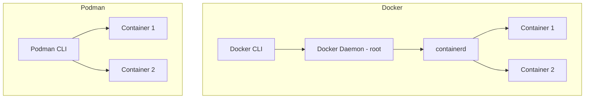

# How to Migrate from Docker to Podman on RHEL

Author: [nawazdhandala](https://www.github.com/nawazdhandala)

Tags: RHEL, Docker, Podman, Migration, Linux

Description: A practical migration guide for moving from Docker to Podman on RHEL, covering command equivalents, Docker Compose migration, systemd integration, and common pitfalls.

---

Docker is not shipped with RHEL. Red Hat has gone all-in on Podman, and if you are coming from a Docker-based workflow, the migration is less painful than you might think. Most Docker commands work identically with Podman. The real differences are architectural, and understanding them will make the transition smooth.

## Key Differences Between Docker and Podman



| Feature | Docker | Podman |
|---------|--------|--------|
| Daemon | Required (dockerd) | None |
| Root required | Yes (default) | No (rootless default) |
| Docker Compose | Native support | Via podman-compose or socket |
| systemd integration | Limited | Native (Quadlet) |
| Pod support | No | Yes |
| Image format | Docker/OCI | Docker/OCI |

## Step 1: Remove Docker (If Installed)

If you somehow have Docker installed on RHEL:

## Stop and disable Docker
```bash
sudo systemctl stop docker docker.socket
sudo systemctl disable docker docker.socket
```

## Remove Docker packages
```bash
sudo dnf remove -y docker-ce docker-ce-cli containerd.io docker-compose-plugin
```

## Remove Docker data (back up first if needed)
```bash
sudo mv /var/lib/docker /var/lib/docker.backup
```

## Step 2: Install Podman

This section covers step 2: install podman.

## Install the container tools suite
```bash
sudo dnf install -y container-tools
```

This installs Podman, Buildah, and Skopeo.

## Step 3: Create the Docker Alias

For muscle memory and scripts that call `docker`:

## Add a docker alias to your shell profile
```bash
echo 'alias docker=podman' >> ~/.bashrc
source ~/.bashrc
```

For system-wide aliasing, install the podman-docker package:

## Install the docker CLI compatibility package
```bash
sudo dnf install -y podman-docker
```

This creates a `/usr/bin/docker` symlink that points to Podman and also provides a Docker-compatible man page.

## Step 4: Migrate Docker Images

Export images from Docker and import into Podman:

## On the old Docker system, save images to tar files
```bash
docker save my-app:latest -o my-app.tar
docker save my-db:latest -o my-db.tar
```

## On the new RHEL system, load them into Podman
```bash
podman load -i my-app.tar
podman load -i my-db.tar
```

Or use Skopeo to copy directly between storage backends:

```bash
skopeo copy docker-daemon:my-app:latest containers-storage:my-app:latest
```

## Step 5: Migrate Docker Volumes

Docker volumes live in `/var/lib/docker/volumes/`. Copy the data:

## On the Docker system, find the volume data
```bash
docker volume inspect my-data --format '{{.Mountpoint}}'
```

## Copy the volume data
```bash
sudo tar czf volume-backup.tar.gz -C /var/lib/docker/volumes/my-data/_data .
```

## On the RHEL system, create a Podman volume and restore
```bash
podman volume create my-data
sudo tar xzf volume-backup.tar.gz -C $(podman volume inspect my-data --format '{{.Mountpoint}}')
```

## Step 6: Migrate Docker Compose Files

Your existing `docker-compose.yml` files need minor adjustments:

## Install podman-compose
```bash
pip3 install --user podman-compose
```

Most compose files work as-is. Common changes needed:

1. Replace `docker.io/` prefix if images use short names
2. Add `:Z` to volume mounts for SELinux
3. Remove Docker-specific features like `deploy` sections

Before:
```yaml
volumes:
  - ./data:/var/lib/mysql
```

After:
```yaml
volumes:
  - ./data:/var/lib/mysql:Z
```

## Step 7: Migrate Container Startup Scripts

Replace Docker systemd services or cron-based startup with Quadlet:

Old Docker approach:
```bash
# Cron or script that runs:
docker run -d --restart always --name web -p 80:80 nginx
```

New Podman Quadlet approach:
```bash
cat > ~/.config/containers/systemd/web.container << 'EOF'
[Unit]
Description=Web Server

[Container]
Image=docker.io/library/nginx:latest
PublishPort=80:80

[Service]
Restart=always

[Install]
WantedBy=default.target
EOF

systemctl --user daemon-reload
systemctl --user enable --now web
```

## Step 8: Docker Socket Compatibility

Enable the Podman socket for tools that expect a Docker socket:

## Enable rootless Podman socket
```bash
systemctl --user enable --now podman.socket
```

## Set DOCKER_HOST for compatibility
```bash
export DOCKER_HOST=unix://$XDG_RUNTIME_DIR/podman/podman.sock
```

## For rootful socket
```bash
sudo systemctl enable --now podman.socket
```

Now tools like `docker-compose`, Portainer, and other Docker-compatible tools can talk to Podman.

## Step 9: Update CI/CD Pipelines

Replace Docker commands in your CI/CD scripts:

```bash
# Before (Docker)
docker build -t my-app:$TAG .
docker push my-registry.com/my-app:$TAG

# After (Podman - identical syntax)
podman build -t my-app:$TAG .
podman push my-registry.com/my-app:$TAG
```

For Buildah-specific builds:

```bash
buildah build -t my-app:$TAG .
buildah push my-app:$TAG docker://my-registry.com/my-app:$TAG
```

## Command Equivalence Reference

| Docker Command | Podman Equivalent |
|---------------|-------------------|
| docker run | podman run |
| docker build | podman build |
| docker push | podman push |
| docker pull | podman pull |
| docker ps | podman ps |
| docker images | podman images |
| docker logs | podman logs |
| docker exec | podman exec |
| docker stop | podman stop |
| docker rm | podman rm |
| docker rmi | podman rmi |
| docker inspect | podman inspect |
| docker network | podman network |
| docker volume | podman volume |
| docker compose | podman-compose |
| docker system prune | podman system prune |

## Common Migration Pitfalls

**SELinux volume mounts:** Add `:Z` or `:z` to volume mounts. Docker on RHEL typically ran with SELinux in permissive mode for containers, but Podman enforces it.

**Rootless port binding:** Unprivileged users cannot bind ports below 1024 by default. Fix with:
```bash
sudo sysctl -w net.ipv4.ip_unprivileged_port_start=80
```

**User namespace differences:** Files created by root inside a rootless container are owned by your subordinate UIDs on the host, not by root.

**No docker0 bridge:** Podman uses different network interfaces. Scripts that reference `docker0` need updating.

**Service persistence:** Rootless containers need `loginctl enable-linger` to survive user logout.

## Verification Checklist

After migration, verify:

```bash
# Images migrated
podman images

# Volumes migrated
podman volume ls

# Containers running
podman ps

# Services enabled
systemctl --user list-unit-files | grep container

# Network connectivity
podman run --rm docker.io/library/alpine ping -c 1 google.com
```

## Summary

Migrating from Docker to Podman on RHEL is mostly about replacing the `docker` command with `podman` and switching from Docker's daemon-based service management to systemd Quadlet files. The container images, registries, and day-to-day commands are nearly identical. Take time to understand rootless containers and SELinux integration, as those are the areas where most migration issues show up.
