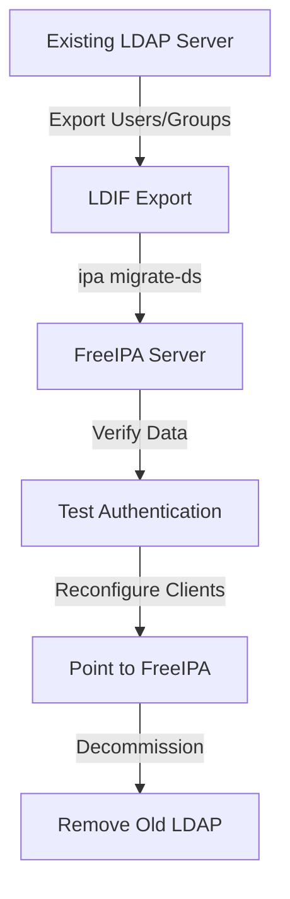

# How to Migrate from an External LDAP Server to FreeIPA (IdM) on RHEL 9

Author: [nawazdhandala](https://www.github.com/nawazdhandala)

Tags: RHEL, LDAP, FreeIPA, Migration, Linux

Description: A guide to migrating user and group data from an external LDAP directory (OpenLDAP or 389 DS) to FreeIPA on RHEL 9, covering data export, import, and client cutover.

---

Moving from a standalone LDAP server to FreeIPA gives you integrated Kerberos authentication, certificate management, DNS, HBAC, and a web UI on top of your directory service. The migration itself is mostly about getting the data out of the old server and into FreeIPA without losing users, groups, or breaking client authentication during the transition.

## Migration Strategy



FreeIPA includes a built-in migration tool (`ipa migrate-ds`) that connects directly to the source LDAP server and imports users and groups. This is the preferred approach over manual LDIF manipulation.

## Prerequisites

- A working FreeIPA server on RHEL 9
- Network connectivity between FreeIPA and the source LDAP server
- Read access to the source LDAP directory (bind DN and password)
- A list of LDAP schemas and custom attributes in use
- A maintenance window for the client cutover

## Step 1 - Audit the Source LDAP Server

Before migrating, understand what you are working with.

```bash
# Count users in the source LDAP
ldapsearch -x -H ldap://old-ldap.example.com \
  -D "cn=admin,dc=example,dc=com" -W \
  -b "ou=people,dc=example,dc=com" "(objectClass=posixAccount)" dn | grep "dn:" | wc -l

# Count groups
ldapsearch -x -H ldap://old-ldap.example.com \
  -D "cn=admin,dc=example,dc=com" -W \
  -b "ou=groups,dc=example,dc=com" "(objectClass=posixGroup)" dn | grep "dn:" | wc -l

# Check the schema in use
ldapsearch -x -H ldap://old-ldap.example.com \
  -D "cn=admin,dc=example,dc=com" -W \
  -b "ou=people,dc=example,dc=com" -s one "(objectClass=*)" objectClass | head -30
```

## Step 2 - Enable Migration Mode on FreeIPA

FreeIPA has a migration mode that must be enabled before importing users.

```bash
# Enable migration mode
ipa config-mod --enable-migration=TRUE
```

This allows users to authenticate with their old LDAP passwords through a migration process. When a user first logs in to FreeIPA, their password is captured and stored in the FreeIPA Kerberos database.

## Step 3 - Run the Migration

Use `ipa migrate-ds` to pull data from the source LDAP server.

```bash
# Migrate users and groups from the source LDAP
ipa migrate-ds \
  --bind-dn="cn=admin,dc=example,dc=com" \
  --user-container="ou=people" \
  --group-container="ou=groups" \
  --with-compat \
  ldap://old-ldap.example.com:389
```

You will be prompted for the bind password.

### Migration Options

If your LDAP uses a different schema, specify the object classes:

```bash
# Custom schema mapping
ipa migrate-ds \
  --bind-dn="cn=admin,dc=example,dc=com" \
  --user-container="ou=people" \
  --group-container="ou=groups" \
  --user-objectclass=inetOrgPerson \
  --group-objectclass=groupOfNames \
  --group-member-attribute=member \
  ldap://old-ldap.example.com:389
```

To exclude certain users or groups:

```bash
# Exclude specific users
ipa migrate-ds \
  --bind-dn="cn=admin,dc=example,dc=com" \
  --user-container="ou=people" \
  --group-container="ou=groups" \
  --exclude-users="admin,nologin,nobody" \
  ldap://old-ldap.example.com:389
```

## Step 4 - Verify Migrated Data

After the migration, check that users and groups came across correctly.

```bash
# List migrated users
ipa user-find --sizelimit=0 | tail -5

# Check a specific user
ipa user-show jsmith --all

# List migrated groups
ipa group-find --sizelimit=0 | tail -5

# Check group membership
ipa group-show developers --all
```

Verify UID and GID consistency:

```bash
# Compare UIDs between old and new
# On FreeIPA:
ipa user-show jsmith | grep UID

# On old LDAP:
ldapsearch -x -H ldap://old-ldap.example.com \
  -D "cn=admin,dc=example,dc=com" -W \
  -b "ou=people,dc=example,dc=com" "(uid=jsmith)" uidNumber
```

## Step 5 - Handle Passwords

Passwords cannot be migrated directly because they are stored as hashes and FreeIPA needs to create Kerberos keys. FreeIPA handles this through first-login migration.

When migration mode is enabled, the first time a user logs in to FreeIPA with their old LDAP password:
1. FreeIPA forwards the authentication to the migration page
2. The password is used to create Kerberos keys
3. Subsequent logins use Kerberos

```bash
# Users can trigger password migration by logging into the FreeIPA web UI
# Or by using kinit:
kinit jsmith
# Enter the old LDAP password
# FreeIPA creates the Kerberos principal
```

For users who cannot log in interactively, reset their passwords:

```bash
# Force a password reset for a user
ipa passwd jsmith
```

## Step 6 - Migrate Clients to FreeIPA

Switch LDAP clients to point to FreeIPA. The best approach is to enroll them as FreeIPA clients.

```bash
# On each client, install and configure the IdM client
sudo dnf install ipa-client -y

# Enroll as a FreeIPA client
sudo ipa-client-install \
  --server=ipa.example.com \
  --domain=example.com \
  --realm=EXAMPLE.COM \
  --mkhomedir
```

If you cannot immediately enroll all clients, configure SSSD to point to FreeIPA's LDAP interface as a temporary measure:

```ini
[domain/example.com]
id_provider = ldap
auth_provider = ldap
ldap_uri = ldaps://ipa.example.com
ldap_search_base = dc=example,dc=com
ldap_user_search_base = cn=users,cn=accounts,dc=example,dc=com
ldap_group_search_base = cn=groups,cn=accounts,dc=example,dc=com
```

## Step 7 - Disable Migration Mode

Once all users have migrated their passwords, disable migration mode.

```bash
# Disable migration mode
ipa config-mod --enable-migration=FALSE
```

## Step 8 - Decommission the Old LDAP Server

After all clients are pointed to FreeIPA and all users have authenticated at least once:

```bash
# Stop the old LDAP server
sudo systemctl stop slapd

# Keep it around for a few weeks in case you need to reference it
# Then remove it
```

## Troubleshooting

### Users Not Migrated

```bash
# Check migration logs
sudo journalctl -u httpd | grep migrate

# Run migration with verbose output
ipa migrate-ds --debug \
  --bind-dn="cn=admin,dc=example,dc=com" \
  --user-container="ou=people" \
  ldap://old-ldap.example.com:389
```

### UID Conflicts

If FreeIPA already has users with conflicting UIDs:

```bash
# Check for conflicts
ipa user-find --uid=10001
```

### Group Membership Issues

```bash
# Verify group members were migrated
ipa group-show developers

# Manually add missing members
ipa group-add-member developers --users=jsmith
```

The migration from a standalone LDAP to FreeIPA is well-supported and the built-in tools handle most of the heavy lifting. Plan for the password migration phase to take time, as each user needs to log in at least once to complete the process.
