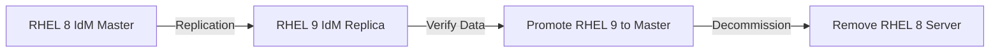

# How to Migrate Identity Management from RHEL 8 to RHEL 9

Author: [nawazdhandala](https://www.github.com/nawazdhandala)

Tags: RHEL, IdM, Migration, FreeIPA, Linux

Description: A practical guide to migrating your Identity Management (IdM/FreeIPA) deployment from RHEL 8 to RHEL 9, covering replica promotion, data verification, and rollback planning.

---

Migrating IdM from RHEL 8 to RHEL 9 is not an in-place upgrade. The supported path is to stand up new RHEL 9 replicas, replicate data to them, and then decommission the old RHEL 8 servers. This approach gives you a fallback if something goes sideways and keeps the directory service available throughout the process.

## Migration Strategy Overview



The general plan is straightforward: install a RHEL 9 replica into the existing topology, confirm everything replicated properly, move the CA renewal master and CRL generation roles to the new server, then retire the old ones.

## Prerequisites

Before you start, make sure you have:

- A fully functional IdM deployment on RHEL 8 (FreeIPA 4.9.x)
- A fresh RHEL 9 system with a static IP and proper DNS entries
- The RHEL 9 system registered and subscribed with access to the idm:DL1 module (or the idm packages in BaseOS/AppStream)
- Network connectivity between old and new servers on ports 389, 636, 88, 464, and 443
- A current backup of your RHEL 8 IdM server

## Step 1 - Back Up the Existing RHEL 8 IdM Server

Always start with a backup. If the migration goes wrong, you want a recovery point.

```bash
# Create a full IdM backup on the RHEL 8 server
sudo ipa-backup

# Verify the backup was created
ls -la /var/lib/ipa/backup/
```

The backup includes the Directory Server database, Kerberos data, CA data, and configuration files.

## Step 2 - Prepare the RHEL 9 System

On the new RHEL 9 system, set the hostname and configure DNS to point to the existing IdM server.

```bash
# Set the FQDN hostname
sudo hostnamectl set-hostname replica.example.com

# Make sure the hostname resolves correctly
host replica.example.com

# Install the IdM client and server packages
sudo dnf install ipa-server ipa-server-dns -y
```

If your RHEL 8 IdM deployment uses an integrated CA, also install the CA packages:

```bash
# Install CA component if needed
sudo dnf install ipa-server-ca -y
```

## Step 3 - Enroll the RHEL 9 System as an IdM Client

Before promoting the RHEL 9 box to a replica, enroll it as a client first. This validates connectivity and authentication.

```bash
# Enroll as an IdM client pointing to the RHEL 8 master
sudo ipa-client-install --server=master.example.com \
  --domain=example.com \
  --realm=EXAMPLE.COM \
  --principal=admin \
  --password=YourAdminPassword \
  --mkhomedir
```

Verify the enrollment:

```bash
# Check that you can authenticate and query IdM
kinit admin
ipa user-find --sizelimit=5
```

## Step 4 - Install the RHEL 9 Replica

Now promote the RHEL 9 client to a full replica:

```bash
# Install the replica with DNS and CA
sudo ipa-replica-install \
  --setup-dns \
  --setup-ca \
  --forwarder=8.8.8.8 \
  --no-forward-policy
```

If you are not using integrated DNS, skip the DNS flags:

```bash
# Install replica without DNS
sudo ipa-replica-install --setup-ca
```

This process can take 10 to 30 minutes depending on the size of your directory.

## Step 5 - Verify Replication

After the replica install completes, check that data is replicating properly.

```bash
# Check replication topology
ipa topologysegment-find suffix

# Check replication status from the RHEL 9 replica
ipa-replica-manage list

# Verify user data exists on the new replica
ipa user-find --sizelimit=10
```

Also check the Directory Server replication status directly:

```bash
# Check the replication agreement status
sudo dsconf -D "cn=Directory Manager" ldap://replica.example.com \
  repl-agmt list --suffix dc=example,dc=com
```

## Step 6 - Migrate CA Renewal Master and CRL Generation

If you are running an integrated CA, move the renewal master role to the RHEL 9 replica before decommissioning the RHEL 8 server.

```bash
# Check the current CA renewal master
ipa config-show | grep "CA renewal"

# Move the CA renewal master to the RHEL 9 replica
ipa config-mod --ca-renewal-master-server=replica.example.com
```

Move CRL generation as well:

```bash
# On the RHEL 9 replica, enable CRL generation
sudo ipa-crlgen-manage enable

# On the old RHEL 8 server, disable CRL generation
sudo ipa-crlgen-manage disable
```

## Step 7 - Update DNS and Client Configuration

If you use IdM-integrated DNS, update SRV records and any hardcoded references.

```bash
# Update any clients that point to the old server
# On each client, update /etc/ipa/default.conf if needed
sudo sed -i 's/master.example.com/replica.example.com/' /etc/ipa/default.conf

# Re-run SSSD to pick up new server
sudo systemctl restart sssd
```

## Step 8 - Decommission the RHEL 8 Server

Once you have confirmed that everything works on the RHEL 9 replica, remove the old server from the topology.

```bash
# From the RHEL 9 replica, remove the old server
ipa server-del master.example.com

# On the RHEL 8 server, uninstall IdM
sudo ipa-server-install --uninstall
```

## Post-Migration Checks

Run these checks after the migration is complete:

```bash
# Confirm the RHEL 9 server is the only server (or the primary)
ipa server-find

# Verify CA certificate chain
ipa-certupdate

# Test Kerberos authentication
kdestroy -A
kinit admin

# Test a user login on a client
ssh testuser@client.example.com
```

## Rollback Plan

If you run into problems during migration:

1. Do not decommission the RHEL 8 server until you have fully tested the RHEL 9 replica
2. If replication is broken, remove the RHEL 9 replica and start over
3. If you already decommissioned the RHEL 8 server, restore from the backup taken in Step 1

```bash
# Restore from backup on a fresh RHEL 8 install
sudo ipa-restore /var/lib/ipa/backup/ipa-full-2026-03-04-00-00-00
```

## Common Pitfalls

- **Clock skew**: Kerberos is extremely sensitive to time differences. Make sure both servers use NTP and are within 5 minutes of each other.
- **DNS resolution**: Both forward and reverse DNS must work for both servers. Test with `host` and `dig` before starting.
- **Firewall ports**: Ensure ports 88, 464, 389, 636, 443, 8080, and 8443 are open between servers.
- **Certificate expiration**: If your IPA CA certificates are close to expiring, renew them before migrating.

The migration is not complicated, but it does require patience and methodical verification at each step. Keep the old servers running until you are absolutely sure the new ones are handling everything correctly.
