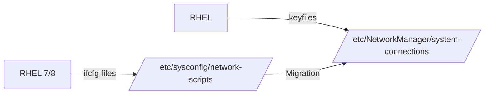

# How to Migrate from ifcfg Files to Keyfile Format in RHEL

Author: [nawazdhandala](https://www.github.com/nawazdhandala)

Tags: RHEL, NetworkManager, Ifcfg, Keyfile, Migration, Linux

Description: A practical guide to migrating network configuration from the legacy ifcfg format to the keyfile format on RHEL, with step-by-step procedures and rollback strategies.

---

If you have been managing Red Hat systems for a while, you are probably familiar with the ifcfg files that lived in `/etc/sysconfig/network-scripts/`. Those files were the standard way to configure networking for over two decades. With RHEL, Red Hat has officially deprecated the ifcfg format in favor of NetworkManager keyfiles. This is not just a cosmetic change - the ifcfg plugin may be removed entirely in a future release, so migration is something you should plan for now.

## What Changed and Why

In RHEL 8 and earlier, NetworkManager supported two configuration backends:

- **ifcfg-rh plugin**: Read and wrote files in `/etc/sysconfig/network-scripts/`
- **keyfile plugin**: Read and wrote `.nmconnection` files in `/etc/NetworkManager/system-connections/`

RHEL defaults to the keyfile format. The ifcfg plugin is still included for backward compatibility, but it is deprecated. New installations create keyfiles by default.



## Checking Your Current Configuration Format

Before migrating, figure out what format your connections are using:

```bash
# List all connections and their file paths
nmcli -f NAME,FILENAME connection show
```

If you see paths under `/etc/sysconfig/network-scripts/`, those connections are still using the ifcfg format. Connections under `/etc/NetworkManager/system-connections/` are already using keyfiles.

## Understanding the Format Differences

Here is what a typical ifcfg file looks like:

```bash
# Legacy ifcfg format - /etc/sysconfig/network-scripts/ifcfg-ens192
TYPE=Ethernet
BOOTPROTO=none
NAME=ens192
DEVICE=ens192
ONBOOT=yes
IPADDR=192.168.1.100
PREFIX=24
GATEWAY=192.168.1.1
DNS1=8.8.8.8
DNS2=8.8.4.4
DOMAIN=example.com
```

And here is the equivalent keyfile format:

```ini
# Keyfile format - /etc/NetworkManager/system-connections/ens192.nmconnection
[connection]
id=ens192
type=ethernet
interface-name=ens192
autoconnect=true

[ipv4]
method=manual
address1=192.168.1.100/24,192.168.1.1
dns=8.8.8.8;8.8.4.4;
dns-search=example.com;

[ipv6]
method=auto
```

The keyfile format uses INI-style sections and is generally more readable than the flat key-value pairs in ifcfg files.

## Migration Methods

### Method 1: Automatic Migration with nmcli

The simplest approach is to use `nmcli` to migrate connections automatically. NetworkManager can convert ifcfg profiles to keyfiles:

```bash
# Migrate a specific connection from ifcfg to keyfile format
nmcli connection migrate ens192
```

To migrate all connections at once:

```bash
# Migrate all ifcfg connections to keyfile format
nmcli connection migrate
```

After migration, verify the new files were created:

```bash
# Check that keyfiles were created
ls -la /etc/NetworkManager/system-connections/

# Verify the connection still works
nmcli connection show ens192
```

### Method 2: Manual Recreation

If you prefer more control, you can recreate connections manually. This is useful when you want to clean up old configurations or rename connections:

```bash
# First, note down the current settings
nmcli connection show ens192

# Delete the old ifcfg-based connection
nmcli connection delete ens192

# Create a new connection (will use keyfile format by default on RHEL)
nmcli connection add \
  con-name ens192 \
  ifname ens192 \
  type ethernet \
  ipv4.method manual \
  ipv4.addresses 192.168.1.100/24 \
  ipv4.gateway 192.168.1.1 \
  ipv4.dns "8.8.8.8,8.8.4.4"

# Activate the new connection
nmcli connection up ens192
```

### Method 3: Scripted Bulk Migration

For environments with many servers, here is a script approach:

```bash
#!/bin/bash
# migrate-ifcfg.sh - Migrate all ifcfg connections to keyfile format

# List connections still using ifcfg format
IFCFG_CONNECTIONS=$(nmcli -t -f NAME,FILENAME connection show | grep sysconfig | cut -d: -f1)

if [ -z "$IFCFG_CONNECTIONS" ]; then
    echo "No ifcfg connections found. Nothing to migrate."
    exit 0
fi

echo "The following connections will be migrated:"
echo "$IFCFG_CONNECTIONS"
echo ""

for conn in $IFCFG_CONNECTIONS; do
    echo "Migrating: $conn"
    nmcli connection migrate "$conn"
    if [ $? -eq 0 ]; then
        echo "  Success"
    else
        echo "  Failed - check NetworkManager logs"
    fi
done

echo ""
echo "Migration complete. Verify with: nmcli -f NAME,FILENAME connection show"
```

## Pre-Migration Checklist

Before you migrate production systems, follow this checklist:

1. **Back up existing configuration files**

```bash
# Create a backup of all network configuration
cp -r /etc/sysconfig/network-scripts/ /root/network-scripts-backup-$(date +%Y%m%d)
cp -r /etc/NetworkManager/ /root/NetworkManager-backup-$(date +%Y%m%d)
```

2. **Document current network state**

```bash
# Save current IP configuration
ip addr show > /root/ip-addr-before-migration.txt
ip route show > /root/ip-route-before-migration.txt
nmcli connection show > /root/nmcli-connections-before-migration.txt
```

3. **Ensure you have out-of-band access** (IPMI, iLO, console) in case network connectivity is lost during migration.

## Post-Migration Validation

After migrating, run through these checks:

```bash
# Verify all connections are using keyfile format
nmcli -f NAME,FILENAME connection show

# Confirm IP addresses are correct
ip addr show

# Confirm routes are correct
ip route show

# Test connectivity
ping -c 3 8.8.8.8

# Test DNS resolution
nslookup google.com

# Check NetworkManager logs for any warnings
journalctl -u NetworkManager --since "10 minutes ago" --no-pager
```

## Cleaning Up Old ifcfg Files

After successful migration and validation, you can remove the old ifcfg files:

```bash
# Remove old ifcfg files (only after confirming keyfiles work)
rm /etc/sysconfig/network-scripts/ifcfg-ens192

# Do NOT remove ifcfg-lo - it is not managed by NetworkManager
```

## Handling Special Cases

### Connections with Custom Scripts

If your ifcfg files reference dispatcher scripts (like `ifup-local` or `ifdown-local`), you need to migrate those to NetworkManager dispatcher scripts in `/etc/NetworkManager/dispatcher.d/`.

### VLAN and Bond Configurations

VLANs and bonds migrate the same way, but verify the member/parent relationships are preserved:

```bash
# Check bond members after migration
nmcli connection show bond0 | grep connection.master
```

### Connections with Routing Rules

If you had `route-*` or `rule-*` files alongside your ifcfg files, verify that the routing information was carried over:

```bash
# Check routes in the migrated connection
nmcli connection show ens192 | grep ipv4.routes
```

## Preventing New ifcfg Files

To make sure no new ifcfg files get created accidentally, you can disable the ifcfg-rh plugin entirely in NetworkManager's configuration:

```bash
# Create a configuration to disable the ifcfg-rh plugin
cat > /etc/NetworkManager/conf.d/no-ifcfg.conf << 'EOF'
[main]
plugins=keyfile
EOF

# Reload NetworkManager to apply
systemctl reload NetworkManager
```

## Wrapping Up

Migrating from ifcfg to keyfile format is one of those tasks that is easy to put off but worth doing sooner rather than later. The keyfile format is cleaner, better documented, and is where Red Hat is investing all their future development effort. For most systems, the `nmcli connection migrate` command handles the conversion seamlessly. Just make sure you have backups, out-of-band access, and a validation plan before touching production servers.
