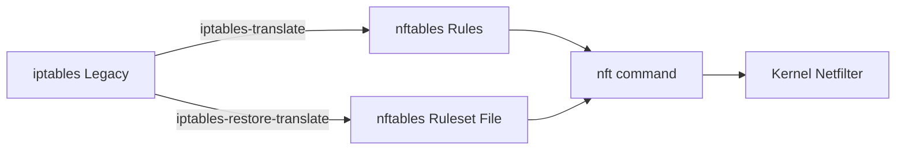

# How to Migrate from iptables to nftables on RHEL

Author: [nawazdhandala](https://www.github.com/nawazdhandala)

Tags: RHEL, Nftables, iptables, Migration, Linux

Description: A practical guide to migrating your firewall rules from the legacy iptables framework to nftables on RHEL, covering tool usage, rule translation, and validation.

---

If you've been running iptables for years, you probably have a solid set of rules that just work. But RHEL has moved on, and nftables is now the default packet filtering framework. The good news is that migration doesn't have to be painful. Red Hat ships translation tools that make the process straightforward, and this post walks through the whole thing step by step.

## Why Move to nftables?

The iptables framework served us well for two decades, but it has real limitations. Every rule change requires replacing the entire ruleset in the kernel. There's no native support for sets or maps. And managing IPv4 and IPv6 means maintaining two separate utilities (iptables and ip6tables).

nftables fixes all of this. It uses a single framework for both IPv4 and IPv6, supports atomic rule updates, and gives you sets and maps for efficient matching. It also has a cleaner syntax once you get used to it.



## Step 1: Check Your Current iptables Rules

Before doing anything, dump your current rules so you have a backup.

Export the current iptables ruleset to a file:

```bash
iptables-save > /root/iptables-backup.rules
ip6tables-save > /root/ip6tables-backup.rules
```

Review what you have:

```bash
iptables -L -n -v --line-numbers
```

## Step 2: Install the Translation Tools

RHEL includes the iptables-nft package which provides translation utilities. Make sure it's installed:

```bash
dnf install iptables-nft -y
```

This gives you two key commands: `iptables-translate` and `iptables-restore-translate`.

## Step 3: Translate Individual Rules

The `iptables-translate` command converts one iptables rule at a time into nftables syntax. This is useful for understanding how the translation works.

Translate a single rule:

```bash
iptables-translate -A INPUT -p tcp --dport 22 -j ACCEPT
```

Output will look something like:

```bash
nft add rule ip filter INPUT tcp dport 22 counter accept
```

Try a few more of your existing rules to get a feel for the syntax differences:

```bash
iptables-translate -A INPUT -s 192.168.1.0/24 -p tcp --dport 443 -j ACCEPT
iptables-translate -A FORWARD -i eth0 -o eth1 -j ACCEPT
```

## Step 4: Translate the Full Ruleset

For a complete migration, use `iptables-restore-translate` to convert your entire saved ruleset at once.

Convert the full iptables backup to nftables format:

```bash
iptables-restore-translate -f /root/iptables-backup.rules > /root/nftables-rules.nft
```

Do the same for your IPv6 rules:

```bash
ip6tables-restore-translate -f /root/ip6tables-backup.rules >> /root/nftables-rules.nft
```

Review the translated file before applying:

```bash
cat /root/nftables-rules.nft
```

## Step 5: Disable iptables and Enable nftables

Stop the iptables service and switch to nftables:

```bash
# Stop and disable iptables
systemctl stop iptables
systemctl disable iptables

# Enable and start nftables
systemctl enable nftables
systemctl start nftables
```

## Step 6: Load Your Translated Rules

Apply the translated ruleset:

```bash
nft -f /root/nftables-rules.nft
```

Verify the rules loaded properly:

```bash
nft list ruleset
```

## Step 7: Make Rules Persistent

To ensure your rules survive a reboot, save them to the nftables configuration file:

```bash
nft list ruleset > /etc/nftables/main.nft
```

Then include this file in the main nftables config:

```bash
echo 'include "/etc/nftables/main.nft"' >> /etc/sysconfig/nftables.conf
```

Restart nftables to confirm persistence:

```bash
systemctl restart nftables
nft list ruleset
```

## Step 8: Validate Connectivity

After migration, always test your services. Don't just assume everything works.

Check that SSH is still accessible:

```bash
ss -tlnp | grep 22
```

Test HTTP/HTTPS if you run web services:

```bash
curl -I http://localhost
curl -I https://localhost
```

Check that logging is working if you had log rules:

```bash
journalctl -k | grep nft
```

## Common Pitfalls

**Rule ordering matters.** nftables processes rules in the order they appear within a chain, just like iptables. But the chain priorities work differently. Make sure you understand how base chain priorities map to the old iptables hook points.

**Don't mix iptables and nftables.** Once you migrate, stick with nft commands. Running iptables commands on a system using nftables can create confusion because the iptables-nft compatibility layer translates them silently.

**firewalld uses nftables by default on RHEL.** If you're running firewalld, it's already using nftables as its backend. In that case, you might not need a manual migration at all, just let firewalld manage things.

## Quick Reference: iptables vs nftables Commands

| Task | iptables | nftables |
|------|----------|----------|
| List rules | `iptables -L -n` | `nft list ruleset` |
| Add rule | `iptables -A INPUT ...` | `nft add rule inet filter input ...` |
| Delete rule | `iptables -D INPUT 3` | `nft delete rule inet filter input handle 3` |
| Flush rules | `iptables -F` | `nft flush ruleset` |
| Save rules | `iptables-save` | `nft list ruleset > file.nft` |
| Restore rules | `iptables-restore < file` | `nft -f file.nft` |

## Wrapping Up

Migrating from iptables to nftables on RHEL is less work than most people expect. The translation tools handle the heavy lifting, and the new syntax is actually easier to read once you spend a few minutes with it. Take the time to test thoroughly after migration, and keep your old iptables backup around until you're confident everything is solid.
