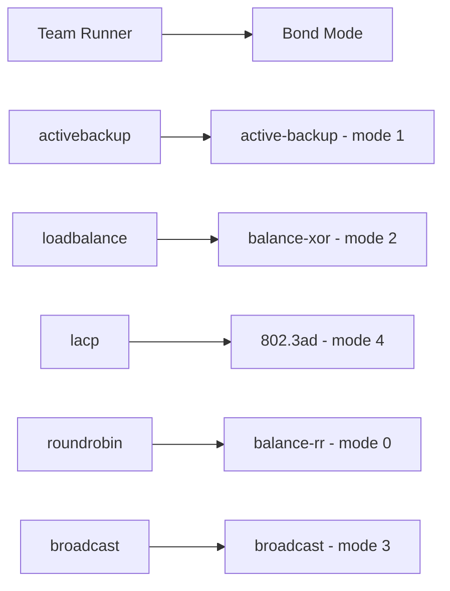

# How to Migrate from Network Teaming to Bonding on RHEL 9

Author: [nawazdhandala](https://www.github.com/nawazdhandala)

Tags: RHEL, Network Teaming, Bonding, Migration, Linux

Description: A practical migration guide for moving from deprecated network teaming to bonding on RHEL 9, with step-by-step instructions and a mapping of team runners to bond modes.

---

Red Hat deprecated network teaming starting with RHEL 9. If you have been running team interfaces, it is time to migrate to bonding. The teamd package is still available in RHEL 9 but is not getting new features, and it will likely be removed entirely in a future release.

I recently migrated a fleet of servers from teaming to bonding, and the process is not complicated if you plan it right. Here is how to do it with minimal downtime.

## Why Teaming Is Deprecated

Network teaming was introduced as a modern alternative to bonding with a user-space daemon (teamd) and JSON-based configuration. It worked well, but the reality is that kernel bonding has matured significantly. Bonding handles the same use cases with less complexity, and Red Hat decided to consolidate on one solution.

## Teaming to Bonding Mode Mapping

The first thing you need is a mapping between your team runner and the equivalent bonding mode:



| Team Runner | Bond Mode | Bond Mode Number |
|---|---|---|
| activebackup | active-backup | 1 |
| roundrobin | balance-rr | 0 |
| loadbalance | balance-xor | 2 |
| lacp | 802.3ad | 4 |
| broadcast | broadcast | 3 |

## Step 1: Document the Current Team Configuration

Before touching anything, record the existing setup:

```bash
# Show the current team connection details
nmcli connection show team0

# Check team runner and link watchers
teamdctl team0 state

# List team slave interfaces
teamdctl team0 port present eth0
teamdctl team0 port present eth1

# Save the current IP configuration
nmcli -g ipv4.addresses,ipv4.gateway,ipv4.dns connection show team0
```

Write down the IP address, gateway, DNS, the team runner mode, and any special options like link watchers or load balancing settings.

## Step 2: Plan for Downtime

Swapping from team to bond requires tearing down the team and building a bond. If this is a remote server, plan accordingly:

- Have out-of-band access (IPMI, iLO, iDRAC, or a KVM)
- Schedule a maintenance window
- Prepare all the nmcli commands in a script so you can run them quickly

Here is a migration script template:

```bash
#!/bin/bash
# Migration script: team0 to bond0
# Run this with console access, not over SSH on the team interface

# Step 1: Tear down the team
nmcli connection down team0
nmcli connection delete team0-slave1
nmcli connection delete team0-slave2
nmcli connection delete team0

# Step 2: Create the bond (adjust mode to match your team runner)
nmcli connection add type bond con-name bond0 ifname bond0 \
  bond.options "mode=active-backup,miimon=100"

# Step 3: Add slaves
nmcli connection add type ethernet con-name bond0-slave1 ifname eth0 master bond0
nmcli connection add type ethernet con-name bond0-slave2 ifname eth1 master bond0

# Step 4: Configure IP (use your actual values)
nmcli connection modify bond0 ipv4.addresses 192.168.1.50/24
nmcli connection modify bond0 ipv4.gateway 192.168.1.1
nmcli connection modify bond0 ipv4.dns "8.8.8.8"
nmcli connection modify bond0 ipv4.method manual

# Step 5: Bring it up
nmcli connection up bond0

echo "Migration complete. Verify with: ip addr show bond0"
```

## Step 3: Execute the Migration

Run the script from a console session (not over the network interface being migrated):

```bash
# Make the script executable and run it
chmod +x migrate-team-to-bond.sh
./migrate-team-to-bond.sh
```

## Step 4: Verify the Bond

After the bond is up, verify everything:

```bash
# Check the bond interface has the correct IP
ip addr show bond0

# Verify bond status
cat /proc/net/bonding/bond0

# Test connectivity
ping -c 4 192.168.1.1

# Check DNS resolution works
dig google.com
```

## Step 5: Update References

After migration, update anything that referenced the old team interface:

- Firewall rules referencing team0
- Application configurations bound to team0
- Monitoring scripts checking team0
- Any routing rules or policy routing that mention team0

```bash
# Check if firewalld had the team interface in a zone
firewall-cmd --get-active-zones

# If needed, add the bond to the appropriate zone
firewall-cmd --zone=public --change-interface=bond0 --permanent
firewall-cmd --reload
```

## Handling LACP Migration

If you were running the `lacp` team runner, the bond equivalent requires switch-side coordination:

```bash
# Create a bond with 802.3ad (LACP) mode
nmcli connection add type bond con-name bond0 ifname bond0 \
  bond.options "mode=802.3ad,miimon=100,lacp_rate=fast,xmit_hash_policy=layer3+4"
```

The `xmit_hash_policy=layer3+4` option provides better traffic distribution across slaves by hashing on both IP and port. Make sure your switch LACP configuration matches.

## Handling VLANs on Top of Teams

If you had VLANs stacked on the team interface, recreate them on the bond:

```bash
# If you had team0.100, recreate as bond0.100
nmcli connection add type vlan con-name bond0.100 ifname bond0.100 vlan.parent bond0 vlan.id 100
nmcli connection modify bond0.100 ipv4.addresses 10.10.100.10/24
nmcli connection modify bond0.100 ipv4.method manual
nmcli connection up bond0.100
```

## Rollback Plan

If something goes wrong, you can recreate the team (at least until the package is removed from RHEL):

```bash
# Recreate team if bond migration fails
nmcli connection delete bond0-slave1
nmcli connection delete bond0-slave2
nmcli connection delete bond0

nmcli connection add type team con-name team0 ifname team0 \
  team.runner activebackup
nmcli connection add type ethernet con-name team0-slave1 ifname eth0 master team0
nmcli connection add type ethernet con-name team0-slave2 ifname eth1 master team0
nmcli connection modify team0 ipv4.addresses 192.168.1.50/24
nmcli connection modify team0 ipv4.gateway 192.168.1.1
nmcli connection modify team0 ipv4.method manual
nmcli connection up team0
```

## Summary

Migrating from teaming to bonding on RHEL 9 is a matter of mapping your team runner to the equivalent bond mode, documenting your current config, tearing down the team, and building a bond with the same IP settings. Plan for brief downtime, have console access ready, and script the whole process so you can execute it quickly. The sooner you migrate, the less likely you are to hit issues when teaming is eventually removed from RHEL.
