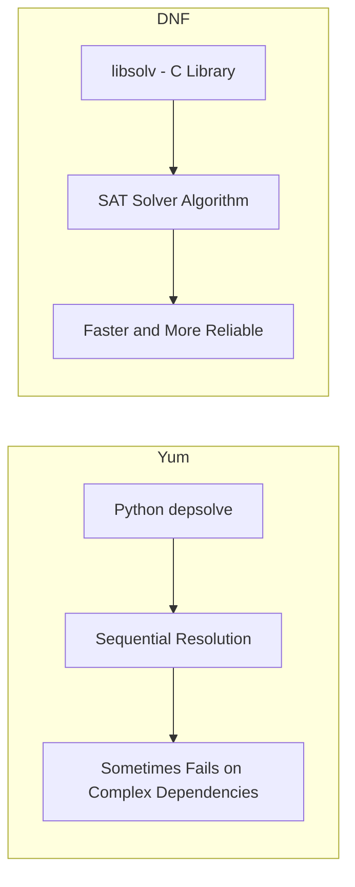

# How to Migrate from Yum to DNF on RHEL

Author: [nawazdhandala](https://www.github.com/nawazdhandala)

Tags: RHEL, DNF, YUM, Migration, Package Management, Linux

Description: A practical guide for sysadmins migrating from yum to dnf on RHEL, covering command differences, new features, configuration changes, and backward compatibility.

---

If you have been managing RHEL systems for any length of time, yum is burned into your muscle memory. `yum install`, `yum update`, `yum search` - it is second nature. But RHEL has fully moved to DNF as the default package manager, and while Red Hat kept backward compatibility through a `yum` symlink, there are real differences worth understanding.

I went through this transition myself across a fleet of servers, and honestly, it is not painful at all. DNF does everything yum did, plus a lot more. Here is what you need to know.

## What Happened to Yum?

Yum (Yellowdog Updater, Modified) served us well for many years, but its Python 2 codebase became increasingly difficult to maintain. DNF (Dandified YUM) was written as a replacement with a modern architecture.

Here is the timeline:
- RHEL 7: yum was the default
- RHEL 8: dnf was the default, yum was a symlink to dnf
- RHEL: dnf is the only option, yum is still a symlink for compatibility

```bash
# Check what yum actually points to on RHEL
ls -la /usr/bin/yum
```

You will see it is a symlink:

```bash
/usr/bin/yum -> dnf-3
```

So when you type `yum install httpd` on RHEL, you are actually running `dnf install httpd`. Your old scripts will not break immediately, but there are differences in behavior and configuration that matter.

## Command Comparison

Most commands translate directly. Here is a side-by-side reference:

| Task | Yum (old) | DNF (new) |
|---|---|---|
| Install a package | yum install httpd | dnf install httpd |
| Remove a package | yum remove httpd | dnf remove httpd |
| Update all packages | yum update | dnf upgrade |
| Search packages | yum search nginx | dnf search nginx |
| List installed | yum list installed | dnf list installed |
| Package info | yum info httpd | dnf info httpd |
| Clean cache | yum clean all | dnf clean all |
| List repos | yum repolist | dnf repolist |
| History | yum history | dnf history |
| Group install | yum groupinstall "Development Tools" | dnf group install "Development Tools" |
| Check for updates | yum check-update | dnf check-upgrade |
| Downgrade | yum downgrade httpd | dnf downgrade httpd |

Note that `dnf upgrade` is the preferred command instead of `dnf update`. Both work, but `upgrade` is the correct DNF terminology.

## New Features in DNF

DNF brought several improvements that make package management easier and more reliable.

### Better Dependency Resolution

DNF uses libsolv for dependency resolution, which is significantly faster and more accurate than yum's depsolve algorithm.



### Module/Application Streams

DNF supports modularity, which lets you choose between different versions of software:

```bash
# List available module streams
dnf module list

# Enable a specific stream
dnf module enable nodejs:18
```

This was not possible with yum.

### Automatic Conflict Resolution

DNF can automatically suggest solutions when package conflicts arise, rather than just failing with an error.

### Better Transaction History

```bash
# View transaction history with more detail
dnf history list
dnf history info 15

# Undo or redo transactions
dnf history undo 15
dnf history redo 15
```

### Plugin Architecture

DNF has a cleaner plugin system:

```bash
# List installed DNF plugins
dnf plugin list

# Common useful plugins
sudo dnf install python3-dnf-plugin-versionlock
sudo dnf install dnf-plugin-system-upgrade
```

## Configuration Changes

### DNF Configuration File

The main config file moved from `/etc/yum.conf` to `/etc/dnf/dnf.conf`. On RHEL, `/etc/yum.conf` is a symlink to `/etc/dnf/dnf.conf`.

```bash
# Check the symlink
ls -la /etc/yum.conf
```

The configuration format is very similar. Here is a typical `/etc/dnf/dnf.conf`:

```ini
[main]
gpgcheck=1
installonly_limit=3
clean_requirements_on_remove=True
best=True
skip_if_unavailable=False
```

### New Configuration Options

DNF introduced some configuration options that yum did not have:

```ini
[main]
# Strictly pick the best (newest) version - fail if deps cannot be met
best=True

# Skip repos that are unreachable instead of failing
skip_if_unavailable=False

# Automatically remove dependencies that are no longer needed
clean_requirements_on_remove=True

# Keep downloaded packages in cache
keepcache=False

# Default to yes for all questions (use with caution)
defaultyes=False

# Number of packages to keep for installonly packages (like kernels)
installonly_limit=3
```

### Repository Configuration

Repo files still live in `/etc/yum.repos.d/` for backward compatibility. The format is the same:

```ini
[myrepo]
name=My Custom Repository
baseurl=https://repo.example.com/rhel9/
enabled=1
gpgcheck=1
gpgkey=https://repo.example.com/RPM-GPG-KEY
```

```bash
# List all configured repos
dnf repolist all

# Add a new repository
sudo dnf config-manager --add-repo https://repo.example.com/rhel9/myrepo.repo
```

## Updating Your Scripts

If you have automation scripts that use yum commands, here is how to update them.

### Shell Scripts

Most scripts will work as-is because of the yum symlink. But it is good practice to update them:

```bash
# Old script
#!/bin/bash
yum install -y httpd
yum update -y

# Updated script
#!/bin/bash
dnf install -y httpd
dnf upgrade -y
```

### Ansible Playbooks

If you use Ansible, the `yum` module still works on RHEL, but you should switch to the `dnf` module:

```yaml
# Old
- name: Install Apache
  yum:
    name: httpd
    state: present

# New
- name: Install Apache
  dnf:
    name: httpd
    state: present
```

Or use the generic `package` module for cross-platform compatibility:

```yaml
- name: Install Apache
  package:
    name: httpd
    state: present
```

### Puppet Manifests

Puppet's `package` resource type works with both:

```puppet
package { 'httpd':
  ensure   => installed,
  provider => 'dnf',
}
```

## Handling the best=True Default

One behavior change that trips people up is the `best=True` default in DNF. With yum, if the newest version of a package had dependency problems, it would silently install an older version. DNF with `best=True` will fail instead.

If you hit dependency errors during updates and want the old yum behavior:

```bash
# Temporarily allow non-best versions
sudo dnf upgrade --nobest

# Or change the default in /etc/dnf/dnf.conf
# best=False
```

I recommend keeping `best=True` and fixing dependency issues properly rather than sweeping them under the rug.

## Performance Differences

DNF is generally faster than yum was, especially for dependency resolution. But metadata downloads can feel slightly different because DNF handles caching differently.

```bash
# Force a metadata refresh
sudo dnf makecache

# Check the metadata expiration setting
grep metadata_expire /etc/dnf/dnf.conf
```

DNF caches metadata for 48 hours by default. You can adjust this per-repo:

```ini
[myrepo]
metadata_expire=3600
```

## Common Gotchas During Migration

1. **check-update vs check-upgrade**: The yum command was `check-update`, DNF uses `check-upgrade`. Both work on RHEL because of compatibility, but `check-upgrade` is the correct DNF command.

2. **Group commands**: Yum used `groupinstall`, `groupremove`, etc. DNF uses `group install`, `group remove` (with a space). The old syntax still works.

3. **Plugin names changed**: If you referenced yum plugins by name in scripts or configs, they might have different names in DNF. Check with `dnf plugin list`.

4. **Protected packages**: DNF has a concept of protected packages that cannot be removed. The `dnf` package itself is protected by default.

5. **Transaction output format**: If you parse yum output in scripts, the format is different in DNF. Update your parsers.

## Verifying Your Migration

After updating your scripts and configs, verify everything works:

```bash
# Make sure DNF is functioning properly
dnf repolist
dnf check-upgrade
dnf list installed | wc -l

# Verify that the yum symlink works for backward compatibility
yum --version
```

## Summary

Migrating from yum to DNF on RHEL is mostly painless because Red Hat maintained backward compatibility through symlinks and command aliases. The core workflow is the same: search, install, update, remove. But DNF brings real improvements in dependency resolution, modularity support, and transaction management. Take the time to update your scripts to use `dnf` commands directly, adjust your configs in `/etc/dnf/dnf.conf`, and learn the new features. Your future self will appreciate it.
