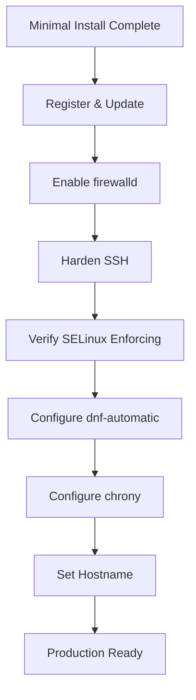

# How to Perform a Minimal Installation of RHEL for Server Use

Author: [nawazdhandala](https://www.github.com/nawazdhandala)

Tags: RHEL, Minimal Install, Server, Linux, Security

Description: Step-by-step guide to performing a minimal RHEL installation and hardening it for server use, covering the installer options, essential post-install packages, and baseline security configuration.

---

When I set up a new server, I always start with a minimal install. There is no reason to have a GUI, LibreOffice, or a pile of desktop utilities on a machine that will sit in a rack or a VM farm serving traffic. A minimal install gives you a clean, small footprint system with fewer packages to patch and fewer potential attack vectors. Here is how to do it properly on RHEL.

## Why Minimal?

A full RHEL "Server with GUI" installation pulls in over 1,400 packages. A minimal install brings that down to around 350-400 packages. That means:

- Smaller disk footprint (under 2 GB vs 5+ GB)
- Fewer services running by default
- Smaller attack surface
- Faster patching cycles (fewer packages to update)
- Quicker boot times

For any production server, minimal is the way to go. You add what you need, nothing more.

## Starting the Installation

Boot from the RHEL ISO (either physical media or mounted to a VM). When the Anaconda installer loads, you will go through the standard setup screens.

### Installation Source and Software Selection

The key step is in **Software Selection**. You will see several options:

- Server with GUI
- Server
- Minimal Install
- Workstation
- Custom Operating System
- Virtualization Host

Select **Minimal Install**. On the right side, you will see optional add-on groups. For a true minimal setup, do not check any of them. You can always add packages later.

### Disk Partitioning

For server use, I recommend manual partitioning rather than automatic. Here is a solid baseline layout:

| Mount Point | Size | Filesystem | Notes |
|-------------|------|------------|-------|
| /boot | 1 GiB | xfs | Boot partition |
| /boot/efi | 600 MiB | vfat | EFI system partition (UEFI systems) |
| / | 20 GiB | xfs | Root filesystem |
| /var | 10 GiB | xfs | Logs, spool, container storage |
| /var/log | 5 GiB | xfs | Isolate logs from filling /var |
| /home | 5 GiB | xfs | User home directories |
| /tmp | 2 GiB | xfs | Temporary files |
| swap | 2-4 GiB | swap | Based on RAM |

Using LVM for everything except /boot and /boot/efi gives you flexibility to resize later.

```bash
# After install, verify the layout
lsblk
df -hT
```

### Network Configuration

Configure your network interface during installation. For servers, set a static IP rather than relying on DHCP.

### Root Password and User Account

Set a strong root password. Also create a regular user account and add it to the `wheel` group so it can use `sudo`. In RHEL, direct root SSH login is disabled by default in the installer if you create a regular user, which is a good security practice.

## Post-Install Essentials

After the reboot, you will land at a bare terminal login prompt. No GUI, no frills. Perfect. Now let's get the essentials in place.

### Register the System

```bash
# Register with Red Hat Subscription Manager
sudo subscription-manager register --username <your-rh-username> --password <your-rh-password>

# Attach a subscription
sudo subscription-manager attach --auto

# Verify repos are available
sudo dnf repolist
```

### Update Everything

```bash
# Apply all available updates
sudo dnf update -y

# Reboot if a new kernel was installed
sudo reboot
```

### Install Essential Packages

A minimal install leaves out a lot of tools you will probably need. Here is my standard set for server administration:

```bash
# Core admin utilities
sudo dnf install -y \
  vim \
  tmux \
  wget \
  curl \
  tar \
  unzip \
  bash-completion \
  bind-utils \
  net-tools \
  tcpdump \
  lsof \
  htop \
  rsync \
  man-pages \
  policycoreutils-python-utils
```

The last package, `policycoreutils-python-utils`, gives you `semanage` and other SELinux tools you will need sooner or later.

### Enable Useful Services

```bash
# Enable persistent journal logging
sudo mkdir -p /var/log/journal
sudo systemd-tmpfiles --create --prefix /var/log/journal
sudo systemctl restart systemd-journald

# Verify journal persistence
journalctl --disk-usage
```

## Securing the Base System

A minimal install is already a good starting point for security, but you need to do some additional work.

### Configure the Firewall

RHEL minimal installs `firewalld` but it may not be enabled. Fix that.

```bash
# Enable and start firewalld
sudo systemctl enable --now firewalld

# Verify it is running
sudo firewall-cmd --state

# Check the default zone
sudo firewall-cmd --get-default-zone

# Allow SSH (should already be allowed in the default zone)
sudo firewall-cmd --list-services

# If you need to add SSH explicitly
sudo firewall-cmd --permanent --add-service=ssh
sudo firewall-cmd --reload
```

### Harden SSH

Edit the SSH configuration to lock things down.

```bash
# Back up the original config
sudo cp /etc/ssh/sshd_config /etc/ssh/sshd_config.bak
```

Create a drop-in configuration file for your customizations:

```bash
# Create a hardening config drop-in
sudo tee /etc/ssh/sshd_config.d/50-hardening.conf << 'EOF'
# Disable root login via SSH
PermitRootLogin no

# Disable password authentication (use keys only)
PasswordAuthentication no

# Limit authentication attempts
MaxAuthTries 3

# Disable empty passwords
PermitEmptyPasswords no

# Disable X11 forwarding on a server
X11Forwarding no
EOF

# Restart SSH to apply
sudo systemctl restart sshd
```

Before you disable password authentication, make sure you have copied your SSH public key to the server.

```bash
# From your workstation, copy your key
ssh-copy-id user@server-ip
```

### SELinux - Keep It Enforcing

RHEL has SELinux in enforcing mode by default. Do not disable it. Check its status:

```bash
# Check SELinux status
getenforce
sestatus
```

If for some reason it was set to permissive, fix it:

```bash
# Set SELinux to enforcing
sudo setenforce 1

# Make it permanent
sudo sed -i 's/^SELINUX=permissive/SELINUX=enforcing/' /etc/selinux/config
```

### Configure Automatic Updates

For servers that do not need strict change control, automatic security updates are worth enabling.

```bash
# Install the automatic update timer
sudo dnf install -y dnf-automatic

# Configure it for security updates only
sudo sed -i 's/^upgrade_type = default/upgrade_type = security/' /etc/dnf/automatic.conf

# Enable the timer
sudo systemctl enable --now dnf-automatic-install.timer

# Verify the timer is active
sudo systemctl status dnf-automatic-install.timer
```

### Configure Time Synchronization

RHEL uses `chronyd` by default, and it is usually already enabled on a minimal install.

```bash
# Verify chrony is running
sudo systemctl status chronyd

# Check synchronization status
chronyc tracking
chronyc sources -v
```

### Set the Hostname

```bash
# Set a proper hostname
sudo hostnamectl set-hostname server01.example.com

# Verify
hostnamectl
```

## Security Baseline Overview

Here is the post-install security flow at a glance:



## Verifying the Minimal Install

After all configuration is done, run a few checks to confirm everything looks right.

```bash
# Count installed packages (should be well under 500)
rpm -qa | wc -l

# List enabled services (should be short)
systemctl list-unit-files --state=enabled --type=service

# Check listening ports (should be minimal)
ss -tlnp

# Verify no unnecessary services are running
systemctl list-units --type=service --state=running
```

On a properly configured minimal install, you should see only a handful of services running: sshd, firewalld, chronyd, NetworkManager, and a few system services. If you see anything unexpected, investigate and disable it.

## What Not to Do

A few common mistakes I see with minimal installs:

- **Do not disable SELinux.** I know it can be frustrating when it blocks something, but learn to work with it. Use `audit2allow` and `semanage` to create proper policies.
- **Do not open all ports** in the firewall "just to get things working." Add services one at a time.
- **Do not install a desktop environment** on a server. If you need a GUI management interface, use Cockpit instead.
- **Do not skip the updates** after installation. The ISO is always behind on patches.

## Final Thoughts

A minimal RHEL install is the cleanest foundation you can start with. It takes maybe 15 minutes to go from a bare install to a hardened, registered, and updated server. From there, you layer on only what the server actually needs, whether that is a web server, database, container runtime, or whatever the workload demands. Every package you do not install is a package you do not have to patch, monitor, or worry about.
