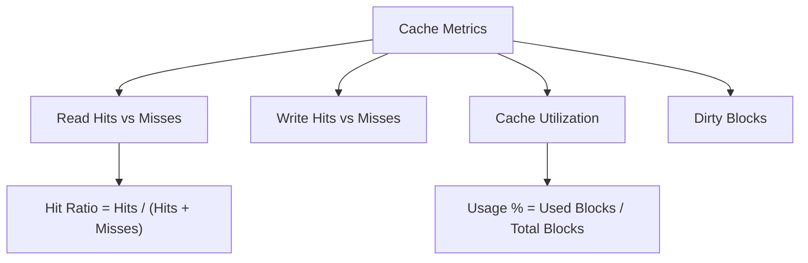

# How to Monitor Cache Hit Ratios and Performance on RHEL

Author: [nawazdhandala](https://www.github.com/nawazdhandala)

Tags: RHEL, Cache, Monitoring, Performance, Linux

Description: Learn how to monitor dm-cache and LVM cache hit ratios on RHEL to verify your caching layer is actually improving performance.

---

Setting up a cache layer is only useful if it actually improves performance. A cache with a 20% hit ratio is wasting SSD space and adding overhead without meaningful benefit. Monitoring cache metrics tells you whether your cache is sized correctly, your workload benefits from caching, and where adjustments are needed.

## Key Cache Metrics

The metrics that matter most:

- **Read hit ratio** - percentage of reads served from cache (higher is better)
- **Write hit ratio** - percentage of writes that hit cached blocks
- **Dirty blocks** - blocks in cache not yet written to origin (writeback mode)
- **Used blocks** - how full the cache is
- **Promotions/Demotions** - how actively data moves between cache and origin



## Viewing Cache Statistics

### LVM Method

```bash
# Show cache stats for a cached LV
lvs -o lv_name,cache_read_hits,cache_read_misses,cache_write_hits,cache_write_misses vg_data/lv_data
```

### Device-Mapper Method

For more detailed statistics:

```bash
# Get raw dm-cache status
dmsetup status vg_data-lv_data
```

The output format for dm-cache is:
```
0 <length> cache <metadata_block_size> <used_metadata>/<total_metadata> <cache_block_size> <used_cache>/<total_cache> <read_hits> <read_misses> <write_hits> <write_misses> <demotions> <promotions> <dirty> <features> ...
```

### Parsing the Statistics

Here is a script to extract and display cache stats in a readable format:

```bash
#!/bin/bash
# /usr/local/bin/cache-report.sh
# Display cache statistics in a readable format

for cached_lv in $(lvs --noheadings -o lv_dm_path --select 'segtype=cache' 2>/dev/null); do
    DM_NAME=$(basename "$cached_lv")
    LV_NAME=$(lvs --noheadings -o lv_name --select "lv_dm_path=$cached_lv" 2>/dev/null | tr -d ' ')

    STATUS=$(dmsetup status "$DM_NAME" 2>/dev/null)
    [ -z "$STATUS" ] && continue

    # Parse dm-cache status fields
    READ_HITS=$(echo "$STATUS" | awk '{print $8}')
    READ_MISSES=$(echo "$STATUS" | awk '{print $9}')
    WRITE_HITS=$(echo "$STATUS" | awk '{print $10}')
    WRITE_MISSES=$(echo "$STATUS" | awk '{print $11}')
    DEMOTIONS=$(echo "$STATUS" | awk '{print $12}')
    PROMOTIONS=$(echo "$STATUS" | awk '{print $13}')
    DIRTY=$(echo "$STATUS" | awk '{print $14}')

    # Calculate ratios
    TOTAL_READS=$((READ_HITS + READ_MISSES))
    TOTAL_WRITES=$((WRITE_HITS + WRITE_MISSES))

    if [ "$TOTAL_READS" -gt 0 ]; then
        READ_RATIO=$((READ_HITS * 100 / TOTAL_READS))
    else
        READ_RATIO=0
    fi

    if [ "$TOTAL_WRITES" -gt 0 ]; then
        WRITE_RATIO=$((WRITE_HITS * 100 / TOTAL_WRITES))
    else
        WRITE_RATIO=0
    fi

    echo "=== Cache Report for $LV_NAME ==="
    echo "Read Hit Ratio:  ${READ_RATIO}% (${READ_HITS} hits / ${TOTAL_READS} total)"
    echo "Write Hit Ratio: ${WRITE_RATIO}% (${WRITE_HITS} hits / ${TOTAL_WRITES} total)"
    echo "Promotions:      $PROMOTIONS"
    echo "Demotions:       $DEMOTIONS"
    echo "Dirty Blocks:    $DIRTY"
    echo ""
done
```

## What Good Numbers Look Like

| Metric | Good | Needs Attention | Problem |
|--------|------|----------------|---------|
| Read hit ratio | > 80% | 50-80% | < 50% |
| Write hit ratio | > 60% | 30-60% | < 30% |
| Cache utilization | 60-90% | < 40% or > 95% | Cache too big or too small |
| Dirty blocks (writeback) | < 20% of cache | 20-50% | > 50% |

## Continuous Monitoring

### Real-Time Monitoring Script

```bash
#!/bin/bash
# Watch cache stats update in real time
while true; do
    clear
    echo "Cache Statistics - $(date)"
    echo "================================"
    /usr/local/bin/cache-report.sh
    sleep 5
done
```

### Logging for Trend Analysis

```bash
#!/bin/bash
# /usr/local/bin/cache-logger.sh
# Log cache statistics to CSV for trending

LOG="/var/log/cache-metrics.csv"

if [ ! -f "$LOG" ]; then
    echo "timestamp,lv,read_hits,read_misses,write_hits,write_misses,read_ratio,dirty" > "$LOG"
fi

TIMESTAMP=$(date +%Y-%m-%dT%H:%M:%S)

lvs --noheadings -o lv_name,cache_read_hits,cache_read_misses,cache_write_hits,cache_write_misses,cache_dirty_blocks \
    --select 'segtype=cache' 2>/dev/null | while read -r NAME RH RM WH WM DIRTY; do

    TOTAL=$((RH + RM))
    RATIO=0
    [ "$TOTAL" -gt 0 ] && RATIO=$((RH * 100 / TOTAL))

    echo "$TIMESTAMP,$NAME,$RH,$RM,$WH,$WM,$RATIO,$DIRTY" >> "$LOG"
done
```

Schedule it every 10 minutes:

```bash
chmod +x /usr/local/bin/cache-logger.sh
echo "*/10 * * * * /usr/local/bin/cache-logger.sh" >> /var/spool/cron/root
```

## Diagnosing Low Hit Ratios

### Cause: Cache Is Too Small

If the working set is larger than the cache, data gets evicted before it is re-accessed:

```bash
# Check cache utilization
lvs -o lv_name,cache_used_blocks,cache_total_blocks vg_data/lv_data
```

If the cache is constantly full (near 100% utilization) and the hit ratio is low, the cache needs to be larger.

### Cause: Workload Is Not Cacheable

Sequential workloads (backups, large file copies) do not benefit from caching because the same data is rarely read twice:

```bash
# Check if the workload is mostly sequential
iostat -x 1 5
```

If you see large average request sizes (`areq-sz` > 128 KB), the workload is likely sequential.

### Cause: Cache Warming

A fresh cache takes time to warm up. Hit ratios start low and improve over hours or days:

```bash
# Monitor hit ratio improvement over time
watch -n 60 'lvs -o lv_name,cache_read_hits,cache_read_misses vg_data/lv_data'
```

### Cause: Thrashing

If the cache is full and data is constantly being promoted and demoted:

```bash
# Check promotion/demotion rates
dmsetup status vg_data-lv_data | awk '{print "Promotions:", $13, "Demotions:", $12}'
```

High, equal promotion and demotion numbers indicate thrashing.

## Alerting on Poor Cache Performance

```bash
#!/bin/bash
# /usr/local/bin/cache-alert.sh

MIN_HIT_RATIO=50

lvs --noheadings -o lv_name,cache_read_hits,cache_read_misses \
    --select 'segtype=cache' 2>/dev/null | while read -r NAME HITS MISSES; do

    TOTAL=$((HITS + MISSES))
    [ "$TOTAL" -lt 1000 ] && continue  # Skip if too few samples

    RATIO=$((HITS * 100 / TOTAL))

    if [ "$RATIO" -lt "$MIN_HIT_RATIO" ]; then
        logger -p user.warning "LOW CACHE HIT RATIO: $NAME at ${RATIO}%"
    fi
done
```

## Summary

Monitoring cache hit ratios on RHEL is essential to verify that your caching investment pays off. Use `lvs` and `dmsetup status` to check hit ratios, dirty blocks, and utilization. A read hit ratio above 80% indicates a well-configured cache. Low hit ratios mean the cache is too small, the workload is not cacheable, or the cache is still warming up. Log metrics over time to spot trends and set up alerts for sustained poor performance.
