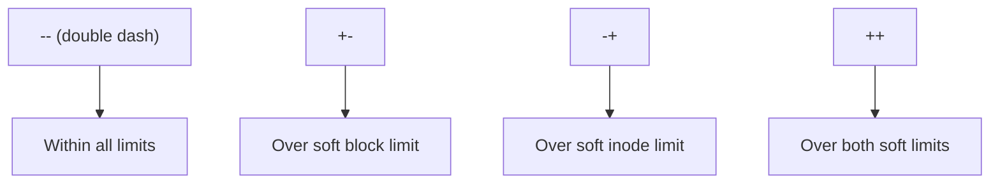

# How to Monitor Disk Quota Usage and Generate Reports on RHEL

Author: [nawazdhandala](https://www.github.com/nawazdhandala)

Tags: RHEL, Quotas, Monitoring, Reports, Linux

Description: Learn how to monitor disk quota usage and generate automated reports on RHEL to stay ahead of storage problems before they become emergencies.

---

Setting up quotas is only half the job. Without monitoring, quotas just silently block users and you get a flood of support tickets instead of a controlled process. Good quota monitoring tells you who is approaching their limits, who has exceeded soft limits, and where you might need to adjust allocations.

## Checking Quota Status

### Individual User Quota

The simplest check for a specific user:

```bash
# Check quota for a specific user on all filesystems
quota -u jsmith
```

For human-readable output:

```bash
# Human-readable quota report for one user
quota -us jsmith
```

### Individual Group Quota

```bash
# Check quota for the developers group
quota -g developers
```

### Full Filesystem Report

The `repquota` command gives you a complete overview:

```bash
# Full user quota report for /home with human-readable sizes
repquota -us /home
```

Sample output:

```bash
*** Report for user quotas on device /dev/mapper/vg_data-lv_home
Block grace time: 7days; Inode grace time: 7days
                        Block limits                File limits
User            used    soft    hard  grace    used  soft  hard  grace
----------------------------------------------------------------------
root      --    200M       0       0              5     0     0
jsmith    --   3.2G      5G      6G            412     0     0
alice     +-   5.1G      5G      6G  6days     823     0     0
```

The `+-` indicator next to alice means she has exceeded her soft block limit and is in the grace period.

## Understanding Report Symbols



## XFS Quota Reports

For XFS filesystems, use `xfs_quota`:

```bash
# Detailed user quota report on XFS
xfs_quota -x -c 'report -ubih' /data
```

For free space information:

```bash
# Show free space and quota information
xfs_quota -x -c 'free -h' /data
```

## Building a Quota Warning Script

This script finds users approaching their limits and sends them a warning email:

```bash
#!/bin/bash
# /usr/local/bin/quota-warning.sh
# Sends email warnings to users approaching their quota limit

FILESYSTEM="/home"
WARN_PERCENT=80  # Warn at 80% of soft limit

# Get quota report and process each user
repquota -u "$FILESYSTEM" | tail -n +5 | while read -r line; do
    USER=$(echo "$line" | awk '{print $1}')
    USED=$(echo "$line" | awk '{print $3}')
    SOFT=$(echo "$line" | awk '{print $4}')

    # Skip users with no soft limit (0 means unlimited)
    [ "$SOFT" -eq 0 ] 2>/dev/null && continue
    [ -z "$SOFT" ] && continue

    # Calculate percentage used
    if [ "$SOFT" -gt 0 ]; then
        PERCENT=$((USED * 100 / SOFT))

        if [ "$PERCENT" -ge "$WARN_PERCENT" ]; then
            # Get user's email from passwd or LDAP
            USER_EMAIL="${USER}@example.com"

            mail -s "Disk Quota Warning: ${PERCENT}% used" "$USER_EMAIL" << MAILEOF
Hi $USER,

You are currently using ${PERCENT}% of your disk quota on $FILESYSTEM.

Used: ${USED} KB
Soft Limit: ${SOFT} KB

Please clean up unnecessary files to avoid being blocked from writing.

- System Administration
MAILEOF
            logger "quota-warning: Sent warning to $USER (${PERCENT}% of quota)"
        fi
    fi
done
```

Make it executable and schedule it:

```bash
chmod +x /usr/local/bin/quota-warning.sh

# Run daily at 9 AM
echo "0 9 * * * /usr/local/bin/quota-warning.sh" >> /var/spool/cron/root
```

## Daily Admin Summary Report

A more detailed report for administrators:

```bash
#!/bin/bash
# /usr/local/bin/quota-admin-report.sh
# Generates a comprehensive quota report for admins

REPORT_FILE="/tmp/quota-report-$(date +%Y%m%d).txt"
ADMIN_EMAIL="admin@example.com"

{
    echo "=== Disk Quota Report for $(hostname) ==="
    echo "Generated: $(date)"
    echo ""

    # Check all filesystems with quotas
    for FS in $(mount | grep -E 'usrquota|uquota' | awk '{print $3}'); do
        FS_TYPE=$(df -T "$FS" | tail -1 | awk '{print $2}')
        echo "--- Filesystem: $FS ($FS_TYPE) ---"
        echo ""

        if [ "$FS_TYPE" = "xfs" ]; then
            xfs_quota -x -c 'report -ubh' "$FS"
        else
            repquota -us "$FS"
        fi

        echo ""
        echo "Disk usage summary:"
        df -h "$FS"
        echo ""
    done

    echo "=== Users Over Soft Limit ==="
    # Find users over their soft limit (shown with + in repquota)
    for FS in $(mount | grep -E 'usrquota|uquota' | awk '{print $3}'); do
        FS_TYPE=$(df -T "$FS" | tail -1 | awk '{print $2}')
        if [ "$FS_TYPE" != "xfs" ]; then
            repquota -u "$FS" | grep "+-\|++"
        fi
    done

} > "$REPORT_FILE"

mail -s "Daily Quota Report - $(hostname) - $(date +%Y-%m-%d)" "$ADMIN_EMAIL" < "$REPORT_FILE"
rm -f "$REPORT_FILE"
```

## Monitoring with warnquota

RHEL includes `warnquota`, a built-in tool for sending quota warnings. Configure it:

```bash
# Edit the warnquota configuration
vi /etc/warnquota.conf
```

Key settings to configure:

```bash
# Email settings
MAIL_CMD = "/usr/sbin/sendmail -t"
FROM = "quota-admin@example.com"
SUBJECT = Disk Quota Warning
CC_TO = "admin@example.com"

# Message template
MESSAGE = Your disk usage has exceeded the allowed quota.|Please reduce your usage.
SIGNATURE = System Administration Team
```

Set up the user-to-email mapping:

```bash
# Edit the quota tab file
vi /etc/quotatab
```

Run it manually to test:

```bash
# Test warnquota - sends warnings to over-quota users
warnquota
```

Then schedule it:

```bash
# Run warnquota daily
echo "0 8 * * * /usr/sbin/warnquota" >> /var/spool/cron/root
```

## Tracking Quota Trends Over Time

Log quota data periodically so you can spot trends:

```bash
#!/bin/bash
# /usr/local/bin/quota-logger.sh
# Logs quota usage to a CSV file for trend analysis

LOG_DIR="/var/log/quota"
mkdir -p "$LOG_DIR"
LOG_FILE="$LOG_DIR/quota-$(date +%Y%m).csv"

# Write header if file is new
if [ ! -f "$LOG_FILE" ]; then
    echo "timestamp,user,used_kb,soft_kb,hard_kb,filesystem" > "$LOG_FILE"
fi

TIMESTAMP=$(date +%Y-%m-%dT%H:%M:%S)

# Log data for each quota-enabled filesystem
repquota -u /home | tail -n +5 | while read -r line; do
    USER=$(echo "$line" | awk '{print $1}')
    USED=$(echo "$line" | awk '{print $3}')
    SOFT=$(echo "$line" | awk '{print $4}')
    HARD=$(echo "$line" | awk '{print $5}')

    [ -z "$USER" ] && continue
    echo "$TIMESTAMP,$USER,$USED,$SOFT,$HARD,/home" >> "$LOG_FILE"
done
```

Schedule it hourly:

```bash
echo "0 * * * * /usr/local/bin/quota-logger.sh" >> /var/spool/cron/root
```

## Quick Quota Dashboard

For a fast terminal overview:

```bash
# One-liner: show top 10 disk users on /home
repquota -us /home | tail -n +5 | sort -k3 -rn | head -10
```

## Summary

Quota monitoring on RHEL involves a mix of built-in tools (`repquota`, `quota`, `xfs_quota`, `warnquota`) and custom scripts. The key is to be proactive: warn users before they hit hard limits, track trends over time, and give admins a daily summary. Combine these approaches and you will spend a lot less time firefighting storage emergencies.
