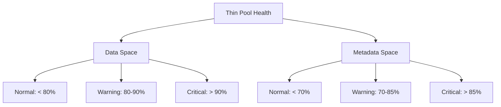

# How to Monitor and Manage Thin Pool Utilization on RHEL

Author: [nawazdhandala](https://www.github.com/nawazdhandala)

Tags: RHEL, LVM, Thin Pool, Monitoring, Linux

Description: Learn how to effectively monitor and manage LVM thin pool utilization on RHEL to prevent pool exhaustion and keep your storage running smoothly.

---

A thin pool running out of space is one of the worst storage failures you can have. Unlike a full filesystem where just one mount point stops accepting writes, a full thin pool freezes every thin volume in the pool simultaneously. Applications hang, databases corrupt, and recovery is painful. Monitoring thin pool utilization is not optional.

## Understanding Thin Pool Metrics

A thin pool has two resources to monitor:

1. **Data space** - actual storage for the data in thin volumes
2. **Metadata space** - mapping information that tracks which pool blocks belong to which thin volume

Both can fill up independently, and either one running out causes the same freeze.



## Basic Monitoring Commands

### Quick Status Check

```bash
# Show thin pool data and metadata usage
lvs -o lv_name,lv_size,data_percent,metadata_percent vg_data/thinpool
```

### Detailed Pool Information

```bash
# Comprehensive thin pool details
lvs -a -o+lv_layout,pool_lv,origin,data_percent,metadata_percent,move_pv,copy_percent vg_data
```

### Using thin_dump for Deep Inspection

```bash
# Dump thin pool metadata for analysis (pool must not be active, or use --format xml)
thin_dump /dev/vg_data/thinpool_tmeta
```

## Automated Monitoring Script

Here is a monitoring script that checks thin pools and alerts when thresholds are exceeded:

```bash
#!/bin/bash
# /usr/local/bin/thinpool-monitor.sh
# Monitors thin pool usage and sends alerts

DATA_WARN=80
DATA_CRIT=90
META_WARN=70
META_CRIT=85

# Get all thin pools
lvs --noheadings -o vg_name,lv_name,data_percent,metadata_percent \
    --select 'lv_attr=~^t' 2>/dev/null | while read -r VG LV DATA META; do

    # Remove decimals for comparison
    DATA_INT=${DATA%.*}
    META_INT=${META%.*}

    # Check data usage
    if [ "$DATA_INT" -ge "$DATA_CRIT" ] 2>/dev/null; then
        logger -p user.crit "CRITICAL: Thin pool $VG/$LV data at ${DATA}%"
        echo "CRITICAL: Thin pool $VG/$LV data usage at ${DATA}%" | \
            mail -s "CRITICAL: Thin pool $VG/$LV" admin@example.com
    elif [ "$DATA_INT" -ge "$DATA_WARN" ] 2>/dev/null; then
        logger -p user.warning "WARNING: Thin pool $VG/$LV data at ${DATA}%"
    fi

    # Check metadata usage
    if [ "$META_INT" -ge "$META_CRIT" ] 2>/dev/null; then
        logger -p user.crit "CRITICAL: Thin pool $VG/$LV metadata at ${META}%"
        echo "CRITICAL: Thin pool $VG/$LV metadata usage at ${META}%" | \
            mail -s "CRITICAL: Thin pool metadata $VG/$LV" admin@example.com
    elif [ "$META_INT" -ge "$META_WARN" ] 2>/dev/null; then
        logger -p user.warning "WARNING: Thin pool $VG/$LV metadata at ${META}%"
    fi
done
```

Schedule it to run every 5 minutes:

```bash
chmod +x /usr/local/bin/thinpool-monitor.sh
echo "*/5 * * * * /usr/local/bin/thinpool-monitor.sh" >> /var/spool/cron/root
```

## Managing Pool Space

### Check What Is Consuming Pool Space

```bash
# Show per-volume usage within the pool
lvs -o lv_name,lv_size,data_percent,origin --select 'pool_lv=thinpool' vg_data
```

### Identify Large Snapshots

Snapshots that have diverged significantly from their origin consume more pool space:

```bash
# Show snapshots and their divergence
lvs -o lv_name,origin,data_percent --select 'lv_attr=~^V' vg_data
```

### Reclaim Space with TRIM/Discard

When files are deleted from thin volumes, the pool does not automatically know about it unless discard is enabled:

```bash
# Run fstrim on all thin volumes
for lv in $(lvs --noheadings -o lv_path --select 'pool_lv=thinpool' vg_data); do
    MOUNT=$(findmnt -n -o TARGET "$lv" 2>/dev/null)
    if [ -n "$MOUNT" ]; then
        fstrim -v "$MOUNT"
    fi
done
```

### Extend the Thin Pool Data Space

```bash
# Add 50 GB to the thin pool
lvextend -L +50G vg_data/thinpool
```

### Extend the Thin Pool Metadata

```bash
# Extend metadata space
lvextend -L +1G vg_data/thinpool_tmeta
```

Or use the pool-level extension that handles both:

```bash
# Extend pool data by 50 GB and metadata proportionally
lvextend --poolmetadatasize +512M -L +50G vg_data/thinpool
```

## Handling a Full Thin Pool

If the thin pool is already full:

### Step 1: Check the Damage

```bash
# See if the pool is in error state
lvs -o lv_name,lv_attr,data_percent,metadata_percent vg_data/thinpool
```

An attribute showing `F` means the pool has failed.

### Step 2: Extend the Pool

If there is free VG space:

```bash
# Extend the pool immediately
lvextend -L +20G vg_data/thinpool
```

### Step 3: Repair if Needed

```bash
# Repair thin pool metadata
lvconvert --repair vg_data/thinpool
```

### Step 4: Resume I/O

After extending, the pool should resume automatically. If not:

```bash
# Manually resume the pool
lvchange -ay vg_data/thinpool
dmsetup resume vg_data-thinpool-tpool
```

## LVM Thin Pool Auto-Extension

LVM can automatically extend thin pools. Configure it in `/etc/lvm/lvm.conf`:

```bash
# Edit LVM configuration
vi /etc/lvm/lvm.conf
```

Find and modify these settings:

```bash
thin_pool_autoextend_threshold = 80
thin_pool_autoextend_percent = 20
```

This tells LVM to extend the pool by 20% when it reaches 80% full.

Make sure the `dmeventd` service is running:

```bash
# Enable and start the monitoring daemon
systemctl enable --now lvm2-monitor
```

Verify it is working:

```bash
# Check that monitoring is active
lvs -o lv_name,seg_monitor vg_data/thinpool
```

The monitor column should show "monitored".

## Logging Pool Usage Over Time

Track trends to predict when you will need more space:

```bash
#!/bin/bash
# /usr/local/bin/thinpool-logger.sh
LOG="/var/log/thinpool-usage.csv"

if [ ! -f "$LOG" ]; then
    echo "timestamp,pool,data_percent,metadata_percent" > "$LOG"
fi

lvs --noheadings -o vg_name,lv_name,data_percent,metadata_percent \
    --select 'lv_attr=~^t' 2>/dev/null | while read -r VG LV DATA META; do
    echo "$(date +%Y-%m-%dT%H:%M:%S),$VG/$LV,$DATA,$META" >> "$LOG"
done
```

Schedule hourly:

```bash
echo "0 * * * * /usr/local/bin/thinpool-logger.sh" >> /var/spool/cron/root
```

## Summary

Monitoring thin pool utilization on RHEL is essential to prevent storage outages. Monitor both data and metadata fill percentages. Set up automated alerts at 80% for data and 70% for metadata. Configure LVM auto-extension as a safety net. Use fstrim to reclaim space from deleted files. And always have a plan for extending the pool before it hits capacity.
