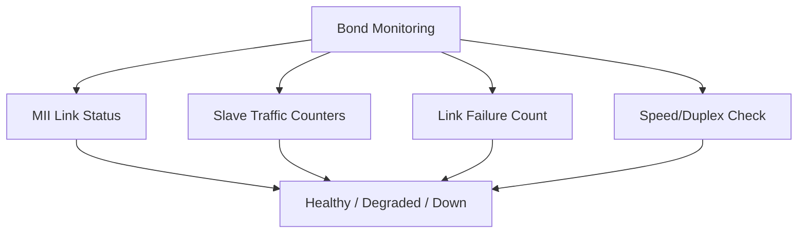

# How to Monitor Network Bond Status and Performance on RHEL 9

Author: [nawazdhandala](https://www.github.com/nawazdhandala)

Tags: RHEL, Network Bonding, Monitoring, Performance, Linux

Description: Practical techniques for monitoring bond health, tracking slave interface performance, and setting up alerts for bond degradation on RHEL 9 servers.

---

Setting up a bond is only half the job. If you do not monitor it, you might run on a degraded bond for weeks without knowing, leaving your server one NIC failure away from a full outage. Here is how to keep tabs on bond status and performance.

## Checking Bond Status

The kernel exposes bond information through the proc filesystem:

```bash
# Full bond status report
cat /proc/net/bonding/bond0
```

This shows you:
- Bonding mode
- Currently active slave
- MII status of each slave
- Link failure counts
- Speed and duplex of each slave

For a quick check, use nmcli:

```bash
# Quick bond overview
nmcli device show bond0

# Connection-level details
nmcli connection show bond0 | grep bond
```

## Monitoring Slave Health



### Counting Active Slaves

A degraded bond (fewer slaves than expected) still works but has reduced redundancy or throughput:

```bash
# Count how many slaves have MII Status: up
grep -c "MII Status: up" /proc/net/bonding/bond0
```

Note: The first "MII Status" line is for the bond itself, so subtract 1 to get the slave count.

### Checking Link Failure Counts

Each slave tracks how many times its link has gone down:

```bash
# Show link failure counts for each slave
grep "Link Failure Count" /proc/net/bonding/bond0
```

A high failure count on one slave suggests a bad cable, a flaky NIC, or a problematic switch port.

## Traffic Statistics

### Per-Slave Traffic Counters

```bash
# Show traffic stats for each slave interface
ip -s link show eth0
ip -s link show eth1

# Show stats for the bond interface itself
ip -s link show bond0
```

Look at:
- **RX/TX bytes**: How much traffic each slave is handling
- **RX/TX errors**: Should be zero, non-zero means hardware or driver issues
- **RX/TX dropped**: Drops indicate congestion or buffer overruns

### Comparing Slave Utilization

For load-balancing modes (802.3ad, balance-xor, balance-rr), check that traffic is actually distributed:

```bash
# Watch slave traffic in real time (refresh every 2 seconds)
watch -n 2 'for i in eth0 eth1; do echo "=== $i ==="; ip -s link show $i | grep -A1 "RX:\|TX:"; done'
```

If one slave carries all the traffic in a load-balancing mode, review your hash policy.

## Automated Monitoring Script

Here is a script you can run from cron or your monitoring system:

```bash
#!/bin/bash
# bond-monitor.sh - Check bond health and report status

BOND="bond0"
EXPECTED_SLAVES=2
PROC_FILE="/proc/net/bonding/$BOND"

# Check if bond exists
if [ ! -f "$PROC_FILE" ]; then
    echo "CRITICAL: Bond $BOND does not exist"
    exit 2
fi

# Check bond MII status
BOND_STATUS=$(grep "MII Status" "$PROC_FILE" | head -1 | awk '{print $3}')
if [ "$BOND_STATUS" != "up" ]; then
    echo "CRITICAL: Bond $BOND MII Status is $BOND_STATUS"
    exit 2
fi

# Count active slaves (subtract 1 for the bond's own MII status line)
TOTAL_UP=$(grep -c "MII Status: up" "$PROC_FILE")
SLAVES_UP=$((TOTAL_UP - 1))

if [ "$SLAVES_UP" -lt "$EXPECTED_SLAVES" ]; then
    # Find which slave is down
    DOWN_SLAVES=$(awk '/Slave Interface/{iface=$3} /MII Status: down/{print iface}' "$PROC_FILE")
    echo "WARNING: Bond $BOND has $SLAVES_UP/$EXPECTED_SLAVES slaves up. Down: $DOWN_SLAVES"
    exit 1
fi

# Check for recent link failures
FAILURES=$(grep "Link Failure Count" "$PROC_FILE" | awk '{sum+=$4} END {print sum}')
if [ "$FAILURES" -gt 0 ]; then
    echo "OK: Bond $BOND - $SLAVES_UP/$EXPECTED_SLAVES slaves up (total link failures: $FAILURES)"
    exit 0
fi

echo "OK: Bond $BOND - $SLAVES_UP/$EXPECTED_SLAVES slaves up, no link failures"
exit 0
```

Make it executable and test:

```bash
chmod +x /usr/local/bin/bond-monitor.sh
/usr/local/bin/bond-monitor.sh
```

## Setting Up Cron-Based Monitoring

```bash
# Run the bond check every 5 minutes and log results
echo "*/5 * * * * root /usr/local/bin/bond-monitor.sh >> /var/log/bond-monitor.log 2>&1" > /etc/cron.d/bond-monitor
```

## Using journalctl for Bond Events

The kernel logs bond state changes:

```bash
# View all bonding-related kernel messages
journalctl -k | grep -i bond

# Follow bond events in real time
journalctl -kf | grep -i bond
```

Key messages to watch for:
- `link status definitely down` - A slave lost its link
- `making interface ethX the new active one` - Failover happened
- `link status up again` - A slave recovered

## Monitoring with SNMP

If you use SNMP-based monitoring (Nagios, Zabbix, etc.), the bond interface appears as a regular network interface in the IF-MIB:

```bash
# Install SNMP tools if not present
dnf install -y net-snmp-utils

# Query interface status via SNMP
snmpwalk -v2c -c public localhost IF-MIB::ifOperStatus
```

For more detailed bond monitoring via SNMP, you would need a custom script that reads `/proc/net/bonding/bond0` and exposes the data.

## Performance Benchmarking

Test the bond throughput to establish a baseline:

```bash
# Install iperf3 for network benchmarking
dnf install -y iperf3

# On the remote server (start the iperf3 server)
iperf3 -s

# On your bonded server (run the client)
iperf3 -c 10.0.1.100 -t 30 -P 4
```

The `-P 4` flag runs 4 parallel streams, which helps test load-balancing modes since a single stream typically uses one slave.

## Monitoring Bond Speed Changes

NIC speed can change if auto-negotiation settles on a lower speed:

```bash
# Check speed and duplex for each slave
ethtool eth0 | grep -E "Speed|Duplex"
ethtool eth1 | grep -E "Speed|Duplex"
```

If a slave drops from 10Gbps to 1Gbps, you have a cable or switch port issue.

## Summary

Monitor your bonds proactively. At minimum, check the slave count and MII status regularly. Track link failure counts to catch flaky hardware early. For load-balancing modes, verify that traffic actually distributes across slaves. Use the kernel journal for real-time event tracking and set up cron-based health checks or integrate with your existing monitoring system. A degraded bond is a ticking time bomb, so catch it before the second link fails.
