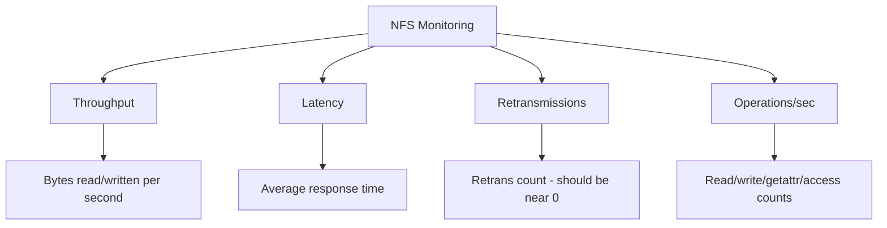

# How to Monitor NFS Server Statistics with nfsstat on RHEL

Author: [nawazdhandala](https://www.github.com/nawazdhandala)

Tags: RHEL, NFS, nfsstat, Monitoring, Linux

Description: Use nfsstat and other monitoring tools on RHEL to track NFS server performance, identify bottlenecks, and diagnose client issues.

---

## Why Monitor NFS?

An NFS server can appear healthy while silently degrading. High retransmission rates, excessive metadata operations, or saturated threads all hurt performance without triggering obvious errors. Regular monitoring lets you spot problems before users start complaining.

## nfsstat Basics

nfsstat is the primary tool for NFS statistics on RHEL. It reads kernel counters to report RPC and NFS operation statistics.

### Server-Side Statistics

```bash
# Show all server statistics
nfsstat -s

# Show only NFSv4 server stats
nfsstat -s -4

# Show only NFSv3 server stats
nfsstat -s -3
```

### Client-Side Statistics

```bash
# Show all client statistics
nfsstat -c

# Show only NFSv4 client stats
nfsstat -c -4
```

### All Statistics (Both Sides)

```bash
# Full dump of all NFS stats
nfsstat -a
```

## Reading nfsstat Output

A typical server output includes:

```bash
Server nfs v4:
null         compound     access       close        commit
0         0% 15234   100% 3421    22% 1205     7% 890      5%
```

Key metrics to watch:
- **read/write counts**: Overall I/O volume
- **access**: Permission checks (high counts may indicate permission issues)
- **getattr**: Metadata lookups (high counts suggest lots of small-file operations)
- **compound**: Total NFSv4 operations

## Per-Mount Statistics

For detailed per-mount performance data:

```bash
# Show per-mount statistics (client side)
cat /proc/self/mountstats

# Or use nfsstat with the mount option
nfsstat -m
```

The mountstats output includes:
- Bytes read and written
- RPC call counts
- Average response times
- Retransmission counts

## Monitoring with mountstats Tool

RHEL includes a Python-based mountstats tool for better formatting:

```bash
# Show formatted mount statistics
mountstats /mnt/nfs-data

# Show I/O statistics
mountstats --iostat /mnt/nfs-data

# Show NFS operation statistics
mountstats --nfs /mnt/nfs-data
```

## Key Metrics to Watch



### Retransmissions

Retransmissions indicate network problems or an overloaded server:

```bash
# Check for retransmissions (client side)
nfsstat -rc

# Look for the retrans field - anything above 0 needs investigation
```

### Thread Utilization

On the server, check if you have enough NFS threads:

```bash
# Check thread pool status
cat /proc/fs/nfsd/pool_stats

# If you see high queue times, add more threads
cat /proc/fs/nfsd/threads
```

## Continuous Monitoring with nfsstat

Watch NFS statistics in real time:

```bash
# Update every 5 seconds, showing deltas
nfsstat -s -l 5

# Watch specific operations
watch -n 5 nfsstat -s
```

## Creating a Simple Monitoring Script

```bash
#!/bin/bash
# /usr/local/bin/nfs-monitor.sh
# Log NFS statistics every 5 minutes

LOGDIR="/var/log/nfs-stats"
mkdir -p "$LOGDIR"
TIMESTAMP=$(date +%Y%m%d-%H%M%S)

# Server stats
nfsstat -s > "$LOGDIR/server-${TIMESTAMP}.log"

# Thread info
cat /proc/fs/nfsd/pool_stats >> "$LOGDIR/server-${TIMESTAMP}.log"

# Export info
exportfs -v >> "$LOGDIR/server-${TIMESTAMP}.log"

# Clean up logs older than 7 days
find "$LOGDIR" -name "*.log" -mtime +7 -delete
```

Add to cron:

```bash
echo "*/5 * * * * root /usr/local/bin/nfs-monitor.sh" | sudo tee /etc/cron.d/nfs-monitor
```

## Using ss for Connection Monitoring

```bash
# Show active NFS connections
ss -tnp | grep 2049

# Count connected clients
ss -tn | grep 2049 | awk '{print $5}' | cut -d: -f1 | sort -u | wc -l

# List connected client IPs
ss -tn | grep 2049 | awk '{print $5}' | cut -d: -f1 | sort -u
```

## Performance Baseline

Before tuning or troubleshooting, establish a baseline:

```bash
# Record baseline statistics
nfsstat -s > /root/nfs-baseline.txt
date >> /root/nfs-baseline.txt

# Record mount parameters
nfsstat -m >> /root/nfs-baseline.txt
```

Compare current stats against the baseline when investigating performance issues:

```bash
# After some time, compare
nfsstat -s > /root/nfs-current.txt
diff /root/nfs-baseline.txt /root/nfs-current.txt
```

## Integrating with System Monitoring

For production environments, feed NFS metrics into your monitoring system:

```bash
# Extract specific metrics for monitoring tools
# Read operations per second
nfsstat -s | grep read | awk '{print $1}'

# Write operations per second
nfsstat -s | grep write | awk '{print $1}'
```

## Wrap-Up

nfsstat is your primary window into NFS performance on RHEL. Check it regularly, watch for retransmissions, monitor thread utilization, and keep an eye on operation counts. Establish a baseline when things are working well, so you have something to compare against when problems arise. Combine nfsstat with mountstats for per-mount detail and ss for connection tracking to get a complete picture of your NFS infrastructure.
