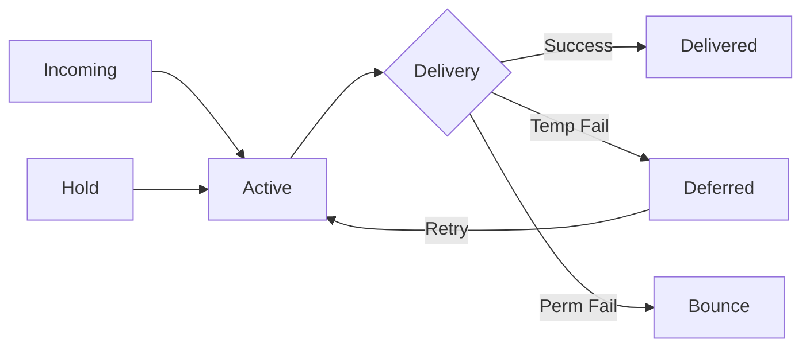

# How to Monitor Postfix Mail Queues and Logs on RHEL

Author: [nawazdhandala](https://www.github.com/nawazdhandala)

Tags: RHEL, Postfix, Mail Queue, Monitoring, Linux

Description: Learn how to effectively monitor Postfix mail queues and analyze logs on RHEL to catch delivery issues before they become problems.

---

## Why Monitor Your Mail Server?

A healthy mail server is one where messages flow through quickly and the queue stays small. When the queue starts growing, it means something is wrong, either your server cannot reach remote hosts, recipients are rejecting mail, or you are under a spam attack. Catching these issues early prevents mail from piling up and users from complaining.

## Understanding Postfix Queues

Postfix uses multiple queues internally:



| Queue | Purpose |
|---|---|
| **incoming** | Newly received messages waiting to be processed |
| **active** | Messages currently being delivered |
| **deferred** | Messages that failed temporarily and are waiting for retry |
| **bounce** | Bounce notifications being sent back to senders |
| **hold** | Messages manually put on hold by the admin |
| **corrupt** | Damaged queue files |

## Viewing the Mail Queue

### Basic Queue Listing

```bash
# Show all queued messages
sudo postqueue -p
```

The output shows queue ID, size, arrival time, sender, and recipients. Messages marked with `*` are in the active queue. Messages without `*` are deferred.

### Queue Summary by Domain

```bash
# Show deferred queue summary grouped by destination domain
sudo qshape deferred

# Show active queue summary
sudo qshape active

# Show incoming queue summary
sudo qshape incoming
```

`qshape` gives you a quick view of which domains have the most stuck messages and how long they have been queued.

### Count Messages in the Queue

```bash
# Quick count of queued messages
sudo postqueue -p | grep -c "^[A-F0-9]"

# Or use find to count queue files
sudo find /var/spool/postfix/deferred -type f | wc -l
sudo find /var/spool/postfix/active -type f | wc -l
```

## Queue Management

### Flush the Queue

```bash
# Attempt immediate delivery of all queued messages
sudo postqueue -f

# Flush messages for a specific domain
sudo postqueue -s example.com
```

### View a Specific Message

```bash
# Display the contents of a queued message
sudo postcat -vq QUEUE_ID
```

### Delete Messages

```bash
# Delete a single message
sudo postsuper -d QUEUE_ID

# Delete all deferred messages
sudo postsuper -d ALL deferred

# Delete all messages (be very careful)
sudo postsuper -d ALL
```

### Hold and Release

```bash
# Put a message on hold
sudo postsuper -h QUEUE_ID

# Put all deferred messages on hold
sudo postsuper -h ALL deferred

# Release a held message
sudo postsuper -H QUEUE_ID

# Release all held messages
sudo postsuper -H ALL
```

### Requeue Messages

```bash
# Requeue a message (re-evaluate routing)
sudo postsuper -r QUEUE_ID

# Requeue all messages
sudo postsuper -r ALL
```

## Reading Postfix Logs

### Log Locations

```bash
# Traditional log file
sudo tail -f /var/log/maillog

# Systemd journal
sudo journalctl -u postfix -f
```

### Key Log Patterns

**Successful delivery:**
```bash
postfix/smtp[PID]: QUEUE_ID: to=<user@remote.com>, relay=mx.remote.com[IP]:25, delay=0.5, status=sent (250 OK)
```

**Deferred delivery:**
```bash
postfix/smtp[PID]: QUEUE_ID: to=<user@remote.com>, relay=none, delay=300, status=deferred (connect to mx.remote.com: Connection timed out)
```

**Bounced message:**
```bash
postfix/smtp[PID]: QUEUE_ID: to=<user@remote.com>, relay=mx.remote.com[IP]:25, delay=0.1, status=bounced (550 User unknown)
```

**Rejected at SMTP level:**
```bash
postfix/smtpd[PID]: NOQUEUE: reject: RCPT from unknown[IP]: 554 Relay access denied
```

### Filtering Logs

```bash
# Find all deliveries to a specific address
sudo grep "to=<user@example.com>" /var/log/maillog

# Find all bounces
sudo grep "status=bounced" /var/log/maillog

# Find all deferred messages
sudo grep "status=deferred" /var/log/maillog

# Find all rejections
sudo grep "NOQUEUE: reject" /var/log/maillog

# Follow a specific message through the logs using its queue ID
sudo grep "ABC123DEF" /var/log/maillog
```

## Log Analysis with pflogsumm

`pflogsumm` is a Postfix log analyzer that generates summary reports:

```bash
# Install pflogsumm
sudo dnf install -y postfix-perl-scripts
```

Generate a report:

```bash
# Analyze today's mail log
sudo pflogsumm /var/log/maillog

# Analyze a specific date range
sudo pflogsumm --detail 10 /var/log/maillog
```

The report includes:
- Total messages sent and received
- Top senders and recipients
- Top sending and receiving domains
- Bounce and reject summaries
- Delivery statistics

### Automated Daily Reports

Create a cron job for daily reports:

```bash
# Add to root's crontab
sudo crontab -e
```

```bash
# Send daily Postfix report at midnight
0 0 * * * /usr/sbin/pflogsumm -d yesterday /var/log/maillog | mail -s "Daily Mail Report" admin@example.com
```

## Monitoring with Custom Scripts

### Queue Size Alert Script

Create `/usr/local/bin/check_mailqueue.sh`:

```bash
#!/bin/bash
# Alert if mail queue exceeds threshold
THRESHOLD=100
QUEUE_SIZE=$(postqueue -p 2>/dev/null | grep -c "^[A-F0-9]")

if [ "$QUEUE_SIZE" -gt "$THRESHOLD" ]; then
    echo "WARNING: Mail queue has $QUEUE_SIZE messages (threshold: $THRESHOLD)" | \
        mail -s "Mail Queue Alert on $(hostname)" admin@example.com
fi
```

```bash
# Make executable and schedule
sudo chmod +x /usr/local/bin/check_mailqueue.sh
```

Add to crontab:

```bash
# Check queue every 15 minutes
*/15 * * * * /usr/local/bin/check_mailqueue.sh
```

## Postfix Built-in Statistics

```bash
# Show queue manager statistics
sudo postfix status

# Show Postfix process table
sudo ps aux | grep postfix

# Show connection rate statistics from the anvil service
sudo grep "anvil" /var/log/maillog | tail -5
```

## Troubleshooting with Logs

**Large deferred queue building up:**

Check the most common deferral reason:

```bash
# Top deferral reasons
sudo grep "status=deferred" /var/log/maillog | sed 's/.*status=deferred //' | sort | uniq -c | sort -rn | head -10
```

**High bounce rate:**

```bash
# Top bounce reasons
sudo grep "status=bounced" /var/log/maillog | sed 's/.*status=bounced //' | sort | uniq -c | sort -rn | head -10
```

**Connection rate from suspicious IPs:**

```bash
# Top connecting IPs
sudo grep "connect from" /var/log/maillog | sed 's/.*connect from //' | sed 's/\[.*//' | sort | uniq -c | sort -rn | head -10
```

## Wrapping Up

Effective mail server monitoring comes down to two things: watch the queue and read the logs. A growing deferred queue is your early warning system. Log analysis with pflogsumm gives you the big picture. Set up automated alerts for queue thresholds and daily summary reports, and you will catch problems before your users do.
