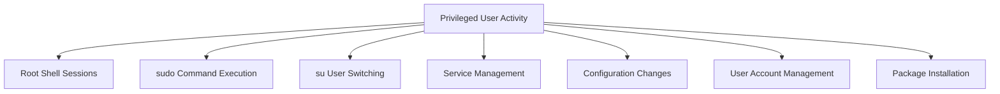

# How to Monitor Privileged User Activity Using auditd on RHEL

Author: [nawazdhandala](https://www.github.com/nawazdhandala)

Tags: RHEL, Auditd, Privileged Users, Monitoring, Security, Compliance, Linux

Description: Set up auditd on RHEL to monitor and log all activities by privileged users, including root actions, sudo usage, and administrative commands.

---

Monitoring privileged user activity is a core requirement for security and compliance. When users operate with elevated privileges, their actions have the potential to affect the entire system. Using auditd on RHEL, you can create a comprehensive record of everything privileged users do, from the commands they run to the files they access. This guide shows you how.

## What to Monitor



## Audit Rules for Privileged User Monitoring

### Track All Commands Run as Root

```bash
sudo tee /etc/audit/rules.d/40-privileged-users.rules << 'EOF'
## Monitor privileged user activity

# Track all commands executed by root (uid 0)
-a always,exit -F arch=b64 -S execve -F euid=0 -k root_commands
-a always,exit -F arch=b32 -S execve -F euid=0 -k root_commands

# Track commands where the effective UID differs from the audit UID
# This catches sudo and su usage
-a always,exit -F arch=b64 -S execve -C uid!=euid -F euid=0 -k privilege_escalation
-a always,exit -F arch=b32 -S execve -C uid!=euid -F euid=0 -k privilege_escalation

# Track su command usage
-a always,exit -F path=/usr/bin/su -F perm=x -F auid>=1000 -F auid!=4294967295 -k user_switch

# Track sudo command usage
-a always,exit -F path=/usr/bin/sudo -F perm=x -F auid>=1000 -F auid!=4294967295 -k sudo_usage

# Track SSH key generation
-a always,exit -F path=/usr/bin/ssh-keygen -F perm=x -F auid>=1000 -F auid!=4294967295 -k ssh_keygen

# Track service management
-a always,exit -F path=/usr/bin/systemctl -F perm=x -F auid>=1000 -F auid!=4294967295 -k service_management

# Track firewall changes
-a always,exit -F path=/usr/bin/firewall-cmd -F perm=x -F auid>=1000 -F auid!=4294967295 -k firewall_changes

# Track package management
-a always,exit -F path=/usr/bin/dnf -F perm=x -F auid>=1000 -F auid!=4294967295 -k package_management
-a always,exit -F path=/usr/bin/rpm -F perm=x -F auid>=1000 -F auid!=4294967295 -k package_management
EOF
```

### Track File Access by Privileged Users

```bash
sudo tee /etc/audit/rules.d/41-privileged-file-access.rules << 'EOF'
## Monitor file access by privileged users

# Track access to sensitive configuration files
-a always,exit -F arch=b64 -S open -S openat -F euid=0 -F dir=/etc -k root_etc_access
-a always,exit -F arch=b64 -S open -S openat -F euid=0 -F dir=/root -k root_home_access

# Track access to audit configuration
-w /etc/audit/ -p rwxa -k audit_config_access
-w /var/log/audit/ -p rwa -k audit_log_access

# Track access to authentication databases
-w /etc/passwd -p rwxa -k auth_db_access
-w /etc/shadow -p rwxa -k auth_db_access
EOF
```

### Track Session Activity

```bash
sudo tee /etc/audit/rules.d/42-sessions.rules << 'EOF'
## Monitor session activity

# Track session initiation
-w /var/run/utmp -p wa -k session
-w /var/log/wtmp -p wa -k session
-w /var/log/btmp -p wa -k session
-w /var/log/lastlog -p wa -k logins

# Track login configuration changes
-w /etc/login.defs -p wa -k login_config
-w /etc/securetty -p wa -k login_config
-w /etc/security/faillock.conf -p wa -k login_config
EOF
```

## Loading the Rules

```bash
# Load all rules
sudo augenrules --load

# Verify rules are loaded
sudo auditctl -l | grep -c "^-"
echo "Total audit rules loaded"
```

## Analyzing Privileged User Activity

### Daily Activity Report

```bash
# See all root commands today
sudo ausearch -k root_commands -ts today -i | grep "type=EXECVE" | head -30

# See all sudo usage today
sudo ausearch -k sudo_usage -ts today -i

# See all privilege escalation events
sudo ausearch -k privilege_escalation -ts today -i
```

### Tracing a Specific User's Session

```bash
# Find all events for a specific user (by audit UID)
sudo ausearch -ua 1000 -ts today -i

# Find what commands a user ran after using sudo
sudo ausearch -ua 1000 -k root_commands -ts today -i

# View the execution trace
sudo ausearch -ua 1000 -m EXECVE -ts today -i
```

### Generating Reports

```bash
# Authentication summary
sudo aureport --auth -ts today -i

# Failed authentication report
sudo aureport --auth --failed -ts today -i

# Executable summary (most frequently run commands)
sudo aureport -x --summary -ts today

# User activity summary
sudo aureport -u --summary -ts today
```

## Building a Privileged User Activity Dashboard Script

```bash
#!/bin/bash
# /usr/local/bin/priv-user-report.sh
# Generate a privileged user activity report

PERIOD_START="${1:-today}"
PERIOD_END="${2:-now}"

echo "============================================"
echo "Privileged User Activity Report"
echo "Period: $PERIOD_START to $PERIOD_END"
echo "Generated: $(date)"
echo "============================================"

echo ""
echo "--- Sudo Usage ---"
sudo ausearch -k sudo_usage -ts "$PERIOD_START" -te "$PERIOD_END" -i 2>/dev/null | \
    grep "comm=" | sed 's/.*comm=/Command: /' | sort | uniq -c | sort -rn | head -20

echo ""
echo "--- Service Management ---"
sudo ausearch -k service_management -ts "$PERIOD_START" -te "$PERIOD_END" -i 2>/dev/null | \
    grep "type=EXECVE" | head -20

echo ""
echo "--- Package Operations ---"
sudo ausearch -k package_management -ts "$PERIOD_START" -te "$PERIOD_END" -i 2>/dev/null | \
    grep "type=EXECVE" | head -20

echo ""
echo "--- User Account Changes ---"
sudo aureport --mods -ts "$PERIOD_START" -te "$PERIOD_END" -i 2>/dev/null

echo ""
echo "--- Failed Login Attempts ---"
sudo aureport --login --failed -ts "$PERIOD_START" -te "$PERIOD_END" -i 2>/dev/null

echo ""
echo "--- Session Summary ---"
sudo aureport --login -ts "$PERIOD_START" -te "$PERIOD_END" --summary 2>/dev/null
```

Make it executable and schedule it:

```bash
sudo chmod +x /usr/local/bin/priv-user-report.sh

# Run manually
sudo /usr/local/bin/priv-user-report.sh today now

# Schedule daily via cron
echo "0 8 * * * root /usr/local/bin/priv-user-report.sh yesterday today > /var/log/priv-user-daily-report.txt 2>&1" | \
    sudo tee /etc/cron.d/priv-user-report
```

## TTY Auditing for Complete Keystroke Logging

For maximum visibility into privileged user sessions, enable TTY auditing in PAM:

```bash
# Add TTY auditing to PAM for admin users
sudo tee -a /etc/pam.d/sshd << 'EOF'
# Enable TTY auditing for all sessions
session required pam_tty_audit.so enable=*
EOF
```

View TTY audit data:

```bash
# View TTY (keystroke) audit data
sudo aureport --tty -ts today -i
```

Note that TTY auditing captures keystrokes in terminal sessions, which can be sensitive. Use it judiciously and ensure the audit logs are properly protected.

## Summary

Monitoring privileged user activity with auditd on RHEL gives you visibility into the most impactful actions on your system. Set up rules to track root commands, sudo usage, service management, and configuration changes. Use ausearch and aureport to analyze the data, and create automated reports to review privileged activity regularly. This approach helps you detect unauthorized changes and maintain accountability for administrative actions.
