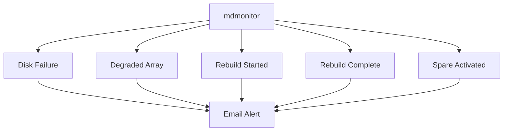

# How to Monitor RAID Array Health and Set Up Email Alerts on RHEL 9

Author: [nawazdhandala](https://www.github.com/nawazdhandala)

Tags: RHEL, RAID, Monitoring, Alerts, Linux

Description: Set up proactive RAID monitoring with mdadm on RHEL 9, including email alerts for disk failures, degraded arrays, and scheduled scrubs.

---

## Why Monitor RAID?

A RAID array silently degrading is worse than a loud failure. If a disk dies and nobody notices, the array runs degraded until a second disk fails, and then you have a real problem. Monitoring ensures you know about failures within minutes, not weeks.

## Checking Array Status Manually

Before setting up automation, know how to check things by hand.

```bash
# Quick status of all arrays
cat /proc/mdstat

# Detailed status of a specific array
sudo mdadm --detail /dev/md5

# Check for any degraded arrays on the system
sudo mdadm --detail /dev/md* 2>/dev/null | grep -E "State|/dev/md"
```

The key field is **State**. You want to see "clean" or "active." If you see "degraded," you have a problem.

## Setting Up the mdadm Monitor Daemon

mdadm includes a built-in monitoring daemon that watches arrays and sends notifications.

### Step 1 - Configure the Monitor

Edit the mdadm configuration file:

```bash
# Set the alert email address in mdadm.conf
echo "MAILADDR admin@example.com" | sudo tee -a /etc/mdadm.conf
```

### Step 2 - Ensure Mail Is Working

mdadm uses the local mail system to send alerts. Install a basic mail relay:

```bash
# Install mailx and postfix for sending alerts
sudo dnf install -y mailx postfix

# Start and enable postfix
sudo systemctl enable --now postfix
```

Test that mail works:

```bash
# Send a test email
echo "RAID monitoring test" | mail -s "Test Alert" admin@example.com
```

### Step 3 - Start the Monitor

On RHEL 9, the mdadm monitor runs via the mdmonitor systemd service.

```bash
# Enable and start the monitor service
sudo systemctl enable --now mdmonitor
```

Check its status:

```bash
# Verify the service is running
sudo systemctl status mdmonitor
```

## What the Monitor Detects

The mdmonitor daemon checks for these events:



## Custom Monitoring with a Script

For more control, you can write a monitoring script and run it via cron.

```bash
#!/bin/bash
# /usr/local/bin/check-raid.sh
# Check all mdadm arrays and alert on degraded status

MAILTO="admin@example.com"
HOSTNAME=$(hostname)

# Loop through all md devices
for md in /dev/md*; do
    [ -b "$md" ] || continue
    STATE=$(sudo mdadm --detail "$md" | grep "State :" | awk '{print $NF}')
    if [ "$STATE" != "clean" ] && [ "$STATE" != "active" ]; then
        DETAIL=$(sudo mdadm --detail "$md")
        echo "$DETAIL" | mail -s "RAID Alert: $md is $STATE on $HOSTNAME" "$MAILTO"
    fi
done
```

Make it executable and add to cron:

```bash
# Make the script executable
sudo chmod +x /usr/local/bin/check-raid.sh

# Run every 5 minutes via cron
echo "*/5 * * * * root /usr/local/bin/check-raid.sh" | sudo tee /etc/cron.d/raid-check
```

## Scheduled RAID Scrubs

RHEL 9 includes a weekly RAID scrub that checks for data consistency. This runs via a systemd timer.

```bash
# Check the scrub timer status
sudo systemctl status mdcheck_start.timer

# The timer is usually enabled by default
sudo systemctl enable mdcheck_start.timer
```

To manually trigger a scrub:

```bash
# Start a scrub on a specific array
echo check | sudo tee /sys/block/md5/md/sync_action

# Monitor scrub progress
cat /proc/mdstat

# Check for mismatches after the scrub
cat /sys/block/md5/md/mismatch_cnt
```

A mismatch count greater than 0 on RAID 1, 5, or 6 could indicate data corruption.

## Monitoring with SMART

Combine RAID monitoring with SMART disk health checks:

```bash
# Install smartmontools
sudo dnf install -y smartmontools

# Enable the SMART daemon
sudo systemctl enable --now smartd

# Check disk health
sudo smartctl -H /dev/sdb
```

Configure smartd to send alerts by editing /etc/smartd.conf:

```bash
# Monitor all disks and send email on errors
# Add this line to /etc/smartd.conf
DEVICESCAN -H -l error -l selftest -f -m admin@example.com -M daily
```

## Integrating with Systemd Journal

All mdadm events go to the systemd journal. You can filter for RAID-related messages:

```bash
# View recent RAID-related log entries
journalctl -u mdmonitor --since "24 hours ago"

# Search for any mdadm messages
journalctl -t mdadm --since "7 days ago"
```

## Wrap-Up

RAID monitoring on RHEL 9 takes about 10 minutes to set up and can save you from a catastrophic data loss. Enable the mdmonitor service, configure email alerts, run regular scrubs, and combine with SMART monitoring for full coverage. The best time to find out about a disk failure is when it happens, not when the second disk fails.
