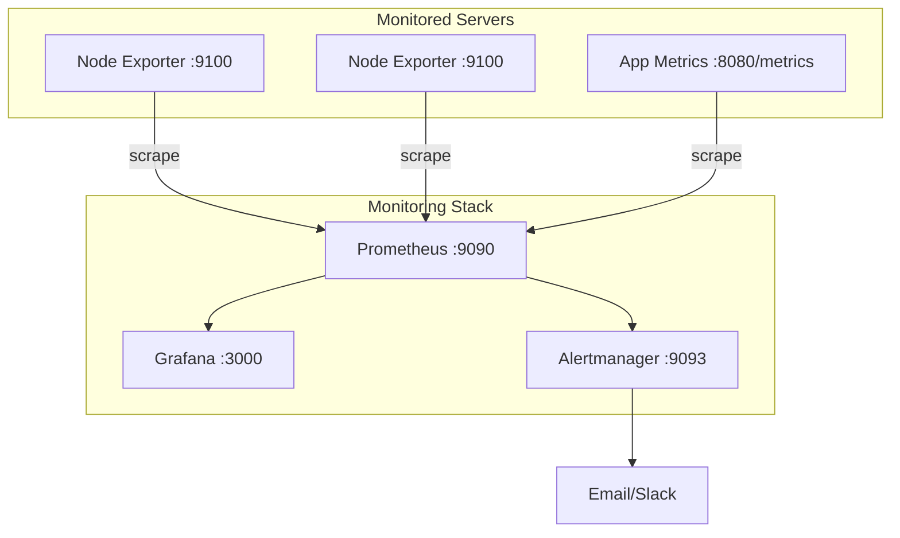

# How to Monitor RHEL 9 with Prometheus and Grafana

Author: [nawazdhandala](https://www.github.com/nawazdhandala)

Tags: RHEL, Prometheus, Grafana, Monitoring, Linux

Description: Learn how to build a complete monitoring stack on RHEL 9 using Prometheus for metrics collection and Grafana for visualization, with practical dashboards and alert rules.

---

Prometheus and Grafana together form the most popular open-source monitoring stack. Prometheus handles metrics collection and storage, while Grafana provides the visualization layer. This guide walks you through setting up a complete monitoring solution on RHEL 9 that covers system health, service availability, and alerting.

## Full Stack Architecture



## Prerequisites

- A dedicated RHEL 9 server for the monitoring stack (4GB RAM, 50GB disk recommended)
- Target RHEL 9 servers to monitor
- Network access between the monitoring server and targets

## Step 1: Install All Components

### Install Prometheus

```bash
# Create Prometheus user
sudo useradd --no-create-home --shell /bin/false prometheus

# Create directories
sudo mkdir -p /etc/prometheus /var/lib/prometheus
sudo chown prometheus:prometheus /etc/prometheus /var/lib/prometheus

# Download and install Prometheus
PROM_VERSION="2.51.0"
cd /tmp
curl -LO "https://github.com/prometheus/prometheus/releases/download/v${PROM_VERSION}/prometheus-${PROM_VERSION}.linux-amd64.tar.gz"
tar xf "prometheus-${PROM_VERSION}.linux-amd64.tar.gz"
cd "prometheus-${PROM_VERSION}.linux-amd64"

sudo cp prometheus promtool /usr/local/bin/
sudo cp -r consoles console_libraries /etc/prometheus/
sudo chown -R prometheus:prometheus /etc/prometheus /usr/local/bin/prometheus /usr/local/bin/promtool

cd /tmp && rm -rf "prometheus-${PROM_VERSION}.linux-amd64"*
```

### Install Node Exporter on Each Target

```bash
# Create user
sudo useradd --no-create-home --shell /bin/false node_exporter

# Download and install
NODE_EXPORTER_VERSION="1.7.0"
cd /tmp
curl -LO "https://github.com/prometheus/node_exporter/releases/download/v${NODE_EXPORTER_VERSION}/node_exporter-${NODE_EXPORTER_VERSION}.linux-amd64.tar.gz"
tar xf "node_exporter-${NODE_EXPORTER_VERSION}.linux-amd64.tar.gz"
sudo cp "node_exporter-${NODE_EXPORTER_VERSION}.linux-amd64/node_exporter" /usr/local/bin/
sudo chown node_exporter:node_exporter /usr/local/bin/node_exporter
rm -rf "node_exporter-${NODE_EXPORTER_VERSION}.linux-amd64"*
```

### Install Grafana

```bash
# Add the Grafana repository
sudo tee /etc/yum.repos.d/grafana.repo << 'EOF'
[grafana]
name=grafana
baseurl=https://rpm.grafana.com
repo_gpgcheck=1
enabled=1
gpgcheck=1
gpgkey=https://rpm.grafana.com/gpg.key
sslverify=1
sslcacert=/etc/pki/tls/certs/ca-bundle.crt
EOF

sudo dnf install grafana -y
```

## Step 2: Configure Node Exporter Service (On Each Target)

```bash
sudo tee /etc/systemd/system/node_exporter.service << 'EOF'
[Unit]
Description=Prometheus Node Exporter
After=network-online.target

[Service]
User=node_exporter
Group=node_exporter
Type=simple
ExecStart=/usr/local/bin/node_exporter \
    --collector.systemd \
    --collector.processes
Restart=always

[Install]
WantedBy=multi-user.target
EOF

sudo systemctl daemon-reload
sudo systemctl enable --now node_exporter
sudo firewall-cmd --permanent --add-port=9100/tcp
sudo firewall-cmd --reload
```

## Step 3: Configure Prometheus

```bash
sudo vi /etc/prometheus/prometheus.yml
```

```yaml
global:
  scrape_interval: 15s
  evaluation_interval: 15s

# Load alert rules
rule_files:
  - "alert_rules.yml"

# Alertmanager configuration
alerting:
  alertmanagers:
    - static_configs:
        - targets:
            - localhost:9093

scrape_configs:
  # Monitor Prometheus itself
  - job_name: "prometheus"
    static_configs:
      - targets: ["localhost:9090"]

  # Monitor all RHEL servers
  - job_name: "rhel-servers"
    scrape_interval: 15s
    static_configs:
      - targets:
          - "webserver1.example.com:9100"
          - "webserver2.example.com:9100"
          - "dbserver1.example.com:9100"
          - "appserver1.example.com:9100"
        labels:
          environment: "production"

      - targets:
          - "staging1.example.com:9100"
        labels:
          environment: "staging"

  # Monitor the local monitoring server
  - job_name: "monitoring-server"
    static_configs:
      - targets: ["localhost:9100"]
        labels:
          role: "monitoring"
```

## Step 4: Create Alert Rules

```bash
sudo vi /etc/prometheus/alert_rules.yml
```

```yaml
groups:
  - name: system_alerts
    rules:
      # Alert when a target is down
      - alert: InstanceDown
        expr: up == 0
        for: 2m
        labels:
          severity: critical
        annotations:
          summary: "Instance {{ $labels.instance }} is down"
          description: "{{ $labels.instance }} has been unreachable for more than 2 minutes."

      # Alert on high CPU usage
      - alert: HighCPUUsage
        expr: 100 - (avg by(instance) (rate(node_cpu_seconds_total{mode="idle"}[5m])) * 100) > 85
        for: 5m
        labels:
          severity: warning
        annotations:
          summary: "High CPU usage on {{ $labels.instance }}"
          description: "CPU usage is above 85% for more than 5 minutes (current: {{ $value | printf \"%.1f\" }}%)."

      # Alert on high memory usage
      - alert: HighMemoryUsage
        expr: (1 - node_memory_MemAvailable_bytes / node_memory_MemTotal_bytes) * 100 > 90
        for: 5m
        labels:
          severity: warning
        annotations:
          summary: "High memory usage on {{ $labels.instance }}"
          description: "Memory usage is above 90% (current: {{ $value | printf \"%.1f\" }}%)."

      # Alert on disk space running low
      - alert: DiskSpaceLow
        expr: (1 - node_filesystem_avail_bytes{mountpoint="/"} / node_filesystem_size_bytes{mountpoint="/"}) * 100 > 85
        for: 5m
        labels:
          severity: warning
        annotations:
          summary: "Disk space low on {{ $labels.instance }}"
          description: "Root filesystem is {{ $value | printf \"%.1f\" }}% full."

      # Alert on disk space critical
      - alert: DiskSpaceCritical
        expr: (1 - node_filesystem_avail_bytes{mountpoint="/"} / node_filesystem_size_bytes{mountpoint="/"}) * 100 > 95
        for: 2m
        labels:
          severity: critical
        annotations:
          summary: "Disk space critical on {{ $labels.instance }}"
          description: "Root filesystem is {{ $value | printf \"%.1f\" }}% full."

      # Alert on high system load
      - alert: HighSystemLoad
        expr: node_load15 > count without(cpu, mode) (node_cpu_seconds_total{mode="idle"})
        for: 10m
        labels:
          severity: warning
        annotations:
          summary: "High system load on {{ $labels.instance }}"
          description: "15-minute load average ({{ $value | printf \"%.1f\" }}) exceeds CPU count."

      # Alert on high network errors
      - alert: NetworkErrors
        expr: rate(node_network_receive_errs_total[5m]) > 10 or rate(node_network_transmit_errs_total[5m]) > 10
        for: 5m
        labels:
          severity: warning
        annotations:
          summary: "Network errors on {{ $labels.instance }}"
```

Validate the rules:

```bash
sudo chown prometheus:prometheus /etc/prometheus/alert_rules.yml
promtool check rules /etc/prometheus/alert_rules.yml
```

## Step 5: Create Prometheus Systemd Service

```bash
sudo tee /etc/systemd/system/prometheus.service << 'EOF'
[Unit]
Description=Prometheus
After=network-online.target

[Service]
User=prometheus
Group=prometheus
Type=simple
ExecStart=/usr/local/bin/prometheus \
    --config.file=/etc/prometheus/prometheus.yml \
    --storage.tsdb.path=/var/lib/prometheus/ \
    --web.console.templates=/etc/prometheus/consoles \
    --web.console.libraries=/etc/prometheus/console_libraries \
    --storage.tsdb.retention.time=30d \
    --web.enable-lifecycle
Restart=always

[Install]
WantedBy=multi-user.target
EOF

sudo systemctl daemon-reload
sudo systemctl enable --now prometheus
```

## Step 6: Start Grafana and Configure

```bash
# Start Grafana
sudo systemctl enable --now grafana-server

# Open firewall ports
sudo firewall-cmd --permanent --add-port=9090/tcp
sudo firewall-cmd --permanent --add-port=3000/tcp
sudo firewall-cmd --reload
```

### Add Prometheus Data Source via Provisioning

```bash
sudo tee /etc/grafana/provisioning/datasources/prometheus.yml << 'EOF'
apiVersion: 1
datasources:
  - name: Prometheus
    type: prometheus
    access: proxy
    url: http://localhost:9090
    isDefault: true
EOF

sudo systemctl restart grafana-server
```

## Step 7: Import Dashboards

Log into Grafana at `http://your-server:3000` (admin/admin) and import these popular dashboards:

| Dashboard ID | Name | Description |
|-------------|------|-------------|
| 1860 | Node Exporter Full | Comprehensive system metrics |
| 11074 | Node Exporter Quick | Quick overview dashboard |
| 3662 | Prometheus Stats | Prometheus self-monitoring |

Go to **Dashboards** > **Import** > Enter the dashboard ID > Select Prometheus data source.

## Step 8: Useful PromQL Queries for Grafana Panels

```promql
# System Overview
up{job="rhel-servers"}

# CPU Usage by Server
100 - (avg by(instance) (rate(node_cpu_seconds_total{mode="idle"}[5m])) * 100)

# Memory Usage by Server
(1 - node_memory_MemAvailable_bytes / node_memory_MemTotal_bytes) * 100

# Disk Usage by Mount
(1 - node_filesystem_avail_bytes{fstype!~"tmpfs|overlay"} / node_filesystem_size_bytes) * 100

# Network Bandwidth (receive)
sum by(instance) (rate(node_network_receive_bytes_total{device!="lo"}[5m])) * 8

# Top 5 CPU Consumers
topk(5, 100 - (avg by(instance) (rate(node_cpu_seconds_total{mode="idle"}[5m])) * 100))
```

## Troubleshooting

```bash
# Check all services
sudo systemctl status prometheus node_exporter grafana-server

# Verify Prometheus targets
curl -s http://localhost:9090/api/v1/targets | python3 -m json.tool | head -50

# Check Prometheus alerts
curl -s http://localhost:9090/api/v1/alerts | python3 -m json.tool

# Check Grafana logs
sudo journalctl -u grafana-server --no-pager -n 20

# Validate Prometheus config
promtool check config /etc/prometheus/prometheus.yml
```

## Summary

A complete RHEL 9 monitoring stack with Prometheus and Grafana gives you real-time visibility into your infrastructure. Install Node Exporter on every server you want to monitor, configure Prometheus to scrape them, set up alert rules for critical conditions, and build Grafana dashboards for visualization. Import community dashboards like Node Exporter Full (ID 1860) for immediate visibility, then customize as your needs grow.
