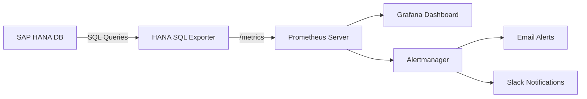

# How to Monitor SAP HANA on RHEL 9 with Prometheus

Author: [nawazdhandala](https://www.github.com/nawazdhandala)

Tags: RHEL, SAP HANA, Prometheus, Monitoring, Grafana, Linux

Description: Set up Prometheus-based monitoring for SAP HANA on RHEL 9 using the HANA SQL exporter to track database performance metrics and alerting.

---

Monitoring SAP HANA with Prometheus gives you flexible, time-series-based observability that integrates with Grafana dashboards and Alertmanager. This guide sets up the SAP HANA SQL exporter for Prometheus on RHEL 9.

## Monitoring Architecture



## Prerequisites

- RHEL 9 running SAP HANA
- Prometheus installed (or a separate monitoring server)
- Network connectivity between Prometheus and the HANA host

## Step 1: Install the SAP HANA SQL Exporter

```bash
# Download the hanadb_exporter (community maintained)
cd /tmp
curl -LO https://github.com/SUSE/hanadb_exporter/releases/latest/download/hanadb_exporter-linux-amd64.tar.gz
tar xzf hanadb_exporter-linux-amd64.tar.gz

# Install to a standard location
sudo mkdir -p /opt/hanadb_exporter
sudo cp hanadb_exporter /opt/hanadb_exporter/
sudo chmod +x /opt/hanadb_exporter/hanadb_exporter
```

## Step 2: Create a Monitoring User in SAP HANA

```bash
# Connect to HANA and create a dedicated monitoring user
sudo su - hdbadm -c "hdbsql -i 00 -u SYSTEM -p YourSystemPassword" <<'SQL'
-- Create a monitoring user with minimal privileges
CREATE USER PROMETHEUS_MONITOR PASSWORD "MonitorPass123" NO FORCE_FIRST_PASSWORD_CHANGE;

-- Grant read-only monitoring views
GRANT MONITORING TO PROMETHEUS_MONITOR;
GRANT CATALOG READ TO PROMETHEUS_MONITOR;

-- Grant access to system views needed for metrics
GRANT SELECT ON SCHEMA SYS TO PROMETHEUS_MONITOR;
GRANT SELECT ON SCHEMA _SYS_STATISTICS TO PROMETHEUS_MONITOR;
SQL
```

## Step 3: Configure the Exporter

```bash
# Create the configuration file
sudo tee /opt/hanadb_exporter/config.json > /dev/null <<'CONFIG'
{
  "listen_address": ":9668",
  "hana": {
    "host": "localhost",
    "port": 30013,
    "user": "PROMETHEUS_MONITOR",
    "password": "MonitorPass123"
  },
  "queries": [
    {
      "name": "hana_memory_usage",
      "help": "SAP HANA memory usage in bytes",
      "query": "SELECT HOST, USED_MEMORY_SIZE, FREE_MEMORY_SIZE, ALLOCATION_LIMIT FROM SYS.M_HOST_RESOURCE_UTILIZATION",
      "metrics": [
        {"label": "host", "column": "HOST"},
        {"gauge": "used_memory", "column": "USED_MEMORY_SIZE"},
        {"gauge": "free_memory", "column": "FREE_MEMORY_SIZE"},
        {"gauge": "allocation_limit", "column": "ALLOCATION_LIMIT"}
      ]
    },
    {
      "name": "hana_cpu_usage",
      "help": "SAP HANA CPU utilization percentage",
      "query": "SELECT HOST, TOTAL_CPU_USER_TIME, TOTAL_CPU_SYSTEM_TIME, TOTAL_CPU_IDLE_TIME FROM SYS.M_HOST_RESOURCE_UTILIZATION",
      "metrics": [
        {"label": "host", "column": "HOST"},
        {"gauge": "cpu_user", "column": "TOTAL_CPU_USER_TIME"},
        {"gauge": "cpu_system", "column": "TOTAL_CPU_SYSTEM_TIME"},
        {"gauge": "cpu_idle", "column": "TOTAL_CPU_IDLE_TIME"}
      ]
    },
    {
      "name": "hana_disk_usage",
      "help": "SAP HANA disk usage in bytes",
      "query": "SELECT HOST, USAGE_TYPE, TOTAL_SIZE, USED_SIZE FROM SYS.M_DISKS",
      "metrics": [
        {"label": "host", "column": "HOST"},
        {"label": "usage_type", "column": "USAGE_TYPE"},
        {"gauge": "total_size", "column": "TOTAL_SIZE"},
        {"gauge": "used_size", "column": "USED_SIZE"}
      ]
    },
    {
      "name": "hana_connections",
      "help": "SAP HANA connection count",
      "query": "SELECT CONNECTION_STATUS, COUNT(*) AS COUNT FROM SYS.M_CONNECTIONS GROUP BY CONNECTION_STATUS",
      "metrics": [
        {"label": "status", "column": "CONNECTION_STATUS"},
        {"gauge": "count", "column": "COUNT"}
      ]
    },
    {
      "name": "hana_replication_status",
      "help": "SAP HANA system replication status",
      "query": "SELECT SITE_NAME, REPLICATION_MODE, REPLICATION_STATUS FROM SYS.M_SERVICE_REPLICATION",
      "metrics": [
        {"label": "site", "column": "SITE_NAME"},
        {"label": "mode", "column": "REPLICATION_MODE"},
        {"label": "status", "column": "REPLICATION_STATUS"}
      ]
    }
  ]
}
CONFIG
```

## Step 4: Create a systemd Service

```bash
sudo tee /etc/systemd/system/hanadb-exporter.service > /dev/null <<'SERVICE'
[Unit]
Description=SAP HANA Database Exporter for Prometheus
After=network.target

[Service]
Type=simple
User=root
ExecStart=/opt/hanadb_exporter/hanadb_exporter --config=/opt/hanadb_exporter/config.json
Restart=on-failure
RestartSec=10

[Install]
WantedBy=multi-user.target
SERVICE

sudo systemctl daemon-reload
sudo systemctl enable --now hanadb-exporter
```

## Step 5: Configure Prometheus to Scrape the Exporter

Add the following to your Prometheus configuration:

```yaml
# Add to /etc/prometheus/prometheus.yml under scrape_configs
scrape_configs:
  - job_name: "sap_hana"
    scrape_interval: 30s
    static_configs:
      - targets: ["hana-server:9668"]
        labels:
          instance: "HDB"
          environment: "production"
```

```bash
# Reload Prometheus configuration
sudo systemctl reload prometheus
```

## Step 6: Create Alert Rules

```bash
sudo tee /etc/prometheus/hana_alerts.yml > /dev/null <<'ALERTS'
groups:
  - name: sap_hana_alerts
    rules:
      - alert: HANAHighMemoryUsage
        expr: hana_memory_usage_used_memory / hana_memory_usage_allocation_limit > 0.90
        for: 5m
        labels:
          severity: critical
        annotations:
          summary: "SAP HANA memory usage above 90%"

      - alert: HANAReplicationBroken
        expr: hana_replication_status{status!="ACTIVE"} > 0
        for: 2m
        labels:
          severity: critical
        annotations:
          summary: "SAP HANA system replication is not active"

      - alert: HANAHighConnectionCount
        expr: sum(hana_connections_count) > 500
        for: 5m
        labels:
          severity: warning
        annotations:
          summary: "SAP HANA has more than 500 active connections"
ALERTS
```

## Step 7: Open Firewall Port

```bash
# Allow the exporter port
sudo firewall-cmd --permanent --add-port=9668/tcp
sudo firewall-cmd --reload
```

## Conclusion

Prometheus-based monitoring for SAP HANA on RHEL 9 gives you detailed visibility into database performance without relying on SAP-specific tools. The custom SQL queries in the exporter can be extended to cover any HANA system view, making it flexible for your specific monitoring needs. Pair it with Grafana for visualization and Alertmanager for notifications.
