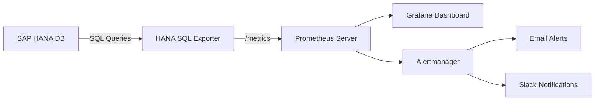

# How to Monitor SAP HANA on RHEL with Prometheus

Author: [nawazdhandala](https://www.github.com/nawazdhandala)

Tags: RHEL, SAP HANA, Prometheus, Monitoring, Grafana, Linux

Description: Set up Prometheus-based monitoring for SAP HANA on RHEL using the HANA SQL exporter to track database performance metrics and alerting.

---

Monitoring SAP HANA with Prometheus gives you flexible, time-series-based observability that integrates with Grafana dashboards and Alertmanager. This guide sets up the SAP HANA SQL exporter for Prometheus on RHEL.

## Monitoring Architecture


```mermaid
graph LR
    HANA[SAP HANA DB] -->|SQL Queries| Exporter[HANA SQL Exporter]
    Exporter -->|/metrics| Prometheus[Prometheus Server]
    Prometheus --> Grafana[Grafana Dashboard]
    Prometheus --> AlertMgr[Alertmanager]
    AlertMgr --> Email[Email Alerts]
    AlertMgr --> Slack[Slack Notifications]
```

## Prerequisites

- RHEL running SAP HANA
- Prometheus installed (or a separate monitoring server)
- Network connectivity between Prometheus and the HANA host

## Step 1: Install the SAP HANA SQL Exporter

```bash
# Install the hanadb_exporter (community maintained)
sudo dnf install -y git python3 python3-pip

cd /tmp
git clone https://github.com/SUSE/hanadb_exporter.git
cd hanadb_exporter

# Install to a standard location
sudo mkdir -p /opt/hanadb_exporter
sudo python3 -m venv /opt/hanadb_exporter/virt
sudo /opt/hanadb_exporter/virt/bin/python -m pip install hdbcli
sudo /opt/hanadb_exporter/virt/bin/python -m pip install .
sudo chmod +x /opt/hanadb_exporter/virt/bin/hanadb_exporter
```

## Step 2: Create a Monitoring User in SAP HANA

```bash
# Connect to HANA and create a dedicated monitoring user
sudo su - hdbadm -c "hdbsql -i 00 -u SYSTEM -p YourSystemPassword" <<'SQL'
-- Create a monitoring user with minimal privileges
CREATE USER PROMETHEUS_MONITOR PASSWORD "MonitorPass123" NO FORCE_FIRST_PASSWORD_CHANGE;

-- Grant read-only monitoring views
CREATE ROLE PROMETHEUS_MONITOR_ROLE;
GRANT MONITORING TO PROMETHEUS_MONITOR_ROLE;
GRANT PROMETHEUS_MONITOR_ROLE TO PROMETHEUS_MONITOR;
SQL
```

## Step 3: Configure the Exporter

```bash
# Create the configuration file
sudo tee /opt/hanadb_exporter/config.json > /dev/null <<'CONFIG'
{
  "listen_address": "0.0.0.0",
  "exposition_port": 9668,
  "multi_tenant": true,
  "timeout": 30,
  "hana": {
    "host": "localhost",
    "port": 30013,
    "user": "PROMETHEUS_MONITOR",
    "password": "MonitorPass123",
    "ssl": false,
    "ssl_validate_cert": false
  }
}
CONFIG

sudo tee /opt/hanadb_exporter/metrics.json > /dev/null <<'METRICS'
{
  "SELECT host, ROUND(instance_total_memory_used_size / 1024 / 1024, 2) host_total_used_mem_mb, ROUND(allocation_limit / 1024 / 1024, 2) host_alloc_limit_mb FROM sys.m_host_resource_utilization;": {
    "enabled": true,
    "metrics": [
      {
        "name": "hanadb_host_memory_used_total",
        "description": "Amount of memory from the memory pool that is currently being used by SAP HANA processes per host in MB",
        "labels": ["HOST"],
        "value": "HOST_TOTAL_USED_MEM_MB",
        "unit": "mb",
        "type": "gauge"
      },
      {
        "name": "hanadb_host_memory_alloc_limit",
        "description": "Memory allocation limit for all processes per host in MB",
        "labels": ["HOST"],
        "value": "HOST_ALLOC_LIMIT_MB",
        "unit": "mb",
        "type": "gauge"
      }
    ]
  },
  "SELECT MAX(TIMESTAMP) timestamp, HOST, MEASURED_ELEMENT_NAME core, SUM(MAP(CAPTION, 'User Time', TO_NUMBER(VALUE), 0)) user_pct, SUM(MAP(CAPTION, 'System Time', TO_NUMBER(VALUE), 0)) system_pct, SUM(MAP(CAPTION, 'Idle Time', TO_NUMBER(VALUE), 0)) idle_pct FROM sys.M_HOST_AGENT_METRICS WHERE MEASURED_ELEMENT_TYPE = 'Processor' GROUP BY HOST, MEASURED_ELEMENT_NAME;": {
    "enabled": true,
    "metrics": [
      {
        "name": "hanadb_cpu_user",
        "description": "Percentage of CPU time spent in user space",
        "labels": ["HOST", "CORE"],
        "value": "USER_PCT",
        "unit": "percent",
        "type": "gauge"
      },
      {
        "name": "hanadb_cpu_system",
        "description": "Percentage of CPU time spent in kernel space",
        "labels": ["HOST", "CORE"],
        "value": "SYSTEM_PCT",
        "unit": "percent",
        "type": "gauge"
      },
      {
        "name": "hanadb_cpu_idle",
        "description": "Percentage of idle CPU time",
        "labels": ["HOST", "CORE"],
        "value": "IDLE_PCT",
        "unit": "percent",
        "type": "gauge"
      }
    ]
  },
  "SELECT md.host, md.usage_type, md.path, md.filesystem_type, TO_DECIMAL(md.total_size / 1024 / 1024, 10, 2) total_size_mb, TO_DECIMAL(du.used_size / 1024 / 1024, 10, 2) used_size_mb FROM sys.m_disk_usage du, sys.m_disks md WHERE du.host = md.host AND du.usage_type = md.usage_type;": {
    "enabled": true,
    "metrics": [
      {
        "name": "hanadb_disk_total_size",
        "description": "Specifies the volume size in MB",
        "labels": ["HOST", "USAGE_TYPE", "PATH", "FILESYSTEM_TYPE"],
        "value": "TOTAL_SIZE_MB",
        "unit": "mb",
        "type": "gauge"
      },
      {
        "name": "hanadb_disk_used_size",
        "description": "Size of used disk space in MB based on usage type",
        "labels": ["HOST", "USAGE_TYPE", "PATH", "FILESYSTEM_TYPE"],
        "value": "USED_SIZE_MB",
        "unit": "mb",
        "type": "gauge"
      }
    ]
  },
  "SELECT host, LPAD(port, 5) port, connection_type, MAP(connection_status,'','N/A', connection_status) connection_status, COUNT(1) total_connections FROM SYS.M_CONNECTIONS GROUP BY host, port, connection_status, connection_type;": {
    "enabled": true,
    "metrics": [
      {
        "name": "hanadb_connections_total",
        "description": "Number of connections grouped by type and status",
        "labels": ["HOST", "PORT", "CONNECTION_TYPE", "CONNECTION_STATUS"],
        "value": "TOTAL_CONNECTIONS",
        "unit": "count",
        "type": "gauge"
      }
    ]
  },
  "SELECT host, LPAD(port, 5) port, site_name, secondary_site_name, secondary_host, LPAD(secondary_port, 5) secondary_port, replication_mode, MAP(UPPER(replication_status),'ACTIVE',0,'ERROR',4,'SYNCING',2,'INITIALIZING',1,'UNKNOWN',3,99) replication_status FROM sys.m_service_replication;": {
    "enabled": true,
    "metrics": [
      {
        "name": "hanadb_sr_replication",
        "description": "System Replication status. Values: 0-ACTIVE, 1-INITIALIZING, 2-SYNCING, 3-UNKNOWN, 4-ERROR, 99-UNMAPPED",
        "labels": ["HOST", "PORT", "SITE_NAME", "SECONDARY_SITE_NAME", "SECONDARY_HOST", "SECONDARY_PORT", "REPLICATION_MODE"],
        "value": "REPLICATION_STATUS",
        "unit": "status",
        "type": "gauge"
      }
    ]
  }
}
METRICS
```

## Step 4: Create a systemd Service

```bash
sudo tee /etc/systemd/system/hanadb-exporter.service > /dev/null <<'SERVICE'
[Unit]
Description=SAP HANA Database Exporter for Prometheus
After=network.target

[Service]
Type=simple
User=hanadb_exporter
ExecStart=/opt/hanadb_exporter/virt/bin/hanadb_exporter --config=/opt/hanadb_exporter/config.json --metrics=/opt/hanadb_exporter/metrics.json
Restart=on-failure
RestartSec=10

[Install]
WantedBy=multi-user.target
SERVICE

sudo useradd --system --home-dir /opt/hanadb_exporter --shell /sbin/nologin hanadb_exporter
sudo chown -R hanadb_exporter:hanadb_exporter /opt/hanadb_exporter
sudo chmod 600 /opt/hanadb_exporter/config.json
sudo systemctl daemon-reload
sudo systemctl enable --now hanadb-exporter
```

## Step 5: Configure Prometheus to Scrape the Exporter

Add the following to your Prometheus configuration:

```yaml
# Add to /etc/prometheus/prometheus.yml under scrape_configs
scrape_configs:
  - job_name: "sap_hana"
    scrape_interval: 30s
    static_configs:
      - targets: ["hana-server:9668"]
        labels:
          instance: "HDB"
          environment: "production"
```

```bash
# Reload Prometheus configuration
sudo systemctl kill -s HUP prometheus
```

## Step 6: Create Alert Rules

Add `/etc/prometheus/hana_alerts.yml` to the `rule_files` list in `/etc/prometheus/prometheus.yml`, then create the rules file:

```bash
sudo tee /etc/prometheus/hana_alerts.yml > /dev/null <<'ALERTS'
groups:
  - name: sap_hana_alerts
    rules:
      - alert: HANAHighMemoryUsage
        expr: hanadb_host_memory_used_total_mb / hanadb_host_memory_alloc_limit_mb > 0.90
        for: 5m
        labels:
          severity: critical
        annotations:
          summary: "SAP HANA memory usage above 90%"

      - alert: HANAReplicationBroken
        expr: hanadb_sr_replication_status > 0
        for: 2m
        labels:
          severity: critical
        annotations:
          summary: "SAP HANA system replication is not active"

      - alert: HANAHighConnectionCount
        expr: sum(hanadb_connections_total_count) > 500
        for: 5m
        labels:
          severity: warning
        annotations:
          summary: "SAP HANA has more than 500 active connections"
ALERTS
```

## Step 7: Open Firewall Port

```bash
# Allow the exporter port
sudo firewall-cmd --permanent --add-port=9668/tcp
sudo firewall-cmd --reload
```

## Conclusion

Prometheus-based monitoring for SAP HANA on RHEL gives you detailed visibility into database performance without relying on SAP-specific tools. The custom SQL queries in the exporter can be extended to cover any HANA system view, making it flexible for your specific monitoring needs. Pair it with Grafana for visualization and Alertmanager for notifications.
