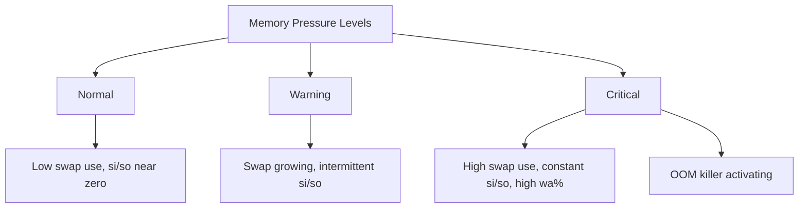

# How to Monitor Swap Usage and Diagnose Memory Pressure on RHEL

Author: [nawazdhandala](https://www.github.com/nawazdhandala)

Tags: RHEL, Swap, Memory, Monitoring, Linux

Description: Learn how to monitor swap usage and diagnose memory pressure on RHEL using built-in tools to catch problems before the OOM killer steps in.

---

Swap usage by itself is not a problem. The kernel legitimently moves inactive pages to swap to free RAM for active workloads. But when swap usage climbs steadily, when swap I/O is constant, or when the system starts thrashing between RAM and swap, you have memory pressure that needs attention.

## Quick Health Check

Start with the basics:

```bash
# Overview of memory and swap
free -h
```

Sample output:

```bash
              total        used        free      shared  buff/cache   available
Mem:           16Gi       12Gi       512Mi       256Mi       3.2Gi       3.0Gi
Swap:          4.0Gi      1.2Gi      2.8Gi
```

Key things to notice:
- `available` tells you how much memory can be used without swapping (includes reclaimable cache)
- Swap `used` shows how much is currently paged out
- If `available` is low AND swap is growing, you have real pressure

## Monitoring Tools

### vmstat - Real-Time Memory and Swap Activity

```bash
# Monitor every 2 seconds, 10 samples
vmstat 2 10
```

Focus on these columns:
- `si` (swap in) - pages read from swap back to RAM per second
- `so` (swap out) - pages written from RAM to swap per second
- `free` - free memory in kilobytes
- `wa` - percentage of CPU time spent waiting for I/O

When `si` and `so` are consistently high, the system is thrashing.

### sar - Historical Swap Data

If `sysstat` is installed and collecting data:

```bash
# Install sysstat if not present
dnf install -y sysstat
systemctl enable --now sysstat
```

View swap usage history:

```bash
# Swap statistics from today
sar -S

# Swap I/O activity
sar -W
```

```bash
# Swap stats from a specific date
sar -S -f /var/log/sa/sa01
```

### /proc/meminfo - Detailed Memory Breakdown

```bash
# Key memory metrics
grep -E "MemTotal|MemFree|MemAvailable|Buffers|Cached|SwapTotal|SwapFree|SwapCached" /proc/meminfo
```

`SwapCached` is an important metric. It shows swap pages that are also in RAM. The kernel keeps both copies so that if the page needs to be swapped out again, it does not need to write it (it is already on disk).

## Identifying Memory-Hungry Processes

### Using top/htop

```bash
# Sort by memory usage in top
top -o %MEM
```

Press `Shift+M` in top to sort by memory usage.

### Check Per-Process Swap Usage

```bash
# Show swap usage per process
for pid in /proc/[0-9]*; do
    pid_num=$(basename "$pid")
    swap=$(awk '/VmSwap/ {print $2}' "$pid/status" 2>/dev/null)
    name=$(awk '/Name/ {print $2}' "$pid/status" 2>/dev/null)
    if [ -n "$swap" ] && [ "$swap" -gt 0 ] 2>/dev/null; then
        echo "${swap} kB - PID $pid_num ($name)"
    fi
done | sort -rn | head -20
```

This shows the top 20 processes by swap usage.

### Using smem for Proportional Memory

```bash
# Install smem
dnf install -y smem

# Show processes sorted by swap usage
smem -rs swap | head -20
```

## Understanding Memory Pressure Indicators



### Pressure Stall Information (PSI)

RHEL supports PSI, which gives direct pressure measurements:

```bash
# Memory pressure metrics
cat /proc/pressure/memory
```

Output looks like:

```bash
some avg10=0.00 avg60=0.00 avg300=0.00 total=0
full avg10=0.00 avg60=0.00 avg300=0.00 total=0
```

- `some` - percentage of time at least one task is stalled on memory
- `full` - percentage of time all tasks are stalled on memory
- `avg10`, `avg60`, `avg300` - averages over 10s, 60s, 300s windows

If `some avg10` exceeds 10-20%, you have noticeable memory pressure. If `full avg10` is above 0 consistently, you have serious problems.

### Check for OOM Events

```bash
# Check for recent OOM kills
journalctl -k --since "1 hour ago" | grep -i "oom\|out of memory"

# Check dmesg for OOM
dmesg | grep -i "oom\|out of memory"
```

## Setting Up Alerts

### Simple Swap Alert Script

```bash
#!/bin/bash
# /usr/local/bin/swap-alert.sh
# Alerts when swap usage exceeds threshold

THRESHOLD=80  # Alert at 80% swap usage

TOTAL=$(free | awk '/Swap/ {print $2}')
USED=$(free | awk '/Swap/ {print $3}')

if [ "$TOTAL" -eq 0 ]; then
    exit 0  # No swap configured
fi

PERCENT=$((USED * 100 / TOTAL))

if [ "$PERCENT" -ge "$THRESHOLD" ]; then
    # Log the alert
    logger -p user.crit "SWAP ALERT: ${PERCENT}% swap used on $(hostname)"

    # Get top memory consumers
    TOP_PROCS=$(ps aux --sort=-%mem | head -6)

    # Send email
    mail -s "SWAP ALERT: ${PERCENT}% on $(hostname)" admin@example.com << EOF
Swap usage has reached ${PERCENT}% on $(hostname)

Memory Status:
$(free -h)

Top Memory Consumers:
$TOP_PROCS

Memory Pressure (PSI):
$(cat /proc/pressure/memory)
EOF
fi
```

Schedule it:

```bash
chmod +x /usr/local/bin/swap-alert.sh
echo "*/5 * * * * /usr/local/bin/swap-alert.sh" >> /var/spool/cron/root
```

## Diagnosing Common Issues

### Gradual Swap Growth (Memory Leak)

If swap usage grows steadily over days/weeks:

```bash
# Track process memory growth
# Run this periodically and compare
ps aux --sort=-%mem | head -20 > /tmp/mem-snapshot-$(date +%Y%m%d%H%M).txt
```

### Sudden Swap Spike

Check what just happened:

```bash
# Recent large memory allocations in the journal
journalctl --since "30 min ago" | grep -i "memory\|oom\|swap"

# Check for newly started memory-heavy processes
ps aux --sort=-rss | head -10
```

### High Swap I/O (Thrashing)

```bash
# Watch swap I/O in real time
vmstat 1 30 | awk '{print strftime("%H:%M:%S"), $0}'
```

If `si` and `so` are both consistently above 100-200 pages/sec, the system is thrashing.

## Summary

Monitoring swap on RHEL requires looking at multiple metrics: swap usage from `free`, I/O rates from `vmstat` and `sar`, per-process usage from `/proc`, and pressure from PSI. Swap usage alone is not alarming, but growing swap combined with high swap I/O and elevated PSI pressure means you need to either add RAM, reduce workload, or find a memory leak. Set up automated alerts at 80% swap usage so you catch problems early.
