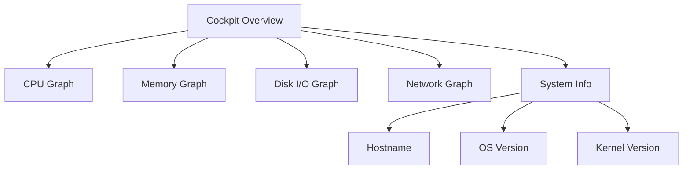
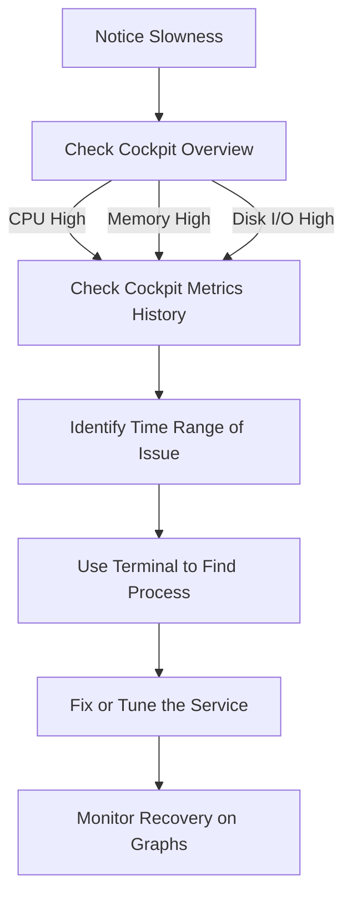

# How to Monitor System Performance Using the Cockpit Web Console on RHEL 9

Author: [nawazdhandala](https://www.github.com/nawazdhandala)

Tags: RHEL, Cockpit, Performance Monitoring, Linux

Description: A hands-on guide to using the Cockpit web console for real-time performance monitoring on RHEL 9, covering CPU, memory, disk, and network metrics.

---

When a server starts acting sluggish, the first thing you need is a quick picture of what's going on. Cockpit's performance page gives you real-time graphs for CPU, memory, disk I/O, and network traffic, all in one browser tab. It's not a replacement for deep performance analysis tools, but for the initial "what's eating my resources" question, it's hard to beat.

## The Overview Dashboard

Log into Cockpit and you'll land on the Overview page. This is your starting point for health checks. It shows:

- Hostname and operating system details
- CPU usage as a percentage
- Memory usage with total and used amounts
- Disk I/O rates
- Network traffic rates



Each metric is shown as a live-updating graph that covers the last few minutes. Click on any graph to get more detail.

## CPU Monitoring

The CPU graph shows overall utilization as a percentage. When you click into it, you get a more detailed view that breaks down CPU usage over time. This is useful for spotting patterns - maybe a cron job spikes the CPU at the same time every hour.

For comparison, the command-line tools that give you similar data:

```bash
# Quick snapshot of CPU usage
top -bn1 | head -5

# More detailed per-CPU breakdown
mpstat -P ALL 1 5

# Load averages
uptime
```

Cockpit shows you the overall system load right on the overview page. If the load average consistently exceeds your CPU core count, something needs attention.

## Memory Monitoring

The memory graph shows used versus total RAM. Cockpit breaks this down clearly so you can see how much memory is actually consumed by applications versus how much the kernel is using for caches and buffers.

This distinction matters because Linux aggressively caches disk data in RAM. A server showing 95% memory usage might actually be fine if most of that is cache.

The CLI equivalent:

```bash
# Show memory breakdown
free -h

# Detailed memory info
cat /proc/meminfo | head -10
```

Cockpit's graph makes it easy to spot memory leaks over time. If the line trends steadily upward without ever dropping back, you've got a process that isn't releasing memory.

## Disk I/O Monitoring

The disk I/O panel shows read and write rates across your storage devices. High disk I/O often explains slow application performance, especially on servers with spinning disks or thin-provisioned virtual storage.

For deeper analysis from the terminal:

```bash
# Watch disk I/O in real time
iostat -xz 2 5

# Check which processes are doing the most I/O
iotop -o
```

If iotop isn't installed, grab it:

```bash
sudo dnf install iotop -y
```

The Cockpit view gives you the aggregate picture. When you see a spike, you can hop into the terminal tab within Cockpit to drill down with iotop.

## Network Traffic Monitoring

The network graph shows incoming and outgoing traffic rates. This is useful for detecting unexpected network activity, bandwidth saturation, or DDoS-style traffic patterns.

Command-line alternatives:

```bash
# Network interface statistics
ip -s link show

# Real-time bandwidth monitoring per interface
nload

# Connection summary
ss -s
```

## Using the Performance Metrics Detail Page

Click "View metrics and history" on the overview page (or navigate to the dedicated metrics page). This gives you a longer time range and more granular data. You'll see graphs for:

- CPU usage and saturation
- Memory usage and swap
- Disk I/O bandwidth and IOPS
- Network bandwidth

The data here is collected by the Performance Co-Pilot (PCP) framework. If PCP isn't installed, Cockpit will offer to set it up for you.

## Setting Up Performance Co-Pilot (PCP)

PCP is a comprehensive performance monitoring framework that integrates tightly with Cockpit. It enables historical data collection so you can look back at what happened hours or days ago.

Install PCP and its Cockpit integration:

```bash
# Install PCP and the Cockpit bridge
sudo dnf install pcp cockpit-pcp -y

# Enable and start the PCP collector
sudo systemctl enable --now pmcd
sudo systemctl enable --now pmlogger
```

After installing PCP, Cockpit's metrics page will show historical data instead of just live graphs. The pmlogger service writes data to `/var/log/pcp/` by default.

Verify PCP is collecting data:

```bash
# Check that PCP daemons are running
systemctl status pmcd pmlogger

# Query a metric to verify collection
pminfo -f kernel.all.load
```

## Configuring PCP Data Retention

By default, pmlogger keeps about 14 days of data. You can adjust this if disk space is a concern.

Check and modify the retention policy:

```bash
# View current pmlogger configuration
cat /etc/pcp/pmlogger/control.d/local

# Adjust retention in the pmlogger config
# The -c flag sets the configuration, -t sets the logging interval
sudo vi /etc/pcp/pmlogger/control.d/local
```

## Identifying Resource-Hungry Processes

When you spot high CPU or memory usage on the Cockpit graphs, the next step is figuring out which process is responsible. Cockpit doesn't have a built-in process table (it used to in older versions), but you can use the integrated terminal.

Quick commands to find the culprits:

```bash
# Top CPU consumers
ps aux --sort=-%cpu | head -10

# Top memory consumers
ps aux --sort=-%mem | head -10

# Real-time process view sorted by CPU
top -o %CPU
```

## Setting Up Alerts with PCP

PCP includes a rules engine called pmie (Performance Metrics Inference Engine) that can trigger alerts when thresholds are exceeded.

Enable the pmie service:

```bash
# Start the inference engine
sudo systemctl enable --now pmie
```

Create a custom alert rule. For example, to log a warning when CPU usage exceeds 90%:

```bash
# Create a custom pmie rule file
sudo tee /etc/pcp/pmie/config.d/cpu-alert.pmie << 'EOF'
// Alert when CPU usage exceeds 90% for 5 minutes
some_host (
    kernel.all.cpu.user + kernel.all.cpu.sys > 0.9 * hinv.ncpu
) -> syslog "High CPU usage detected - exceeds 90%";
EOF

# Restart pmie to pick up the new rule
sudo systemctl restart pmie
```

## Monitoring with Cockpit and PCP Together

Here's the workflow I typically use:



1. Start with the Cockpit overview for a quick health check
2. Drill into the metrics history to see when the problem started
3. Use the terminal to identify specific processes
4. Take corrective action
5. Watch the graphs to confirm the fix worked

## Exporting Performance Data

PCP data can be exported for analysis in external tools:

```bash
# Export PCP archive data to a CSV-like format
pmrep -a /var/log/pcp/pmlogger/$(hostname)/$(date +%Y%m%d) \
    kernel.all.load disk.all.read disk.all.write \
    -t 1min -o csv
```

## Wrapping Up

Cockpit gives you a visual, real-time window into your server's performance. Combined with PCP for historical data, it covers most day-to-day monitoring needs. For quick health checks and trend analysis, the browser-based graphs are faster than assembling the same picture from command-line tools. When you need to dig deeper, the integrated terminal is right there. It's a solid first-response tool for performance troubleshooting on RHEL 9.
